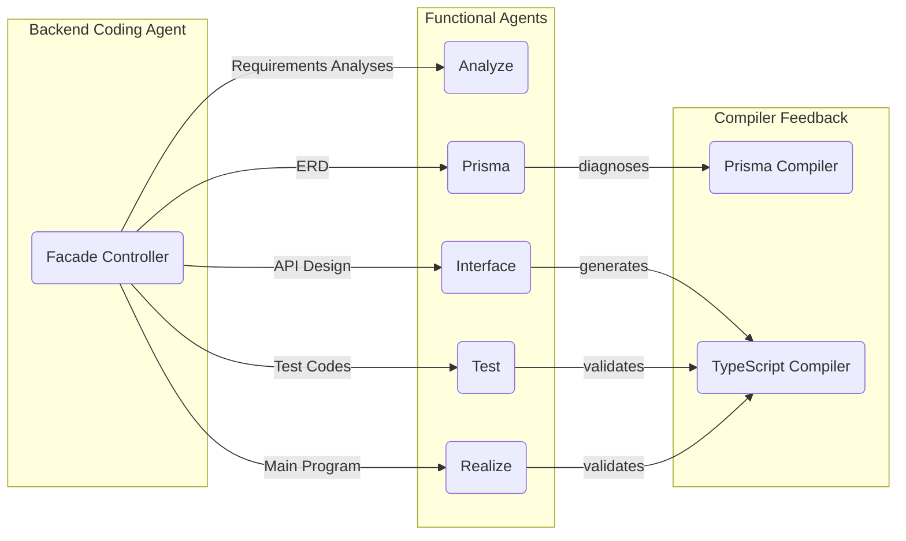
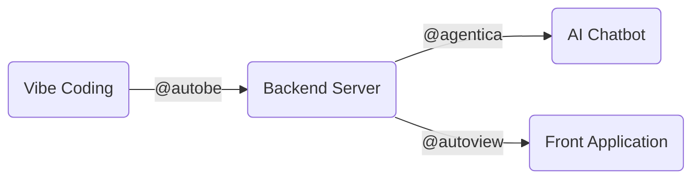
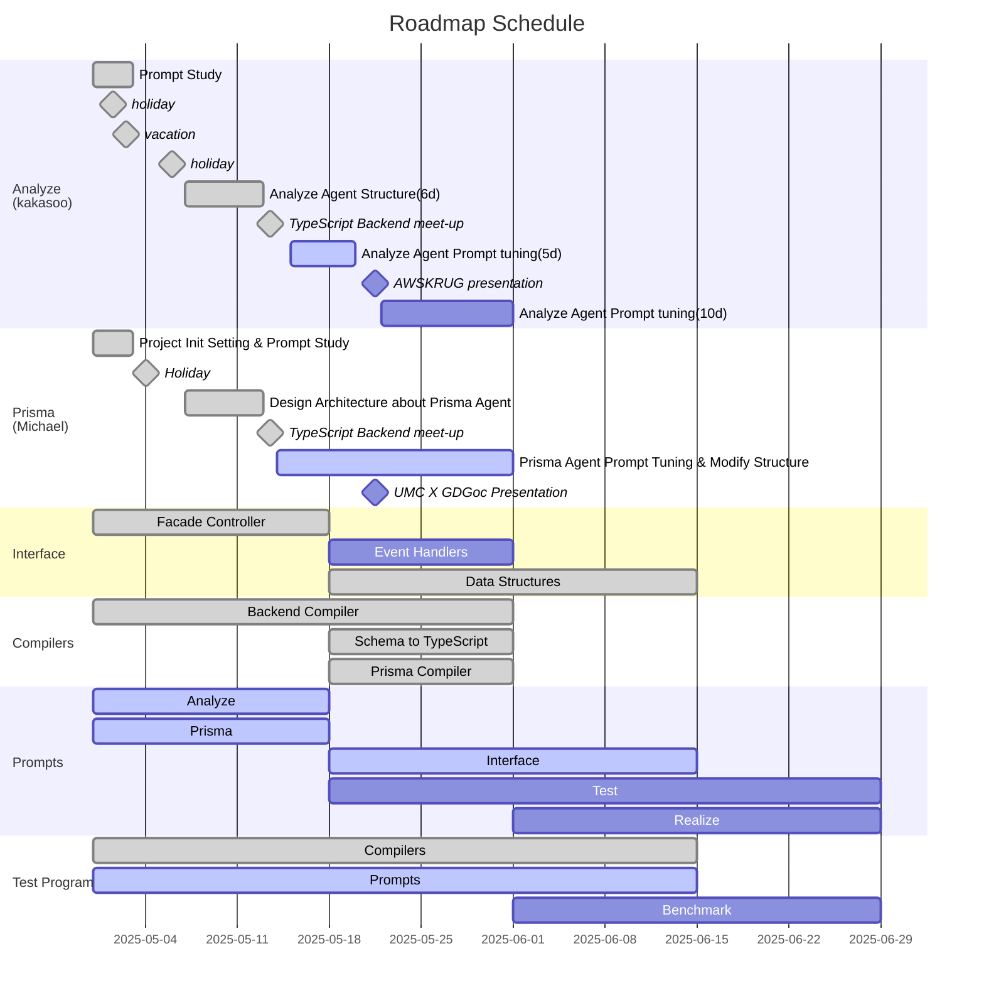

## AutoBE, Vibe Coding Agent of Backend Server


[](https://github.com/wrtnlabs/autobe/blob/master/LICENSE)
[](https://www.npmjs.com/package/@autobe/agent)
[](https://www.npmjs.com/package/@autobe/agent)
[](https://github.com/wrtnlabs/autobe/actions?query=workflow%3Abuild)
[](https://discord.gg/aMhRmzkqCx)

Vibe coding agent of backend server, enhanced by compiler feedback.

`@autobe` is an AI agent of vibe coding that analyzes user requirements and automatically generates backend server code of below stack. And if you combine `@autobe` with [`@agentica`](https://github.com/wrtnlabs/agentica) and [`@autoview`](https://github.com/wrtnlabs/autoview), you can automate not only backend development, but also AI chatbot and frontend application developments.

- TypeScript
- NestJS
- Prisma
- Postgres

`@autobe` based on the waterfall model but incorporating spiral model's iterative improvement cycles, it produces high-quality code through continuous feedback between users and AI. The spiral process ensures not only well-structured code but also safe and reliable implementations verified by integrated compilers and automated test programs at each development stage.

Simply describe your requirements to the AI and review the generated code. The backend code produced by `@autobe` is immediately executable and fully functional out of the box, eliminating the need for extensive manual adjustments or debugging.

## Playground

Coming soon... (2025-06-01).

Currently, playground only steps to the [interface step](#interface).

And as `@autobe`'s features are not fully completed, when "E-Commerce" like huge use case comes, [interface function](#interface) tends to write less operations that we've expected.

- [BBS (Bullet-in Board System)](https://stackblitz.com/edit/autobe-demo-bbs?file=docs%2Fanalysis%2Findex.md,src%2Fapi%2Fstructures%2FIBbsArticle.ts,src%2Fcontrollers%2Fbbs%2Farticles%2FBbsArticlesController.ts,README.md)
- [E-Commerce](https://stackblitz.com/edit/autobe-demo-shopping?file=docs%2Fanalysis%2Findex.md,docs%2FERD.md,src%2Fapi%2Fstructures%2FIShoppingSale.ts,src%2Fcontrollers%2Fshoppings%2Fcustomers%2Forders%2FShoppingsCustomersOrdersController.ts)

## Documentation Resources

Preparing...

## Functional Agents



`@autobe` consists of five core functional agents, each responsible for a specific stage of backend development.

These agents operate independently while utilizing outputs from previous stages to form a coherent development pipeline.

### Analyze

An agent that analyzes requirements and creates specification documents.

- **Input**: All conversation history between users and AI
- **Output**: Structured requirements specification
- **Features**: 
  - Separates business logic from technical requirements
  - Generates follow-up questions for ambiguous requirements
  - Establishes priorities and defines development scope

The Analyze agent serves as the foundation of the entire development process. It not only captures initial requirements but also continuously refines understanding through iterative conversation with users. When requirements are ambiguous or incomplete, it proactively formulates targeted questions to elicit necessary information before proceeding with development.

Additionally, once other agents have generated code, the Analyze agent can interpret change requests in the context of existing implementations, assessing the impact and feasibility of modifications while maintaining system integrity. This comprehensive approach ensures that all subsequent development stages work from a clear, complete, and consistent specification.

### Prisma

An agent that analyzes requirements specifications to generate database schemas in Prisma format.

- **Input**: Requirements specification
- **Output**: Prisma DB schema and ERD documentation
- **Features**:
  - Automatic schema validation with built-in Prisma compiler
  - Detailed comments for entities and attributes
  - Automatic ERD documentation generation (using `prisma-markdown`)
  - Schema optimization through self-review system

The Prisma agent references the requirements specification document created by the [#Analyze Agent](#analyze) to craft the `prisma.schema` file. For each entity and attribute in the database schema, it provides comprehensive documentation including the rationale behind its creation, its purpose, and conceptual explanations. The agent employs normalization techniques to ensure high-quality database design.

Once the DB schema file is written, the Prisma agent compiles it using the built-in Prisma compiler. If compilation errors occur, these are fed back to the AI agent, enabling a self-correction process through compiler feedback. After successful compilation, the schema is converted into ERD documentation using `prisma-markdown`. This documentation is then subjected to a quality assurance process through an internal review agent that verifies and refines the schema.

```prisma
/// Final component information on units for sale.
/// 
/// `shopping_sale_snapshot_unit_stocks` is a subsidiary entity of 
/// {@link shopping_sale_snapshot_units} that represents a product catalog 
/// for sale, and is a kind of final stock that is constructed by selecting 
/// all {@link shopping_sale_snapshot_unit_options options} 
/// (variable "select" type) and their 
/// {@link shopping_sale_snapshot_unit_option_candidates candidate} values in 
/// the belonging unit. It is the "good" itself that customers actually 
/// purchase.
/// 
/// - Product Name) MacBook
///   - Options
///   - CPU: { i3, i5, i7, i9 }
///   - RAM: { 8GB, 16GB, 32GB, 64GB, 96GB }
///   - SSD: { 256GB, 512GB, 1TB }
///   - Number of final stocks: 4 * 5 * 3 = 60
///
/// For reference, the total number of `shopping_sale_snapshot_unit_stocks` 
/// records in an attribution unit can be obtained using Cartesian Product. 
/// In other words, the value obtained by multiplying all the candidate 
/// values that each (variable "select" type) option can have by the number 
/// of cases is the total number of final stocks in the unit. 
///
/// Of course, without a single variable "select" type option, the final 
/// stocks count in the unit is only 1.
///
/// @namespace Sales
/// @erd Carts
model shopping_sale_snapshot_unit_stocks {
  /// Primary Key.
  ///
  /// @format uuid
  id String @id @db.Uuid

  /// Belonged unit's {@link shopping_sale_snapshot_units.id}
  ///
  /// @format uuid
  shopping_sale_snapshot_unit_id String @db.Uuid

  /// Name of the final stock.
  name String @db.VarChar

  /// Nominal price.
  ///
  /// This is not real price to pay, but just a nominal price to show.
  /// If this value is greater than the `real_price`, it would be shown
  /// like seller is giving a discount.
  ///
  /// @minimum 0
  nominal_price Float @db.DoublePrecision

  /// Real price to pay.
  ///
  /// @minimum 0
  real_price Float @db.DoublePrecision

  /// Initial inventory quantity.
  ///
  /// If this stock has been sold over this quantity count, the stock can't
  /// be sold anymore, because of out of stock. In that case, the seller can
  /// supplement the inventory quantity by registering some 
  /// {@link shopping_sale_snapshot_unit_stock_supplements} records.
  ///
  /// @minimum 0
  quantity Int

  /// Sequence order in belonged unit.
  sequence Int @db.Integer
}
```

### Interface

An agent that designs API interfaces based on requirements specifications and ERD documentation.

- **Input**: Requirements specification, ERD documentation
- **Output**: API interface code, DTO schemas
- **Features**:
  - OpenAPI Operation Schema and JSON Schema generation
  - Detailed API documentation comments
  - Self validating interface generation pipeline
  - NestJS interface code conversion

The Interface agent bridges the gap between database design and implementation by creating precise, consistent API interfaces. The agent follows a sophisticated generation process that prioritizes correctness and clarity.

First, it analyzes the requirements specification and ERD documentation to understand the business domain and data relationships. Then, instead of directly writing TypeScript code, it constructs formal OpenAPI Operation Schemas and JSON Schemas as an intermediate representation. This deliberate constraint helps maintain consistency and prevents the unbounded expressiveness of TypeScript from introducing design flaws.

These schemas are combined to produce a validated `swagger.json` file, which undergoes rigorous verification. Only after passing validation is this structured representation transformed into NestJS controllers and DTOs. This pipeline ensures that all API interfaces adhere to OpenAPI standards and project conventions.

Each generated interface includes comprehensive JSDoc comments explaining its purpose, behavior, and relationship to other components. These annotations serve both as documentation for developers and as self-verification mechanisms for the agent to confirm its design decisions align with requirements.

An internal review agent continually cross-references the generated interfaces against the original requirements and data model, ensuring completeness and consistency. Additionally, the system integrates human feedback by presenting generated interfaces to users for approval or revision before proceeding to implementation.

```typescript
@Controller("shoppings/customers/sales")
export class ShoppingCustomerSaleController {
  /**
   * List up every summarized sales.
   *
   * List up every {@link IShoppingSale.ISummary summarized sales}.
   *
   * As you can see, returned sales are summarized, not detailed. It does not
   * contain the SKU (Stock Keeping Unit) information represented by the
   * {@link IShoppingSaleUnitOption} and {@link IShoppingSaleUnitStock} types.
   * If you want to get such detailed information of a sale, use
   * `GET /shoppings/customers/sales/{id}` operation for each sale.
   *
   * > If you're an A.I. chatbot, and the user wants to buy or compose
   * > {@link IShoppingCartCommodity shopping cart} from a sale, please
   * > call the `GET /shoppings/customers/sales/{id}` operation at least once
   * > to the target sale to get detailed SKU information about the sale.
   * > It needs to be run at least once for the next steps.
   *
   * @param input Request info of pagination, searching and sorting
   * @returns Paginated sales with summarized information
   * @tag Sale
   */
  @core.TypedRoute.Patch()
  public async index(
    @HubCustomerAuth() customer: IHubCustomer,
    @core.TypedBody() input: IShoppingSale.IRequest,
  ): Promise<IPage<IShoppingSale.ISummary>> {
    customer;
    input;
    return typia.random<IPage<IShoppingSale.ISummary>>()
  }
}
```

### Test

An agent that generates E2E test code for each API interface.

- **Input**: API interfaces, OpenAPI Schema
- **Output**: Test code for each API function
- **Features**:
  - Dependency analysis for sequencing test execution
  - Automatic generation of complex test scenarios
  - Detailed test documentation through comments
  - Code validation through TypeScript compiler
  - Test coverage optimization

The Test agent synthesizes information from previously generated artifacts to produce thorough end-to-end test suites that validate both individual API endpoints and their interactions. Drawing from the requirements specification, ERD documentation, and interface definitions, it constructs tests that verify functional correctness and business rule compliance.

At its core, the Test agent leverages two critical inputs from the Interface agent's work: firstly, it utilizes both the OpenAPI Operation Schemas and the derived TypeScript/NestJS API interface code that define each endpoint's contract. Secondly, it works with automatically pre-generated e2e test program scaffolds that are mechanically derived from these OpenAPI Operation Schemas. These scaffolds provide the foundation upon which the Test agent builds more sophisticated test scenarios, enhancing them with business logic validation and dependency-aware execution sequences.

A key strength of the Test agent is its ability to analyze dependency relationships between API functions. When certain endpoints require preconditions established by other API calls, the agent automatically structures integrated test scenarios that execute functions in the correct sequence. Each test case includes detailed comments explaining the test's purpose, prerequisites, and expected results, serving as both documentation and verification of test intent.

As with other components of the AutoBE system, the Test agent incorporates built-in TypeScript compiler validation to ensure syntactic correctness. When compilation errors occur, they're fed back into the agent, creating a self-correcting learning loop that improves code quality. An internal review agent further evaluates test coverage and quality, suggesting improvements to achieve optimal testing thoroughness.

```typescript
export const test_api_shoppings_admins_sales_reviews_comments_create =
  async (connection: api.IConnection) => {
    const output: IShoppingSaleInquiryComment =
      await api.functional.shoppings.admins.sales.reviews.comments.create(
        connection,
        typia.random<string & tags.Format<"uuid">>(),
        typia.random<string & tags.Format<"uuid">>(),
        typia.random<IShoppingSaleInquiryComment.ICreate>(),
      );
    typia.assert(output);
  };
```

> Systematically generated test code by OpenAPI Operation Schema

### Realize

An agent that writes realization code for each API function.

- **Input**: Requirements specification, Prisma schema, API interfaces, test code
- **Output**: Service realization code for each API endpoint
- **Features**:
  - Compilation feedback through TypeScript compiler
  - Runtime feedback through test code execution
  - Code quality improvement through self-review system
  - Business logic optimization

The Implementation agent is the culmination of the AutoBE development pipeline, synthesizing outputs from all previous agents to create fully functional service provider code for each API endpoint. This agent comprehensively analyzes the requirements specification, Prisma schema, API interfaces, and test code to implement business logic that satisfies all defined requirements.

Internal validation mechanisms ensure high-quality output through multiple feedback loops. First, an embedded TypeScript compiler provides immediate compilation feedback, catching syntax errors and type mismatches. Second, the realization code is tested against the test suites created by the Test Agent, providing runtime feedback that validates functional correctness. Finally, an internal review agent evaluates the code quality, identifying opportunities for optimization and improvement.

The Implementation agent focuses on creating maintainable, efficient code that correctly implements the business logic while adhering to best practices. It generates service providers that handle database interactions through Prisma, implement security and validation checks, and process business rules according to the requirements specification.

## Blueprint

### Full Stack Vibe Coding



Our [WrtnLabs](https://github.com/wrtnlabs) team is developing two more projects, [`@agentica`](https://github.com/wrtnlabs/agentica) and [`@autoview`](https://github.com/wrtnlabs/autoview). Among these, [`@agentica`](https://github.com/wrtnlabs/agentica) automatically creates an AI Chatbot when you simply provide a `swagger.json` file, and [`@autoview`](https://github.com/wrtnlabs/autoview) automatically generates a Frontend Application when you bring a `swagger.json` file.

Therefore, you're not just limited to automatically creating a backend with `@autobe` and vibe coding. If you've created a backend server with vibe coding through `@autobe`, you can immediately create an AI Chatbot and Frontend Application along with it

Can you conversate? Then you're a full-stack developer.

### Agentica, AI Function Calling Framework


https://github.com/wrtnlabs/agentica

Agentica is an Agentic AI framework specialized in AI Function Calling.

It actually does everything with the function calling, and brings functions from below three protocols. If you put `swagger.json` file of `@autobe` generated backend server, it directly becomes an AI chatbot interacting with it.

  - TypeScript Class/Interface
  - Swagger/OpenAPI Document
  - MCP (Model Context Protocol) Server

```typescript
import { Agentica, assertHttpController } from "@agentica/core";
import OpenAI from "openai";
import typia from "typia";

import { MobileFileSystem } from "./services/MobileFileSystem";

const agent = new Agentica({
  vendor: {
    api: new OpenAI({ apiKey: "********" }),
    model: "gpt-4o-mini",
  },
  controllers: [
    // functions from TypeScript class
    typia.llm.controller<MobileFileSystem, "chatgpt">(
      "filesystem",
      MobileFileSystem(),
    ),
    // functions from Swagger/OpenAPI
    assertHttpController({
      name: "shopping",
      model: "chatgpt",
      document: await fetch(
        "https://shopping-be.wrtn.ai/editor/swagger.json",
      ).then(r => r.json()),
      connection: {
        host: "https://shopping-be.wrtn.ai",
        headers: { Authorization: "Bearer ********" },
      },
    }),
  ],
});
await agent.conversate("I wanna buy MacBook Pro");
```

### AutoView, Type to React Component


https://github.com/wrtnlabs/autoview

AutoView is a frontend automation tool generating React component code from type information of below. If you put `swagger.json` file of `@autobe` generated backend server, it directly becomes a frontend application.

  - TypeScript Type
  - JSON Schema (OpenAPI Document)

```typescript
import { AutoViewAgent } from "@autoview/agent";
import fs from "fs";
import OpenAI from "openai";
import typia, { tags } from "typia";

// 1. Define your own TypeScript interface to display
interface IMember {
  id: string & tags.Format<"uuid">;
  name: string;
  age: number & tags.Minimum<0> & tags.Maximum<100>;
  thumbnail: string & tags.Format<"uri"> & tags.ContentMediaType;
}

// 2. Setup the AutoView agent
const agent = new AutoViewAgent({
  model: "chatgpt",
  vendor: {
    api: new OpenAI({ apiKey: "********" }),
    model: "o3-mini",
    isThinkingEnabled: true,
  },
  input: {
    type: "json-schema",
    unit: typia.json.unit<IMember>(),
  },
  transformFunctionName: "transformMember",
  experimentalAllInOne: true, // recommended for faster and less-error results
});

// 3. Get the result!
const result = await agent.generate(); 
await fs.promises.writeFile(
  "./src/transformers/transformMember.ts",
  result.transformTsCode,
  "utf8",
);
```

## Roadmap Schedule



We're developing `@autobe` with dedicated effort, and each unit (agent) is now working properly. We plan to launch the complete service application by 2025-08-01, with the following pre-release schedule:

  - Alpha version: 2025-06-01
  - Beta version: 2025-07-01
