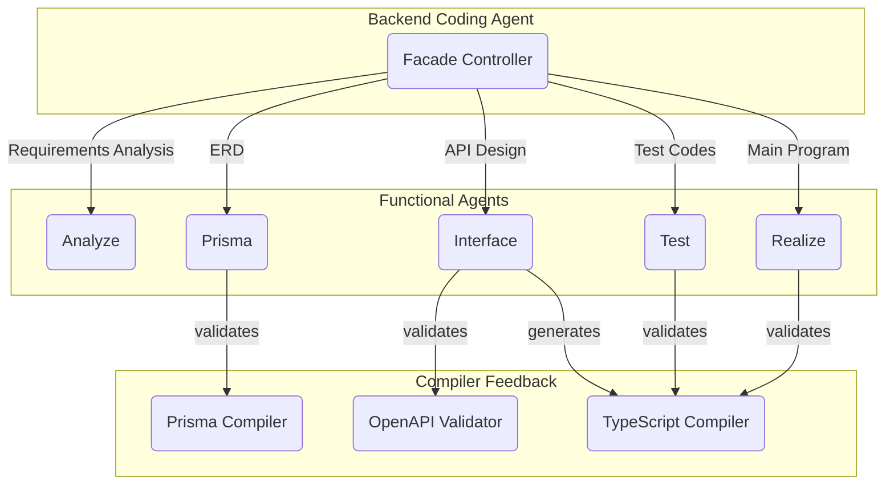
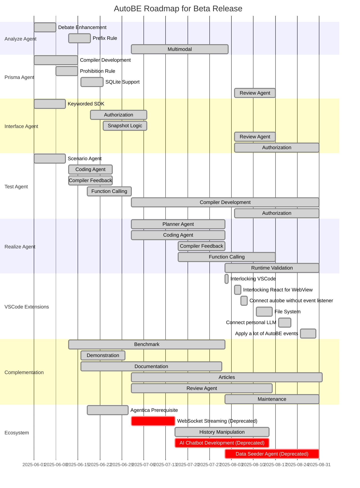

# AutoBE

AI backend builder for prototype to production

Tell AutoBE about the backend application you want to create. AutoBE will analyze your requirements and build the backend application for you. The generated backend application is guaranteed to be 100% buildable by an AI-friendly compilers and ensures stability through powerful e2e test functions.

If the API or DB design created by AutoBE differs significantly from what you wanted, please explain what's different. AutoBE will modify the backend application for you. If what AutoBE generated differs subtly from what you wanted, please modify it with the help of AI code assistants like Claude Code.

Below are examples and demo videos of backend applications generated with AutoBE.

https://github.com/user-attachments/assets/b995dd2a-23bd-43c9-96cb-96d5c805f19f

1. **Discussion Board**: https://github.com/wrtnlabs/autobe-example-bbs
2. **To Do List**: https://github.com/wrtnlabs/autobe-example-todo
3. **Reddit Community**: https://github.com/wrtnlabs/autobe-example-reddit
4. **E-Commerce**: https://github.com/wrtnlabs/autobe-example-shopping
   - Requirements Analysis: [Report](https://github.com/wrtnlabs/autobe-example-shopping/tree/main/docs/analysis)
   - Database Design: [Entity Relationship Diagram](https://github.com/wrtnlabs/autobe-example-shopping/tree/main/docs/ERD.md) / [Prisma Schema](https://github.com/wrtnlabs/autobe-example-shopping/tree/main/prisma/schema)
   - API Design: [API Controllers](https://github.com/wrtnlabs/autobe-example-shopping/tree/main/src/controllers) / [DTO Structures](https://github.com/wrtnlabs/autobe-example-shopping/tree/main/src/api/structures)
   - E2E Test Functions: [`test/features/api`](https://github.com/wrtnlabs/autobe-example-shopping/tree/main/test/features/api)
   - API Implementations: [`src/providers`](https://github.com/wrtnlabs/autobe-example-shopping/tree/main/src/providers)

## Pricinples

AutoBE 는 폭포수 모델의 순서에 따라 백엔드 어플리케이션을 생성하며, 총 40 개의 에이전트가 이를 보조합니다.

또한 폭포수의 각 단계에는 AI-friendly compilers 가 준비되어있어, AutoBE 가 생성한 소스 코드의 타입 안정성을 보장해줍니다. AutoBE 는 AI Function Calling 으로 이들 컴파일러의 AST (Abstract Syntax Tree) 데이터를 구성, 이를 검증하여 AI agent에게 피드백을 주거나, 코드로 변환하거나 합니다.

> 현재 AutoBE 는 Prisma ORM 과 TypeScript 소스 코드만 생성합니다. 
> 
> 그러나 이러한 AST 구조 덕분에, 언어 중립적인 개발이 가능합니다. 차후 우리 AutoBE 팀은 AST to Programming Language Transformer 를 몇 가지 더 만들어, 다양한 프로그래밍 언어들을 지원하고자 합니다.
>
> 대략 그 시기는 2026 년이 될 것입니다.

아래는 economic/political discussion board 에 대한 각 waterfall phase 별 산출물입니다. 만일 여러분이 AutoBE 로 백엔드 서버를 완전 자동으로 만드는 것을 원하지 않고, 단지 요구사항 정의서나 DB/API 설계 내지 e2e 테스트 함수까지만을 원한다면 그리하셔도 됩니다.

## Documentation Resources

Find comprehensive resources at our [official website](https://autobe.dev).

### 🏠 Home

- 🙋🏻‍♂️ [Introduction](https://autobe.dev/docs)
- 📦 [Setup](https://autobe.dev/docs/setup)
- 🔍 Concepts
  - [Waterfall Model](https://autobe.dev/docs/concepts/waterfall)
  - [Compiler Strategy](https://autobe.dev/docs/concepts/compiler)
  - [AI Function Calling](https://autobe.dev/docs/concepts/function-calling)

### 📖 Features

- 🤖 Agent Library
  - [Facade Controller](https://autobe.dev/docs/agent/facade)
  - [Configuration](https://autobe.dev/docs/agent/config)
  - [Event Handling](https://autobe.dev/docs/agent/event)
  - [Prompt Histories](https://autobe.dev/docs/agent/history)
- 📡 WebSocket Protocol
  - [Remote Procedure Call](https://autobe.dev/docs/websocket/rpc)
  - [NestJS Server](https://autobe.dev/docs/websocket/nestjs)
  - [NodeJS Server](https://autobe.dev/docs/websocket/nodejs)
  - [Client Application](https://autobe.dev/docs/websocket/client)
- 🛠️ Backend Stack
  - [TypeScript](https://autobe.dev/docs/stack/typescript)
  - [Prisma ORM](https://autobe.dev/docs/stack/prisma)
  - [NestJS Framework](https://autobe.dev/docs/stack/nestjs)

### 🔗 Appendix

- 🌐 [No-Code Ecosystem](https://autobe.dev/docs/ecosystem)
- 📅 Roadmap
  - [Alpha Release (completed)](https://autobe.dev/docs/roadmap/alpha)
  - [Beta Release (in progress)](https://autobe.dev/docs/roadmap/beta)
  - [v1.0 Official Release (planned)](https://autobe.dev/docs/roadmap/v1.0)
- 🔧 [API Documentation](https://autobe.dev/api)

## Roadmap Schedule

`@autobe`'s comprehensive three-month beta development roadmap spans from 2025-06-01 through 2025-08-31, marking a critical phase in our journey toward production readiness.

Following the successful completion of our alpha release on 2025-05-31, we have established a robust foundation with fully developed Analysis, Prisma, and Interface Agents. These core components have successfully automated the most complex challenges in backend development: comprehensive requirements analysis, intelligent database architecture, and seamless API design. This achievement represents a significant milestone in our mission to completely automate backend application design.

The upcoming beta phase strategically focuses on delivering and refining the Test Agent and Realization Agent while ensuring system-wide stability and performance optimization across the entire `@autobe` ecosystem. Our ambitious target for 2025-08-31 is to achieve a breakthrough: a 100% reliable No-Code Agent platform that can autonomously handle any backend application development challenge without human intervention.

## License

AutoBE and all backend applications generated by AutoBE are licensed under the [GNU Affero General Public License v3.0 (AGPL-3.0)](LICENSE).

Additionally, any client applications that interact with AutoBE-generated backend servers are also subject to AGPL-3.0 licensing requirements due to the copyleft nature of the license.

For those who wish to avoid open source disclosure obligations, commercial licenses are available for purchase (coming soon).