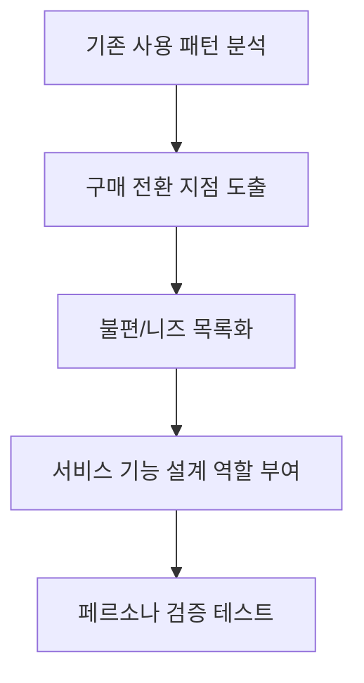

# 2. 타겟 사용자 분석

## 2-1. 서론: 사용자 중심 설계의 중요성

성공적인 커머스 서비스는 다양한 유형의 고객을 정확히 이해하는 것에서 출발합니다. 본 플랫폼은 구독, 정기결제, 일시구매 등 여러 상품 모델에서 각기 다른 사용자군이 명확히 존재함을 확인했습니다. 이에 따라 시장을 세분화하고, 대표적인 페르소나와 실질적인 구매/이용 행동 분석을 진행해 서비스 경쟁력을 극대화합니다.

---

## 2-2. 시장 세분화

커머스 서비스의 잠재시장과 기존시장을 구분하여 각 영역별로 타겟 사용자를 세밀하게 정의합니다.

### 2-2-1. 잠재시장
- 온라인 리테일 신규 진입자
- 구독 경제 서비스 미이용층(기존 오프라인 중심 소비자)
- B2B(기업구매 및 자동납품 등)

### 2-2-2. 기존시장
- 온라인 쇼핑 및 정기배송 일상화 사용자층
- 다양한 플랫폼(쇼핑∙콘텐츠∙식품 등) 구독 경험 보유자
- 취미/전문 카테고리 단골 사용자

---

## 2-3. 대표 페르소나 도출

### 페르소나1 : 박소연(34, 직장인, 싱글)
- **특성:** 맞벌이, 주중 바쁜 업무, 생활용품 정기배송 선호
- **니즈:** 주문 자동화/정기결제, 알림서비스, 배송 옵션 다양성
- **고민:** 반복 구매 번거로움, 신뢰있는 브랜드 선호
- **적용 전략:** 마이크로 구독 서비스, 간편 장바구니 반복결제, 브랜드 필터 제공

### 페르소나2 : 김재훈(27, 대학생, 1인 가구)
- **특성:** 소비 트렌드 민감, 취미/디지털 서비스 구독 선호
- **니즈:** 저가∙트라이얼 구독, 빠른 해지/전환, 리뷰 기반 추천
- **고민:** 과한 자동결제, 해지의 어려움
- **적용 전략:** 신속 해지, 구독권 기간 알림, 맞춤 추천 시스템

### 페르소나3 : 임은숙(46, 소상공인, 사업자 회원)
- **특성:** 업체 필수품 정기구매, 견적/적립 포인트 중시
- **니즈:** 대량구매 할인, 세금계산서, 자동정산
- **고민:** 매번 주문 번거로움, 정산/배송 오류
- **적용 전략:** 법인회원 전용몰, 간편자동주문 API, 상세 주문내역 관리

| 페르소나 | 주요 특성             | 핵심 니즈                  | 서비스 적용 전략           |
|----------|---------------------|--------------------------|-------------------------|
| 박소연   | 바쁜 직장인, 싱글    | 정기배송, 주문 자동화      | 마이크로 구독, 간편 반복결제 |
| 김재훈   | 대학생, 트렌드 반영 | 트라이얼/저가, 쉬운 해지   | 신속 해지, 기간 알림         |
| 임은숙   | 소상공인, 법인       | 대량구매, 정산 자동화      | 법인회원 몰, API연동         |

---

## 2-4. 주요 니즈 및 인사이트

- **맞춤형 추천:** 이전의 결제/상품 선택 데이터 기반
- **간편 반응(해지/재구매):** 정기/구독의 장점과 편리성
- **유연한 결제 옵션:** 카드/간편결제/포인트 등 다양한 방식 필요
- **신뢰성(리뷰/브랜드):** 구매전 커뮤니티, 검증 정보 중시
- **운영 효율:** B2B 타겟은 자동정산/세금계산서 등 금융 연동 요구

### 니즈 도출 플로우 (Mermaid)

---

## 2-5. 실제 적용 예시

- 20~30대 여성 회원 대상, 라이프스타일 맞춤 '정기배송 패키지' 출시 후 6개월 내 재구매율 55% 달성
- 대학생 중심 디지털 구독 서비스의 프리 트라이얼 기간을 통한 신규 전환율 35% 증가
- 소상공인 전용 API 자동발주 시스템 도입 후 주문 과정 90% 자동화

---

다음 단계에서는 핵심 기능 명세 항목을 상세히 기술하겠습니다.