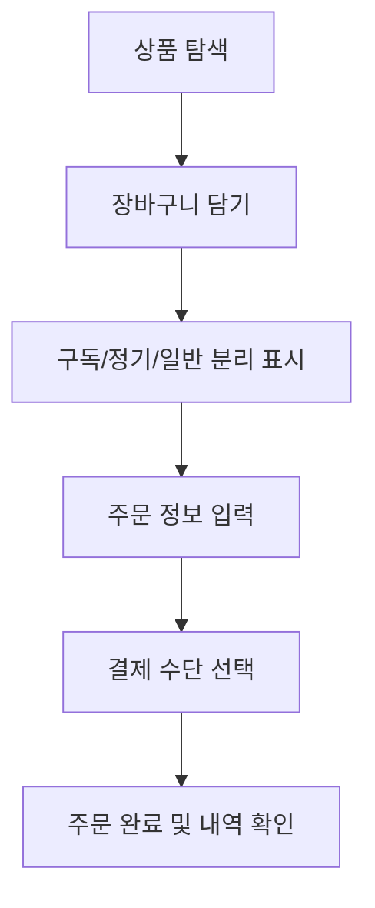

# 3. 핵심 기능 명세

## 3-1. 서론: 다양한 상품 유형을 지원하는 통합 커머스의 기능적 토대

구독, 정기결제, 일반 상품 등 다양한 유형의 상품을 하나의 플랫폼 내에서 원활하게 연동∙처리하기 위해서는 강력한 핵심 기능들과 사용자 중심의 구조가 필수적입니다. 본 장에서는 커머스 서비스 구현을 위한 필수 핵심 기능과 각 기능별 상세 프로세스를 중심으로 실제 시스템 설계에 바로 적용 가능한 수준으로 명세합니다.

---

## 3-2. 상품 탐색 및 검색 기능

### 3-2-1. 카테고리 기반 탐색
- 대분류, 중분류, 소분류로 나누어 상품군을 체계적으로 정렬
- 사용자 선택에 따라 직관적으로 하위 카테고리 진입
- 예시: '식품 > 신선식품 > 과일류' 등

### 3-2-2. 고급 검색/필터
- 가격, 할인율, 브랜드, 구독/정기/일반 여부 등 다중 필터 제공
- 인기순, 신상품, 사용후기 많은 순 정렬 옵션

### 3-2-3. 실시간 검색어 추천
- 이용자 입력 기반 연관 키워드 자동완성
- 최근 검색어 및 인기 검색어 노출

#### 기능 예시 시나리오
1. 사용자가 '정기배송 식품' 키워드 입력 → 실시간 추천 노출
2. 카테고리, 가격 등 추가 필터 → 원하는 상품 리스트 확인

---

## 3-3. 상품상세 페이지 및 정보 제공

- 단일 페이지 내 상품 유형(구독/정기/일반) 선택 및 가격, 옵션 노출
- 구독 상품은 등록/갱신주기, 해지정책, 혜택 상세 표시
- 정기결제는 횟수 설정, 결제주기, 예약/일시정지 옵션 제공
- 후기, 구매 Q&A, 추천 연관상품 자동 노출

#### 예시
- 사용자가 구독 상품 페이지에 진입 → '월간/주간' 구독 주기, 자동결제 방법, 구독 혜택(무료배송, 포인트 적립 등) 확인 가능

---

## 3-4. 장바구니 및 주문 프로세스

### 3-4-1. 장바구니
- 일반/구독/정기상품의 혼합 담기 지원
- 상품별 결제방식(단건/정기) 분리 관리
- 장바구니 내 옵션 변경, 수량·기간 편집 기능

### 3-4-2. 주문/결제 플로우
- 한 번의 주문에서 다양한 결제유형(일시, 구독, 정기) 동시 처리
- 결제수단: 신용카드, 간편결제, 무통장, 포인트 등
- 배송지, 받는 날짜 설정/변경 옵션

#### 사용자 플로우 (Mermaid)

---

## 3-5. 마이페이지 및 주문/구독 관리

- 주문내역, 구독 현황, 정기배송 일정 캘린더 방식 시각화
- 구독/정기 서비스 '일시정지, 변경, 해지' 직접 처리
- 정산/포인트 내역, 배송일정 알림

#### 예시 시나리오
- 사용자가 약정된 구독을 한 달 일시정지 신청 → 자동 결제일 및 배송 주기 자동 조정
- 포인트 적립률 높은 상품을 중심으로 회원등급 시스템 연동 제공

---

## 3-6. 추천 및 개인화 기능

- 구매 이력, 관심사, 검색 데이터 기반 상품 추천 엔진
- 머신러닝 기반 트렌드 파악, 개인별 맞춤 콘텐츠 노출
- 실험: 추천상품 클릭률 15% 이상 상승 목표

---

## 3-7. 알림 및 커뮤니케이션

- 결제/주문/배송 등 주요 이벤트별 푸시/문자/이메일 알림
- 구독 만기 안내, 결제 실패 알림, 혜택 안내 등
- 1:1 상담(톡/전화/이메일 등) 연동

---

## 3-8. 기능별 요약 표

| 구분       | 주요 기능                                                         | 시나리오 예시                          |
|------------|------------------------------------------------------------------|-----------------------------------------|
| 상품탐색   | 카테고리/검색/필터/추천                                          | 신선식품 정기배송 상품 고급 필터        |
| 장바구니   | 복수 유형 혼합담기, 옵션·기간 편집                              | 구독+일일구매 동시 결제 플로우          |
| 주문/결제  | 멀티 결제, 다양한 수단, 배송/일정 선택                         | 카드+포인트 결제, 원하는 날짜 지정       |
| 마이페이지 | 구독/정기/주문 한눈에 관리, 정보변경, 포인트관리                 | 구독 일시정지, 포인트 환급              |
| 추천/알림  | 개인화 추천, 다양한 알림                                        | 맞춤 추천 노출, 결제 실패 안내           |

---

다음은 서비스 메인 페이지 및 전체 구조에 대해 상세히 기술합니다.