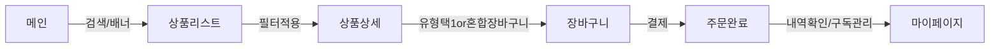

# 4. 메인 페이지 및 서비스 구조

## 4-1. 서론: 사용자 경험 중심의 UI/UX 설계 필요성

사용자는 실제 서비스 내비게이션, 상품 탐색, 결제, 개인화 서비스 경험에서 첫 인상을 강하게 받습니다. 본 장에서는 구독, 정기결제, 일반 상품의 복합 커머스 특성에 최적화된 전체 UI/UX, 정보 구조(IA), 화면 플로우, 실제 적용 사례, 반응형 웹 및 접근성 전략까지 체계적으로 설명합니다.

---

## 4-2. 서비스 전체 UI/UX 구성

### 4-2-1. 주요 레이아웃 요소
- **헤더:** 사이트 로고, 메인 내비게이션(B2C/B2B 구분), 검색창, 알림/마이페이지 보조 메뉴
- **메인 배너:** 프로모션, 인기 상품/구독추천, 이벤트 등 비주얼 강조 영역 분리
- **카테고리 메뉴:** 상단/좌측 영역에 트리 구조 카테고리 고정 노출(일반/구독/정기/이벤트 별도 표시)
- **상품 리스트:** 카드형/리스트형 자동 전환, 마케팅 배지 및 구독/정기 등 유형별 라벨
- **고정 퀵메뉴:** 최근 본 상품, 장바구니, 빠른 상담
- **푸터:** CS/법적 고지/정책/패밀리 사이트 등

### 4-2-2. 주요 페이지
- 홈(메인)
- 카테고리/검색 결과
- 상품상세
- 장바구니/주문결제
- 마이페이지(구독/정기관리 포함)
- 관리자/판매자 센터(별도 진입)

#### 주요 노출 영역 배치 예시
| 섹션          | 기능                                         |
|---------------|-----------------------------------------------|
| 상단배너      | 실시간 이벤트, 뉴스, 추천카테고리            |
| 구독추천      | 월간 인기 구독, 기간 한정 특가                |
| 신상품 영역   | 최신 등록 일반/구독 상품, 트렌드 상품소개    |
| 마이추천      | 유저별 최적화 추천상품/맞춤 프로모션         |
| 정보/가이드   | 정기결제/구독 사용법, 배송정책 주요 FAQ      |

---

## 4-3. 주요 화면 플로우 및 시나리오

### 4-3-1. 사용자 플로우(상세 프로세스)
- A. 메인 배너 또는 검색을 통한 상품 노출 접점 진입
- B. 카테고리 및 필터 적용 후 결과 리스트 이동
- C. 상품상세에서 구독/정기/일반 유형 및 조건 비교
- D. 장바구니 담기(혼합/분리 결제 UX)
- E. 주문결제 → 완료 후 마이페이지 진입
- F. 구독 및 정기배송 상태 모니터, 해지/변경/일시정지 처리

#### 플로우 다이어그램(Mermaid)

### 4-3-2. 반응형 설계 및 접근성
- PC/모바일/태블릿 자동 최적화: 카드형 그리드, 하단네비, 햄버거메뉴 채택
- 웹 표준 준수 및 시각장애인용 ARIA 라벨 적용, 폰트/컬러 대비 강화
- 터치/드래그 기반 조작, 비주얼 강조는 단순∙직관 우선
- 주요 버튼(구독/장바구니/구매 등) 위치 우측 하단 고정, 액션 쉬운 위치

---

## 4-4. 정보구조(IA) 설계

### 메인 IA 구조표
| 1Depth      | 2Depth                | 3Depth(선택)           |
|-------------|-----------------------|------------------------|
| 홈          | 프로모션, 추천상품    | 이벤트, 테마           |
| 카테고리    | 대/중/소분류         | 상품리스트             |
| 검색        | 최근/인기/필터적용    | 연관검색, 보관함        |
| 상품상세    | 설명/옵션/리뷰/FAQ   | 구독/정기 결제 옵션     |
| 마이페이지  | 주문/구독/정기/포인트| 배송지, 환불/CS         |
| 관리자센터  | 상품/회원/통계관리   | 정산, 매출, 공지        |

---

## 4-5. 실제 적용 예시 및 프로토타입 스냅샷
- 정기배송 사용자: 홈 - 구독추천 - 상품유형비교 - '정기배송 담기' 클릭 - 주문완료 - 마이페이지서 배송주기 확인 및 변경
- 일반 상품 사용자: 인기메뉴/카테고리 진입 - 신상품/특가 구매 - 포인트 사용 결제 - 구매확정
- 관리자/판매자: 카테고리 등록 - 상품별 유형 태그 - 공지사항 배포 - 실시간 주문/정산 확인

---

다음 단계에서는 상품 유형별 시나리오(구독, 정기결제, 일시구매) 항목을 상세히 서술합니다.