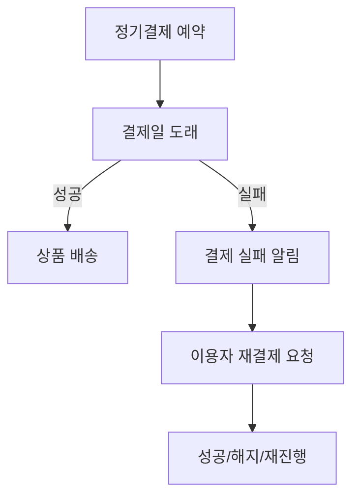
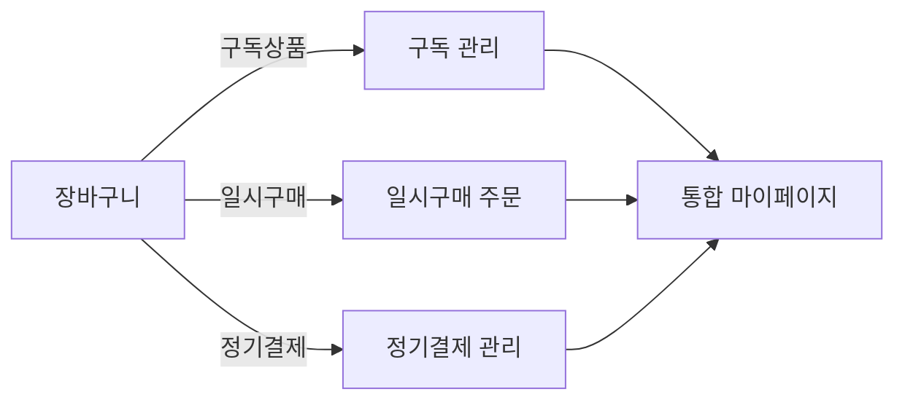

# 5. 상품 유형별 시나리오(구독, 정기결제, 일시구매)

## 5-1. 서론: 유형별 서비스 플로우의 실제적 설계 필요성

커머스 플랫폼의 경쟁력은 다양한 상품 유형(구독, 정기결제, 일반 일시구매)을 사용자 관점에서 어떻게 손쉽게 구매·관리·전환할 수 있게 하느냐에 달려 있습니다. 본 장은 실무 기획 및 시스템 개발에 바로 활용할 수 있도록 각 상품 유형별 실제 시나리오, 업무 플로우, 혼합 구매/관리 패턴을 상세히 서술합니다.

---

## 5-2. 구독 상품 시나리오

### 5-2-1. 구독 상품 구매 플로우
1. **메인/카테고리 접속** → 구독 전용 프로모션/추천 영역 클릭
2. 관심 상품 진입 → 구독 주기(월/주/분기 등), 조건(정기결제 금액, 추가 혜택 등) 확인
3. 상품 옵션(수량, 색상 등) 선택 → ‘구독 시작’ 클릭
4. 결제 수단 지정(카드/계좌/포인트 복합 지원)
5. 약관 동의 및 최초 결제 진행 → 최종 구독 등록 완료
6. 마이페이지 ‘구독관리’ 탭에서 구독 현황, 다음 결제일, 해지/일시정지 옵션 제공

#### 예시 시나리오
- A씨(직장인): 생활용품 정기배송을 구독. 서비스가 월1회 결제/배송을 자동 관리하며, 배송 주기 및 품목을 앱에서 실시간 변경 가능. 해지시 바로 반영.

#### 구독 상품 상세 기능표
| 단계        | 사용자 동작         | 시스템 처리 및 결과                         |
|-------------|---------------------|---------------------------------------------|
| 상품 탐색   | 구독상품 라벨 선택 | 유형별 옵션/혜택 구분하여 안내              |
| 옵션 설정   | 구독주기, 수량 선택 | 주기/옵션/금액 실시간 반영                  |
| 결제 및 동의| 결제수단 지정, 동의 | 정기결제 예약등록, 최초 결제 즉시 이력 생성  |
| 관리/해지   | 마이페이지 접근     | 현재 상태, 해지/일시정지, 결제·배송 내역 제공|

---

## 5-3. 정기결제(자동결제) 상품 시나리오

### 5-3-1. 정기결제 적용 및 관리 플로우
1. 상품상세 진입 → ‘정기결제’ 옵션 선택
2. 결제 주기 직접(매주/격주/월) 세팅 혹은 추천 플랜 선택
3. 최초 결제 진행, 정기결제 카드/계좌 정보 등록
4. 시스템이 결제일 자동 계산, 지정일 전 사전 알림 발송
5. 주기마다 자동결제·배송 처리, 결제 실패시 재시도/알림
6. 마이페이지에서 결제 정보 변경, 일시정지, 해지 가능(잔여기간 산정)

#### 정기결제 성공/실패 플로우(Mermaid)

#### 예시
- B씨(1인 가구): 반려동물 사료를 격주로 정기결제. 결제카드 교체 필요시 바로 변경, 2회 이상 결제 실패시 자동 해지.

---

## 5-4. 일반 상품(일시구매) 시나리오

### 5-4-1. 일시구매 플로우
1. 카테고리/검색 → 상품 선택
2. 옵션 지정, 수량 변경 후 ‘바로구매’ 선택
3. 결제수단 지정 및 단건 주문
4. 배송정보 입력/확정 → 구매 완료 후 마이페이지 내 내역 및 CS 사용

#### 예시
- C씨(대학생): 신상품 한정판 일시구매, 포인트 일부 사용, 다음 운동화 구매시 적립금 활용.

---

## 5-5. 상품 유형 혼합구매 및 관리 시나리오

### 5-5-1. 혼합 구매 장바구니·주문 프로세스
- 사용자가 구독+일반/정기상품 혼합 장바구니 구성 가능
- 결제단에서 유형별로(구독/정기/일시) 묶음 분리, 결제 방식 차등 적용
- 배송 정책: 결합배송/개별배송 선택 허용(EMS, 시간예약, 묶음 옵션 등)
- 마이페이지에서 각 주문별 상세 내역/정산/포인트내역 실시간 제공

#### 혼합 관리 예시 플로우(Mermaid)

---

## 5-6. 표로 정리하는 유형별 서비스 차이점
| 구분      | 가입방식      | 결제주기  | 관리방식              | 고객혜택                 | 예시             |
|-----------|---------------|-----------|-----------------------|--------------------------|------------------|
| 구독      | 단순/1회가입  | 고정      | 앱/웹 해지·변경·일시정지| 멤버십, 무료배송, 전용쿠폰| 넷플릭스, 정기배송 |
| 정기결제  | 상품별 개별   | 선택∙변경 | 마이페이지 직접설정·변경 | 가격할인, 반복배송지원   | 반려동물 사료     |
| 일시구매  | 단건주문      | 없음      | 주문취소/CS주요         | 적립금, 신상품, 이벤트참여| 신발/전자제품 등  |

---

## 5-7. 실제 운영/구현 특이점 정리
- 해지/일시정지/복구/이력 등 복잡 트랜잭션 관리 필요
- 혼합/다중 결제 UX설계: 분리/묶음 최적화
- 알림, 약관, 개인정보 동선별 분기처리 필수 등

---

다음 단계에서는 결제 시스템 설계 항목을 심도 있게 설명합니다.