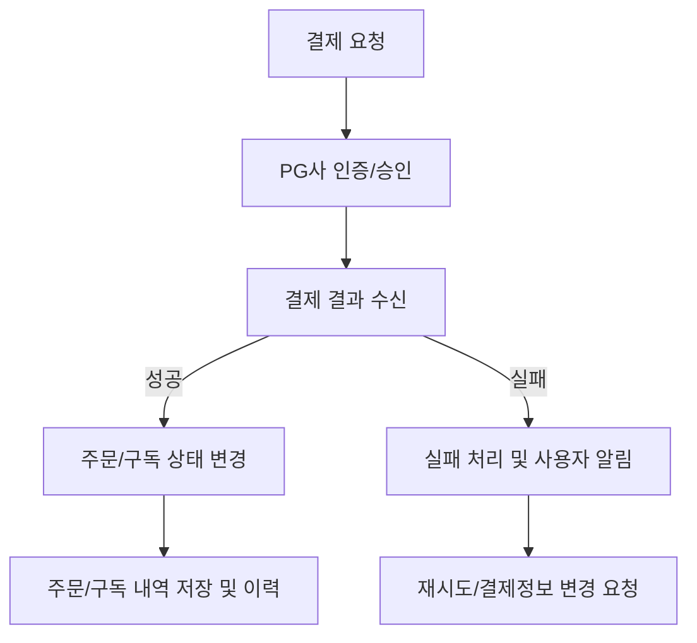
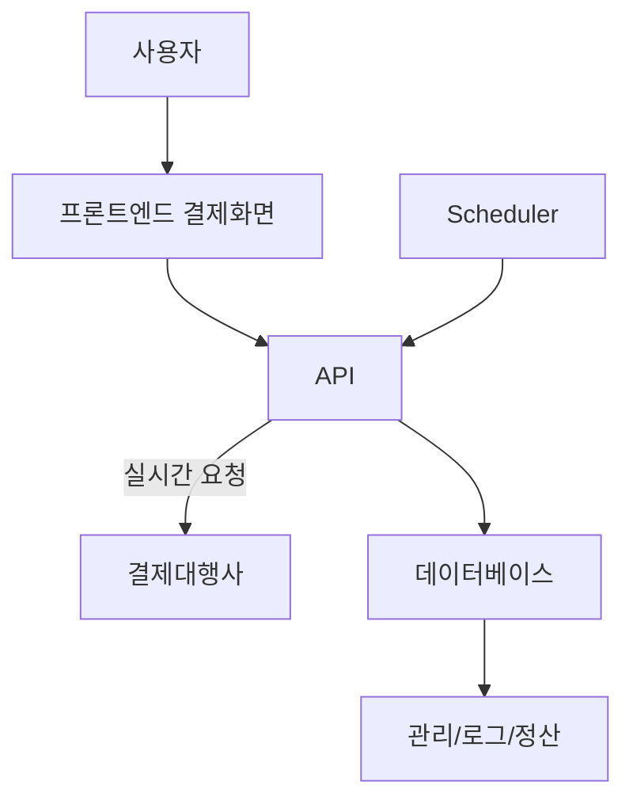

# 6. 결제 시스템 설계

## 6-1. 서론: 복합 커머스 환경에서의 결제 시스템 핵심 요건

구독형, 정기결제, 일시구매 등 다양한 결제 유즈케이스를 단일 플랫폼에서 처리하기 위해서는 결제수단 다양화, 데이터 흐름의 안정성, 반복결제와 단일결제의 유연한 연동, 그리고 결제 실패 등 각종 예외 처리의 체계화가 필수입니다. 여기서는 각 결제 유형별 시스템 설계, 보안 정책, 주요 로직, 실 서비스 적용상의 유의점까지 실질적으로 분석하였습니다.

---

## 6-2. 결제 유형별 상세 설계

### 6-2-1. PG(결제대행) 연동 결제
- 주요 PG사와 API 실시간 연동: 카드, 계좌이체, 간편결제, 휴대폰, 가상계좌 등 지원
- 결제 승인·거절 실시간 처리 및 내역 저장
- 사용자 결제 UI/UX는 모든 결제수단에서 일관성 제공

### 6-2-2. 정기결제/구독 결제
- 최초 한 번 결제정보(토큰) 등록 → 주기별 자동 결제 스케줄러 연동
- 주기 전 사전 알림(SMS/앱푸시), 자동재시도, 결제실패 시 상태변경/해지 처리
- 카드/계좌 만료 등 결제정보 갱신, 정기결제 동의 및 약관 이력 관리

### 6-2-3. 복합 결제 및 일시결제
- 구독/정기결제와 일시구매를 동일 장바구니 내 병렬 주문 허용, 유형별 결제 분리 처리
- 신용카드/포인트 복합결제(먼저 포인트 차감 후 카드 결제 블렌딩)
- 무통장 입금시 가상계좌 자동 생성 및 자동 매칭 기능

---

## 6-3. 결제 처리 주요 로직 및 데이터 흐름

### 6-3-1. 결제 데이터 처리 플로우(Mermaid)

### 6-3-2. 정기결제 자동화 처리
- 스케줄러(Quartz/batch): 매일/주간/월간 결제대상 추출→자동 결제 리퀘스트→결과업데이트
- 결제 실패시 최대 1~3회 자동재시도 로직, 2회 이상 연속 실패시 사전 해지 및 CS연락 프로세스 탑재

---

## 6-4. 결제 시스템 아키텍처

- Presentation Layer: 결제/구독 등록, 사용자 알림, 마이페이지내 결제 정보 관리
- API Layer: PG/간편결제 연동, 토큰 관리, 거래상태 CRUD, 비동기/동기 흐름 병행
- DB Layer: 결제이력, 구독이력, 카드/계좌/포인트 등 민감정보 마스킹/암호화 저장
- Scheduler/Batch: 주기적 자동결제, 상태 트리거, 만기/실패 알림 등

#### 아키텍처 다이어그램(Mermaid)

---

## 6-5. 결제 실패 및 오류 처리 시나리오

| 실패유형   | 주요 시나리오             | 시스템 처리                     | 사용자 알림            |
|------------|--------------------------|----------------------------------|-----------------------|
| 인증실패   | 카드정보 오류, 한도초과  | 실패 로그, 재입력 요청           | 즉시 안내 + 재시도 유도|
| 만료/정지  | 카드 만료, 계좌 해지     | 결제정보 갱신 안내 팝업/푸시      | 결제정보 수정 알림     |
| PG오류     | 일시적 네트워크/POS 중단 | 결제 재시도, 고객센터 자동 연결  | 사과 + 재도전 안내     |
| 반복실패   | 2~3회 연속 오류          | 자동구독/주문 중지, CS 전달      | 해지/중지 안내         |

---

## 6-6. 보안 정책 및 주요 운영 유의점
- 고객 결제정보 암호화(PCI DSS, 토큰화 등)와 접근권한 엄격관리
- 결제/취소/환불 로그의 비가역성 보장 및 이력 감사
- 스케쥴러/배치 모듈 이중화, 실시간 모니터링 및 장애 자동알림
- 비정상 결제 패턴(스팸, 반복실패, 무단접근 등) 탐지 자동화

---

## 6-7. 실제 서비스 적용 예시
- 구독형 서비스: 신규 구독 등록→카드등록→월 마다 자동청구, 결제정보 만기시 팝업/푸시 발송
- 복합 상품: 정기배송+일시구매 동시 주문→포인트+카드 결제 분리 처리가 한 번에, 실시간 분할 정산
- CS: 결제 장애 시 실시간 CRM/콜센터 접점 안내 및 관리 시스템 자동 생성

---

다음 단계에서는 관리자(Back Office) 기능 설계 항목을 상세히 다룹니다.