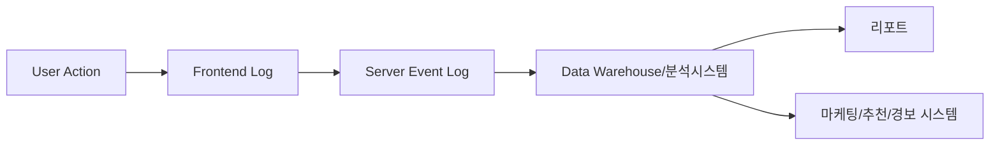

# 8. 데이터 분석 항목 및 활용

## 8-1. 서론: 데이터 드리븐 커머스의 시대

커머스의 경쟁력은 실시간 고객 행동과 트랜잭션 데이터 수집, 고도화된 분석 및 예측, 그리고 데이터 기반 자동화∙의사결정 시스템에서 비롯됩니다. 본 장에서는 주요 커머스 KPI 정의, 데이터 수집 구조, 분석 방법, 리포팅 사례, 활용 플로우, 개인정보보호 전략, 서비스 개선 실전 사례를 심도 있게 기술합니다.

---

## 8-2. 주요 데이터 지표(KPI) 정의

### 핵심 매출/고객 지표
- **MAU/DAU:** 월/일간 활성사용자 수
- **구매전환율(CVR):** 방문자 대비 실제 구매자 비율
- **구독유지율(Churn/Retention):** 이탈/유지 비율(월, 분기)
- **평균 객단가/AOV:** 고객 1인당 평균 구매 금액
- **구독/정기결제 성공률:** 자동결제 정상 비율
- **반복구매율:** 3회 이상 재구매 고객 비중
- **장바구니 이탈율:** 담기 대비 결제 완료 비율

### 트랜잭션/운영 지표
- 주문수/취소/환불 비율, 정기결제 실패율
- CS문의 유형별 분포 및 응답률, 응대시간
- 재고 회전율, 품절 알림 응답률

---

## 8-3. 데이터 수집 및 분석 구조

### 8-3-1. 데이터 플로우 개요
- 프론트(웹/앱): Behavior, 클릭로그, 장바구니/구매/해지/경로 수집
- 서버: 주문/결제/구독이력, CS, 정산, 운영 로그 집계
- 외부 API: PG, 배송, 마케팅 등 제3자 데이터 연동

#### 데이터 파이프라인(Mermaid)

---

## 8-4. 데이터 분석 및 예측모델

- 고객군 세분화(클러스터링/코호트)
- LTV(고객생애가치)예측 모델 구축
- 이탈/리텐션 예측(Churn Prediction)
- 추천 모델(최근구매, 관심사, 베스트, 개인화 알고리즘)
- 결제 실패/이상거래 알림 모델

#### 예측 모델 적용 예시
| 분석목적   | 모델/알고리즘      | 활용전략                        |
|------------|---------------------|----------------------------------|
| 리텐션     | Churn Tree, SVM     | 해지 위험군 타겟 전용 쿠폰 발송  |
| 추천       | Collaborative Filtering| 연관/맞춤상품, 홈화면 자동배치   |
| LTV        | 회귀/신경망         | 고가치고객 우대 전략             |

---

## 8-5. 실시간 리포트/BI 대시보드

- 주문/매출/구독/반복구매 현황 실시간 집계
- BI툴(Qlik, Tableau, PowerBI 등) 자동 연동 대시보드
- 마케팅 캠페인별 실적 비교 리포트
- 관리자/사업자별 맞춤 ‘내 통계’ 페이지 지원

---

## 8-6. 데이터 기반 서비스 개선 플로우

1. 핵심 이탈 및 전환구간 진단(구매전환율, 이탈모수 정밀 진단)
2. KPI 악화 원인, 고객 행동별 로그 딥다이브 분석
3. 우선순위별 개선(A/B테스트, UX수정, CRM타겟팅)
4. 개선 후 데이터 기반 효과 분석, 반복 최적화

---

## 8-7. 개인정보 및 데이터 보안

- 개인정보/특정 거래내역 암호화 및 마스킹, 비식별화 정책(데이터 최소화 수집)
- 접근권한·API권한 분리, 감사로그 모니터링
- 개인정보 이용/파기 및 옵트아웃 정책(사용자 제어)

---

## 8-8. 실제 서비스 적용 및 활용 예시

- 신규구매→구독전환 행동분석으로 구독전용 할인 캠페인 기획
- 최근 3회 연속 결제실패 고객 자동 콜센터 연결
- 반복구매 군에만 멤버십 등급업 부여 및 전용 마케팅 동작
- 실시간 이탈경보시 AI챗봇 쿠폰 발급 후 LTV 실제 증가 확인

---

끝으로, 플랫폼 확장성과 향후 발전 전략을 상세히 기술합니다.