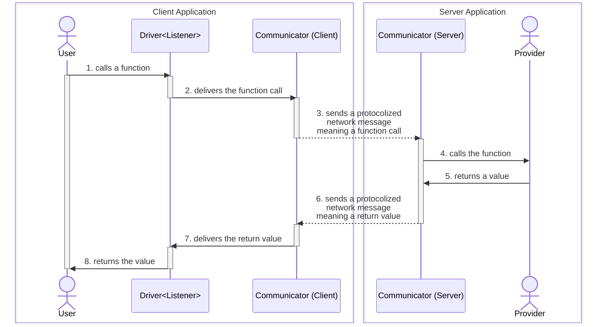

import { Tabs } from "nextra/components";

## `@autobe/rpc`
RPC module of AutoBE for WebSocket Communication.

If you are considering to develop AI chatbot application development, WebSocket protocol is essentially required. Chatting application is basically a two-way communication. AI chatbot is also a two-way chat between an user and an assistant, based on events. Therefore, it cannot be a one-way communication HTTP Restful API, and a two-way protocol such as WebSocket is required.

However, don't be afraid of WebSocket application development. Below is the example codes of WebSocket application development utilizing `@autobe/rpc` in both client and server side. Look at the example codes, and feel how easy and type-safe it is.

<Tabs items={[
  "Client Application",
  "NodeJS Server",
  "NestJS Server",
]}>
  <Tabs.Tab>
```typescript filename="client/src/main.ts" showLineNumbers copy
import { IAutoBeRpcListener, IAutoBeRpcService } from "@autobe/rpc";
import { Driver, WebSocketConnector } from "tgrid";

const connector: WebSocketConnector<
  null,
  IAutoBeRpcListener<"chatgpt">,
  IAutoBeRpcService<"chatgpt">
> = new WebSocketConnector(null, {
  text: async (evt) => {
    console.log(evt.role, evt.text);
  },
  describe: async (evt) => {
    console.log("describer", evt.text);
  },
});
await connector.connect("ws://localhost:3001");

const driver: Driver<IAutoBeRpcService<"chatgpt">> = 
  connector.getDriver();
await driver.conversate("Hello, what you can do?");
```
  </Tabs.Tab>
  <Tabs.Tab>
```typescript filename="nodejs/src/main.ts" showLineNumbers copy
import { AutoBeAgent } from "@autobe/agent";
import {
  AutoBeRpcService,
  IAutoBeRpcListener,
  IAutoBeRpcService,
} from "@autobe/rpc";
import { WebSocketServer } from "tgrid";

const server: WebSocketServer<
  null,
  IAutoBeRpcService<"chatgpt">,
  IAutoBeRpcListener<"chatgpt">
> = new WebSocketServer();
await server.open(3_001, async (acceptor) => {
  const agent: AutoBeAgent<"chatgpt"> = new AutoBeAgent({ ... });
  const service: AutoBeRpcService<"chatgpt"> = 
    new AutoBeRpcService({
      agent,
      listener: acceptor.getDriver(),
    });
  await acceptor.accept(service);
});
```
  </Tabs.Tab>
  <Tabs.Tab>
```typescript filename="nestjs/src/chat.controller.ts" showLineNumbers copy
import { AutoBeAgent } from "@autobe/agent";
import { AutoBeRpcService, IAutoBeRpcListener } from "@autobe/rpc";
import { WebSocketRoute } from "@nestia/core";
import { Controller } from "@nestjs/common";
import { WebSocketAcceptor } from "tgrid";

@Controller("chat")
export class ChatController {
  @WebSocketRoute()
  public async start(
    // @WebSocketRoute.Param("id") id: string,
    @WebSocketRoute.Acceptor()
    acceptor: WebSocketAcceptor<
      null, // header
      AutoBeRpcService<"chatgpt">,
      IAutoBeRpcListener<"chatgpt">
    >,
  ): Promise<void> {
    const agent: AutoBeAgent<"chatgpt"> = new AutoBeAgent({ ... });
    const service: AutoBeRpcService<"chatgpt"> = 
      new AutoBeRpcService({
        agent,
        listener: acceptor.getDriver(),
      });
    await acceptor.accept(service);
  }
}
```
  </Tabs.Tab>
</Tabs>


## Setup
### NodeJS Server
<Tabs items={['npm', 'pnpm', 'yarn']}>
  <Tabs.Tab>
```bash filename="Terminal" copy
npm install @autobe/agent @autobe/compiler
npm install @autobe/rpc tgrid
npx typia setup
```
  </Tabs.Tab>
  <Tabs.Tab>
```bash filename="Terminal" copy
pnpm install @autobe/interface @autobe/rpc tgrid
pnpm typia setup
```
  </Tabs.Tab>
  <Tabs.Tab>
```bash filename="Terminal" copy
# YARN BERRY IS NOT SUPPORTED
yarn add @autobe/core @samchon/openapi typia
yarn add @autobe/rpc tgrid
yarn typia setup
```
  </Tabs.Tab>
</Tabs>

To develop NodeJS WebSocket server of AI chatbot, you need to install these packages.

At first, you have to setup [`@autobe/agent`](/docs/agent), [`@samchon/openapi`](https://github.com/samchon/openapi) and [`typia`](https://typia.io) basically to construct agent. `@samchon/openapi` is a library defining LLM function calling schemas, and their converters from the Swagger/OpenAPI documents. And `typia` is a framework which can compose LLM function calling schemas from a TypeScript class type by compiler skills.

At next, setup `@autobe/rpc` and [`tgrid`](https://tgrid.com) packages. `tgrid` is a TypeScript based RPC (Remote Procedure Call) framework supporting WebSocket protocol, and `@autobe/rpc` is an wrapper module of `@autobe/core` following the WebSocket RPC.

At last, run `npx typia setup` command. It's because `typia` is a transformer library analyzing TypeScript source code in the compilation level, and it needs additional setup process transforming TypeScript compiler via [`ts-patch`](https://github.com/nonara/ts-patch).

### NestJS Server
<Tabs items={['npm', 'pnpm', 'yarn']}>
  <Tabs.Tab>
```bash filename="Terminal" copy
npm install @nestjs/common @nestjs/core @nestjs/platform-express
npm install @autobe/agent @autobe/interface @autobe/compiler
npm install @autobe/rpc tgrid

npm install -D nestia
npx nestia setup
```
  </Tabs.Tab>
  <Tabs.Tab>
```bash filename="Terminal" copy
pnpm install @nestjs/common @nestjs/core @nestjs/platform-express
pnpm install @autobe/core @samchon/openapi
pnpm install @autobe/rpc tgrid

pnpm install -D nestia
pnpm nestia setup
```
  </Tabs.Tab>
  <Tabs.Tab>
```bash filename="Terminal" copy
# YARN BERRY IS NOT SUPPORTED
yarn add @nestjs/common @nestjs/core @nestjs/platform-express
yarn add @autobe/core @samchon/openapi
yarn add @autobe/rpc tgrid

yarn add -D nestia
yarn nestia setup
```
  </Tabs.Tab>
</Tabs>

Install NestJS and `@autobe` packages, and then setup `nestia`.

[`@nestia`](https://nestia.io) is a set of helper libraries for NestJS, enhancing type safety and productivity by combining with [`typia`](https://typia.io) which can compose LLM function calling schemas from a TypeScript class type by compiler skills.

Also, `@nestia` makes NestJS to support the WebSocket protocol, so it is essential.

### Client Application
<Tabs items={['npm', 'pnpm', 'yarn']}>
  <Tabs.Tab>
```bash filename="Terminal" copy
npm install @autobe/rpc tgrid
npm install @autobe/core @samchon/openapi
```
  </Tabs.Tab>
  <Tabs.Tab>
```bash filename="Terminal" copy
pnpm install @autobe/core @autobe/rpc tgrid
pnpm install @autobe/core @samchon/openapi
```
  </Tabs.Tab>
  <Tabs.Tab>
```bash filename="Terminal" copy
yarn add @autobe/core @autobe/rpc tgrid
yarn add @autobe/core @samchon/openapi
```
  </Tabs.Tab>
</Tabs>

Just install `@autobe/core`, `tgrid` packages.

If you want to develop advanced features not only handling text contents but also manging LLM function calling schemas like [#Arguments Hooking](/docs/websocket/client/#arguments-hooking) case, you need to setup `@autobe/core` and [`@samchon/openapi`](https://samchon.github.io/openapi) packages too

As client application does not generate LLM function calling schema, it does not need additional setup process for compiler transformation. 


## Remote Procedure Call


WebSocket protocol with RPC paradigm for AI chatbot.

### Header
Header value delivered from client to server after the connection.

In [`TGrid`](https://tgrid.com)'s RPC (Remote Procedure Call) paradigm, header means a value that is delivered after the connection from a client to the server. And header is used in most cases to authenticate the connecting client.

In the above example project, `IAuthorizationHeader` is the header type, and is used by server to determine whether to accept the client's connection or not. If the client's header is not valid, the server would reject the connection.

### Provider
Functions provided from remote system.

Provider is an object instance containing some functions provided for the remote system for RPC (Remote Procedure Call). In many cases, the provide becomes a class instance containing some methods to be called, but it is okay that composing the provider by just an interface type.

Also, the opposite remote system will call provider's functions by the [`Driver<Remote>`](#driver) instance. In the above example, client application is providing `IAutoBeRpcListener` to the server, and server is providing `AutoBeRpcService` (`IAutoBeRpcService`) to the client.

### Driver
Driver of RPC (Remote Procedure Call).

`Driver` is a proxy instance designed to call functions of the remote system. It has a generic argument `Remote` which means the type of remote system's [Provider](#provider), and you can remotely call the functions of the [Provider](#provider) asynchronously through the `Drive<Remote>` instance.

When you call some function of remote [Provider](#provider) by the `Driver<Listener>` instance, it hooks the function call expression, and delivers the function name and arguments (parameter values) to the remote system through the [Communicator](#communicator). If the remote system succeeded to reply the result of the function call, [Communicator](#communicator) resolves the promise of the function call expression with the result, so that makes `Driver<Remote>` working.

In the above example, client application is calling `IAutoBeRpcService.conversate()` function remotely through the `Driver<IAutoBeRpcService>` typed instance. In that case, `IAutoBeRpcService` is the [Provider](#provider) instance from server to client.