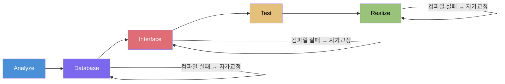
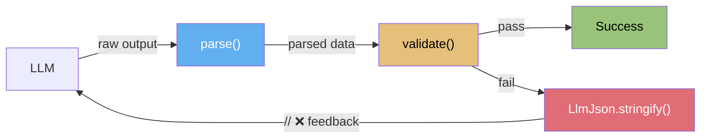

import AutoBeDemoMovie from "../../movies/demo/AutoBeDemoMovie";

> **TL;DR**
>
> 1. Claude Code — npm 사고로 공개된 512,000줄
>    - `while(true)` + 40개 도구 자율 선택 + 4계층 컨텍스트 압축
>    - 6중 보안 방어, Coordinator Mode, `SYSTEM_PROMPT_DYNAMIC_BOUNDARY`
>    - 2세대: 사람이 주도하고, AI가 보조한다
> 2. [AutoBE](https://github.com/wrtnlabs/autobe) — 정반대의 설계
>    - 4개 AST × 4단계 컴파일러 × 자가교정 루프
>    - 74개 오케스트레이터, 58개 History Transformer, `executeCachedBatch`
>    - 3세대 지향: AI가 생성하고, 컴파일러가 검증한다
> 3. 읽고 나서 — 배운 것
>    - 캐시 경계 명시화, 타입 이름으로 정책 강제, self-contained prompt 원칙
>    - 다른 길, 같은 통찰: 검증할 수 있으면 수렴한다

# AutoBE vs Claude Code

## 1. 발단

2026년 4월. Anthropic 엔지니어가 `.npmignore` 없이 `npm publish`를 실행했다. Claude Code의 전체 소스코드 — **512,000줄, 1,900개 파일** — 이 몇 시간 동안 npm 레지스트리에 올라왔다.

우리는 그 소스코드를 보자마자 일정을 비웠다. 마침 에이전트 오케스트레이션을 본격적으로 공부하려던 참이었다. 세상에서 가장 많이 쓰이는 AI 코딩 에이전트의 내부 설계도 — 이보다 좋은 교재는 없었다.

---

## 2. AutoBE란

[AutoBE](https://github.com/wrtnlabs/autobe)는 오픈소스 AI 백엔드 자동 생성 에이전트다. "쇼핑몰 백엔드 만들어줘"라고 하면, 요구사항 분석부터 DB 설계, API 명세, E2E 테스트, NestJS 구현 코드까지 통째로 만든다.

<AutoBeDemoMovie model="qwen/qwen3.5-122b-a10b" />

### 2.1. LLM은 코드를 쓰지 않는다

대부분의 AI 코딩 에이전트는 LLM에게 "이 코드를 써"라고 하고 반환된 텍스트를 파일에 저장한다. AutoBE는 다르다.

AutoBE는 **Function Calling**을 쓴다. LLM이 자유 텍스트 대신 미리 정의된 JSON Schema — 즉 AST(추상 구문 트리) — 를 채운다. 빈 페이지에 글을 쓰는 게 아니라, 양식을 채우는 것이다. 양식이 채워지면 컴파일러가 검증하고, 실제 코드로 변환한다. **LLM이 구조를 채우면, 컴파일러가 코드를 쓴다.**

5단계 파이프라인 전체에 이 원리가 적용된다:

| 단계 | LLM이 채우는 구조 | 컴파일러 검증 |
|------|------------------|-------------|
| 요구사항 | [`AutoBeAnalyze`](https://github.com/wrtnlabs/autobe/blob/main/packages/interface/src/analyze/AutoBeAnalyze.ts) — 구조화된 SRS | 구조 검증 |
| DB 설계 | [`AutoBeDatabase`](https://github.com/wrtnlabs/autobe/blob/main/packages/interface/src/database/AutoBeDatabase.ts) — DB 스키마 AST | Database Compiler |
| API 설계 | [`AutoBeOpenApi`](https://github.com/wrtnlabs/autobe/blob/main/packages/interface/src/openapi/AutoBeOpenApi.ts) — OpenAPI v3.2 스펙 | OpenAPI Compiler |
| 테스트 | [`AutoBeTest`](https://github.com/wrtnlabs/autobe/blob/main/packages/interface/src/test/AutoBeTest.ts) — 30+ 표현식 타입 | Test Compiler |
| 구현 | 모듈화된 코드 (Collector/Transformer/Operation) | TypeScript Compiler |

각 AST는 LLM이 생성할 수 있는 것을 엄격히 제한한다. 예컨대 `AutoBeDatabase`의 필드 타입은 7가지만 허용된다: `"boolean" | "int" | "double" | "string" | "uri" | "uuid" | "datetime"`. `"varchar"`를 쓸 수 없다 — 선택지에 없으니까. **스키마가 곧 프롬프트다** — 모호하지 않고, 모델에 의존하지 않으며, 기계적으로 검증 가능하다.



### 2.2. Function Calling Harness

하지만 LLM이 채워야 하는 구조는 단순하지 않다. DTO 타입을 정의하는 `IJsonSchema`는 10가지 변형의 재귀적 유니언 타입이다:

```typescript
export type IJsonSchema =
  | IJsonSchema.IBoolean
  | IJsonSchema.IInteger
  | IJsonSchema.INumber
  | IJsonSchema.IString
  | IJsonSchema.IArray      // items: IJsonSchema ← 재귀
  | IJsonSchema.IObject     // properties: Record<string, IJsonSchema> ← 재귀
  | IJsonSchema.IReference
  | IJsonSchema.IOneOf      // oneOf: IJsonSchema[] ← 재귀
  | IJsonSchema.INull
  | IJsonSchema.IConstant;
```

10가지 변형이 3단계 깊이로 중첩되면 1,000개의 가능한 경로. `qwen3-coder-next`의 첫 시도 성공률: **6.75%**. 업계 컨센서스대로라면, 이 수준의 복잡한 Function Calling은 "하지 마라"다.

우리는 포기할 수 없었다. 구조화된 출력 없이는 기계적 검증이 불가능하고, 검증 없이는 피드백 루프가 불가능하고, 피드백 루프 없이는 보장이 불가능하니까.

그래서 만든 것이 [Function Calling Harness](/blog/function-calling-harness-qwen-meetup-korea)다. [Typia](https://github.com/samchon/typia)의 3계층 인프라가 핵심이다:



- **`parse()`** — 깨진 JSON 복구. 마크다운 코드 블록 제거, 닫히지 않은 문자열 완성, 따옴표 없는 키 허용, 타입 강제 변환, 이중 직렬화(`"{\\"type\\":\\"card\\"}"`) 재귀적 복원
- **`validate()`** — 스키마 위반 감지. 각 필드의 정확한 경로와 기대 타입을 구조화
- **`LlmJson.stringify()`** — LLM이 읽을 수 있는 피드백 생성. 원본 JSON 위에 `// ❌` 인라인 에러 마커

LLM은 자기 출력 위에 표시된 에러만 고치면 된다. 이 루프가 6.75%를 100%로 만든다. 그 위에 AutoBE의 4단계 컴파일러(Database → OpenAPI → Test → TypeScript)가 시스템 수준의 자가교정 루프를 추가한다. **Function Calling 수준 + 컴파일러 수준의 이중 검증**이 99.8%+ 컴파일 성공률의 원동력이다.

---

## 3. 왜 하필 지금이었나

### 3.1. 의도적으로 멍청하게 만들었다

솔직히 말하면, AutoBE는 지금까지 에이전트 오케스트레이션에 세심한 주의를 기울인 적이 없다. **의도적으로.**

워크플로우를 가장 단순한 형태로 유지했다. 폭포수 모델에 따라 일방향으로만 흐르고, AI의 자기 리뷰는 한 번뿐이었으며, 코드 생성 기회도 한 번뿐이었다. 여기에 더해, 의도적으로 **지나치게 똑똑한 AI 사용도 금지**했다. 소형 모델(`qwen3-30b-a3b`, 3B active)로 반복 실험했다. 이유는 세 가지였다.

**첫째, 안정성.** 각 파이프라인 단계의 성공률을 격리해서 측정해야 했다. 오케스트레이션이 복잡해지면, 어느 단계가 실패했는지 파악하기 어려워진다. 단순한 파이프라인에서는 "Database 단계에서 FK 참조가 깨졌다"가 명확하다. 복잡한 오케스트레이션에서는 "어딘가에서 뭔가가 틀렸다"가 된다.

**둘째, 디버깅.** AI가 자율적으로 개입하는 단계가 많을수록, 실패 원인 추적이 기하급수적으로 어려워진다. 에이전트 A가 교정한 것을 에이전트 B가 다시 건드리고, 에이전트 C가 그 결과를 또 수정하면 — 근본 원인이 묻힌다.

**셋째, 그리고 가장 중요한 것: 취약점 은폐 방지.** 똑똑한 AI와 정교한 워크플로우는 시스템의 취약점을 **스스로 감추어버린다.** Database 단계에서 잘못된 스키마가 생성되어도, 뒤이은 Interface 단계의 AI가 "알아서" 보정해버리면, 우리는 Database 단계의 취약점을 영원히 모른다. 소형 모델이 노출한 취약점은 대형 모델에서도 존재한다 — 단지 덜 자주 드러날 뿐이다. "덜 자주"는 프로덕션에서 "가끔"이 되고, "가끔"은 장애가 된다.

그래서 일부러 — 소형 모델로, 단순한 파이프라인에서, AI 개입을 최소화한 채로 — 각 단계의 validation만 빡빡하게 조였다.

### 3.2. 100%를 부수고 다시 만들다

[이전에 100% 컴파일 + 런타임 성공률을 달성한 적이 있다](/blog/autobe-broke-100-percent-success-rate-on-purpose). 그런데 더 높은 품질을 위해 과감히 부수고 다시 만들었다.

이전 AutoBE는 한국 SI 방법론처럼 모든 API 함수를 완전히 독립적으로 생성했다. 코드 재사용 없이 각 함수가 자기완결적. 컴파일은 쉽고 성공률은 높지만, 생성물은 "일회용 프로토타입"이었다. 요구사항이 바뀌면? 전체를 다시 생성해야 했다.

모듈화(Collector/Transformer/Operation 분리)를 도입했다. 성공률이 **40%로 급락**했다. 모듈 간 순환 의존, import 순서, 경계 타입 추론 — 독립 함수에서는 존재하지 않던 문제들이 폭발했다. 다시 100%까지 복구하는 데 수개월이 걸렸다.

지금의 AutoBE는 모듈 간 의존성이 있는 유지보수 가능한 코드를 생성한다. 그 대가로 컴파일 난이도가 폭증했지만, Function Calling Harness와 컴파일러 강화로 극복했다.

### 3.3. 기교를 부릴 때가 왔다

지금은 컴파일 100%를 완전히 달성한 상태다. 런타임 100%는 아직 진행 중이다.

이 시점에서 선언했다:

> "컴파일 100%를 확보한 기반 위에, 이제 기교를 부리기 시작한다."

에이전트 자기 리뷰 루프를 도입하고, 프롬프트를 고도화하고, 오케스트레이션에 정교함을 더한다. **검증 기반 없이 워크플로우를 아무리 정교하게 만들어도, 그것은 정교한 주사위 굴리기에 불과하다.** 먼저 검증 기반을 닦고, 그 위에 워크플로우를 쌓는 것 — 이것이 올바른 순서라고 확신했다.

그러려면 **"다른 AI 에이전트들은 오케스트레이션을 어떻게 설계했나"를 진지하게 공부해야** 했다.

바로 그때, 512,000줄이 왔다. 이 글은 그 독서 노트다.

---

## 4. 2세대와 3세대

비교에 앞서 하나 짚자. 두 프로젝트는 **근본적으로 다른 문제**를 풀고 있다.

### 4.1. Claude Code — 2세대: 옆에 앉은 시니어 개발자

시스템 프롬프트의 첫 줄:

```
"You are an interactive agent that helps users
with software engineering tasks."
```

**"helps users"** — 사람이 주도하고, AI가 보조한다. 사용자가 파일을 읽어달라 하면 읽고, 코드를 고쳐달라 하면 고친다. 40개 이상의 범용 도구와 `while(true)` 루프 안에서 LLM이 매 턴마다 자율적으로 도구를 선택한다.

### 4.2. AutoBE — 3세대 지향: 혼자 다 하는 백엔드 공장

시스템 프롬프트의 핵심:

```
"You are a professional backend engineer—not an assistant"
```

**"not an assistant"** — AI가 주도하고, 컴파일러가 검증한다. 사용자는 요구사항만 말하면 된다. 나머지는 74개의 전문 오케스트레이터가 5단계 파이프라인을 자율적으로 실행한다.

### 4.3. 세대를 가르는 기준

검증의 주체가 다르다:

| | 2세대 | 3세대 |
|---|---|---|
| **정합성 판단** | 사람 | 기계 |
| **에러 발견** | 사용자가 발견 | 컴파일러가 발견 |
| **교정 루프** | 사용자가 지시 | 자동 반복 |
| **대표 사례** | Claude Code, Cursor | AutoBE |

솔직히, Claude Code는 **훌륭한 어시스턴트**다. 파일 탐색, 디버깅, 리팩터링 — 옆에 앉은 시니어 개발자로서의 역할에서는 현존 최강이라 해도 과언이 아니다. 다만 "어시스턴트"와 "빌더"는 다른 문제다. 프로젝트를 **처음부터 끝까지 혼자 만들어내려면**, 검증의 주체가 사람이어선 안 된다 — 기계여야 한다.

물론 경계는 흐려지고 있다. Claude Code의 Coordinator Mode는 3세대적이고, AutoBE의 대화형 Facade는 2세대적이다. 하지만 핵심 차이는 명확하다: **생성물의 정합성을 누가 보증하느냐.**

---

## 5. 512,000줄에서 발견한 것들

### 5.1. 에이전트 루프: `while(true)` vs 워터폴

#### Claude Code의 심장부

`query.ts` 1,730줄짜리 `while(true)` 루프:

```
while(true) {
    Phase 1: 컨텍스트 준비 (토큰 계산, 압축)
    Phase 2: API 스트리밍 (도구 호출 감지)
    Phase 3: 회복 (7개의 continue 지점)
    Phase 4: 도구 실행 (동시성 제어)
    Phase 5: 계속/종료 결정
}
```

7개의 `continue` 지점이 각각 다른 회복 경로를 나타낸다:

| continue 지점 | 트리거 | 회복 |
|---|---|---|
| `collapse_drain_retry` | 413 Prompt Too Long | 스테이지된 collapse 배출 |
| `reactive_compact_retry` | drain 후에도 413 | 전체 autocompact |
| `max_output_tokens_escalate` | 8k 출력 한도 | 64k로 에스컬레이션 |
| `max_output_tokens_recovery` | 64k 초과 | "resume directly" 주입 |
| `streaming_fallback` | 스트리밍 실패 | 전체 재시도 |
| `stop_hook_blocking` | 훅 에러 | 에러를 대화에 추가 |
| `token_budget_continuation` | 예산 내 | 자동 계속 |

이 루프의 강점은 **유연성**이다. "파일 읽고, 수정하고, 테스트 돌려" — 어떤 조합이든 LLM이 알아서 흐름을 만든다.

#### AutoBE의 결정론적 파이프라인

정반대다. 74개의 전문 오케스트레이터가 하드코딩된 순서로 실행된다. Realize 단계 하나만 봐도:

```
orchestrateRealize()
  ├─ orchestrateRealizeCollector (DB 쿼리 함수)
  │   ├─ Plan → Write → Validate
  │   └─ 실패 시 → CorrectCasting / CorrectOverall
  ├─ orchestrateRealizeTransformer (결과 변환 함수)
  ├─ orchestrateRealizeAuthorizationWrite (인증 로직)
  ├─ orchestrateRealizeOperation (비즈니스 로직)
  │   └─ 교정 루프: TypeScript 컴파일 → 진단 → 재생성
  └─ compileRealizeFiles (최종 검증)
```

무엇을 병렬로 돌릴지, 몇 개씩 돌릴지, 실패 시 어떻게 할지 — 모두 코드로 결정되어 있다. 예측 가능하지만 유연하지 않다.

#### 비교

| | Claude Code | AutoBE |
|---|---|---|
| **구조** | `while(true)` + 도구 자유 선택 | 5단계 워터폴 + 74개 오케스트레이터 |
| **도구 결정** | LLM이 매 턴 자율 결정 | 코드가 사전 결정 |
| **에이전트 수명** | 세션 전체 유지 | 작업당 생성 → 폐기 (MicroAgentica) |
| **적합한 작업** | 열린 탐색, 디버깅 | 구조화된 생성 |

### 5.2. 컨텍스트 관리: 사후 압축 vs 사전 선별

#### Claude Code: 4단계 압축

대화가 길어지면 압축한다:

1. **Snip** — 체크포인트 이전 메시지 제거
2. **Microcompact** — API의 `cache_edits`로 오래된 도구 결과를 서버 측 삭제. 로컬 메시지는 건드리지 않으므로 캐시 무효화 없음
3. **Context Collapse** — 읽기 시점 투영 (90%에서 단계적 압축 커밋, 95%에서 차단)
4. **Autocompact** — LLM에게 대화 요약 요청 (167k 토큰 초과 시). 3회 연속 실패 시 회로 차단(circuit breaker)

시스템 프롬프트에서도 `SYSTEM_PROMPT_DYNAMIC_BOUNDARY`로 정적/동적 부분을 분리한다:

```typescript
const [staticPart, dynamicPart] = systemPrompt.split(
  SYSTEM_PROMPT_DYNAMIC_BOUNDARY
)
// staticPart → cache_control: { scope: 'global' } (크로스-유저 캐시)
// dynamicPart → cache_control: { scope: 'session' }
```

이 경계 마커 하나로 프롬프트 캐시 비용을 극적으로 줄인 것은 배울 만했다.

#### AutoBE: 58개 History Transformer

AutoBE는 압축이 아니라 **변환**을 한다. 58개의 History Transformer가 각 오케스트레이터에 **정확히 필요한 컨텍스트만** 조립한다:

```typescript
// Realize Write용 History Transformer
const histories = [
  { type: "systemMessage", text: REALIZE_OPERATION_WRITE,
    _cache: { type: "ephemeral" } },           // 시스템 프롬프트 (캐시)
  { type: "userMessage", text: formatDatabaseSchemas(state),
    _cache: { type: "ephemeral" } },           // 관련 DB 스키마만 (캐시)
  { type: "userMessage", text: formatOperation(operation) },
  { type: "userMessage", text: formatCollectors(collectors) },
];
// 180KB 전체 컨텍스트 → 8KB 정밀 컨텍스트 (95% 감소)
```

에이전트가 일회용이니까 가능한 일이다. 이전 대화를 압축할 필요 없이, 매번 새 에이전트에게 필요한 것만 담아주면 된다.

`executeCachedBatch` 패턴으로 캐시 효율도 극대화한다: 첫 번째 작업은 순차 실행하여 캐시를 확립하고, 나머지는 병렬 실행하여 90%+ 캐시 히트. 40개 API 구현 시 토큰 비용 약 88% 절감.

#### 비교

| | Claude Code | AutoBE |
|---|---|---|
| **전략** | 있는 것을 줄임 (사후 압축) | 처음부터 적게 넣음 (사전 선별) |
| **비용 증가** | O(N) ~ O(N²) | O(1) — 대화 길이와 무관 |
| **정보 유실** | 요약 시 불가피 | 없음 (필요한 것만 있으므로) |
| **캐시** | `DYNAMIC_BOUNDARY` 분리 | `executeCachedBatch` 패턴 |

### 5.3. 안전성: 6중 방어 vs 컴파일러 게이트

이 비교가 두 프로젝트의 **존재 이유 차이**를 가장 선명하게 보여준다.

#### Claude Code: 사용자 시스템 보호

Claude Code는 **사용자 컴퓨터에서 직접 명령을 실행**한다. 위험은 "LLM이 `rm -rf /`를 실행하는 것"이다. 그래서 6중 방어를 쌓았다:

```
Layer 1: 트리시터 AST 파싱으로 셸 명령 의미 분석
Layer 2: 전체 대화 히스토리를 LLM에 보내 맥락적 안전 판단
Layer 3: OS 레벨 샌드박싱 (macOS seatbelt, Linux bwrap + seccomp)
Layer 4: 8종 소스의 권한 규칙 엔진
Layer 5: 파괴적 패턴 감지 (rm -rf, DROP TABLE, terraform destroy)
Layer 6: 도구 결과 크기 예산 (50KB 초과 시 디스크 저장)
```

BashTool 하나에 **160KB**의 보안 로직이 들어있다. NTFS 8.3 단축명(`GIT~1`)으로 Git bare-repo 공격을 우회하는 것까지 차단한다. 이 방어의 깊이에는 진심으로 놀랐다.

#### AutoBE: 생성물 정합성 보호

AutoBE의 위험은 다르다. "LLM이 잘못된 코드를 생성하는 것"이다. 실제 파일 시스템을 건드리지 않고, 가상 파일 시스템(`Record<string, string>`)에서 작동한다:

```
Gate 1: Typia 스키마 검증 (Function Calling 출력)
Gate 2: Database Compiler (FK 무결성, 순환참조, 예약어)
Gate 3: OpenAPI Interface Compiler (스펙 정합성, DB 교차 검증)
Gate 4: TypeScript Compiler (strict 모드, 증분 컴파일, ESLint)
```

방화벽을 쌓는 것과 애초에 불이 날 수 없는 구조를 만드는 것. 위협 모델이 다르니, 방어 전략이 다르다.

### 5.4. 타입으로 정책을 강제하는 기법

소스를 읽다가 무릎을 친 코드:

```typescript
export type AnalyticsMetadata_I_VERIFIED_THIS_IS_NOT_CODE_OR_FILEPATHS = never
```

**타입 이름 자체가 정책 선언이다.** 이벤트를 로깅할 때 이 타입을 캐스팅해야 하는데, 개발자가 타입 이름을 보게 된다: "나는 이게 코드나 파일 경로가 아님을 검증했다." 주석으로 쓰면 무시되지만, 타입 이름은 컴파일 흐름 안에 들어온다.

이것은 AutoBE의 핵심 원리 — **부재를 통한 제약** — 과 같은 결이다:

```
프롬프트: "varchar, text, bigint를 쓰지 마라" → LLM이 오히려 떠올림
스키마: type: "boolean" | "int" | "double" | "string" | "uri" | "uuid" | "datetime"
→ varchar가 선택지에 존재하지 않음 → 물리적으로 생성 불가
```

"하지 마라"고 말하는 대신, 할 수 없게 만드는 것. 접근은 다르지만 출발점은 같다 — **선택지를 줄여라.**

### 5.5. Coordinator Mode — 인간 팀 리더 패턴

#### 워크플로우

Claude Code의 Coordinator Mode는 LLM이 팀 리더 역할을 한다:

```
Research (병렬 워커) → Synthesis (코디네이터가 직접) → Implementation → Verification
```

워커 결과는 XML로 도착한다:

```xml
<task-notification>
  <task-id>agent-a1b2c3</task-id>
  <status>completed</status>
  <result>Agent's final text response</result>
</task-notification>
```

코디네이터 LLM이 이를 파싱해서 다음 단계를 결정한다. **무엇을 병렬로 돌릴지, 몇 개를 돌릴지 — 모두 LLM이 추론으로 결정한다.**

#### 인상적인 설계 원칙

프롬프트에 명시적으로 금지하는 패턴:

```
// Bad: "Based on your findings, fix the auth bug"
// Good: "Fix the null pointer in src/auth/validate.ts:42.
//   The user field on Session is undefined when sessions expire."
```

"워커에게 줄 프롬프트는 self-contained여야 한다." 이것은 AutoBE의 History Transformer가 하는 일과 정확히 같은 통찰이다 — 다른 경로로 같은 결론에 도달한 것이다.

AutoBE의 `executeCachedBatch`가 "무엇을 병렬로 돌릴지"를 코드에 박아놓는 것과 정확히 반대 — Coordinator는 그 결정마저 LLM에게 맡긴다. 적응적이지만 예측 불가능한 것과, 결정론적이지만 유연하지 않은 것. 이 트레이드오프가 2세대와 3세대의 축소판이다.

---

## 6. 균질성: 모델이 달라도 결과는 비슷하다

### 6.1. 벤치마크 데이터

AutoBE의 가장 독특한 성취 중 하나는 **균질성**이다. 13개 모델로 4개 프로젝트(todo, reddit, shopping, erp)를 생성했다. [벤치마크 결과](https://autobe.dev/benchmark/)를 보면, 모델 간 점수 차이가 놀라울 정도로 작다:

| 모델 | todo | reddit | shopping | erp |
|------|------|--------|----------|-----|
| claude-sonnet-4.6 | 87 (B) | 85 (B) | 72 (C) | 85 (B) |
| gpt-5.4 | 79 (C) | 78 (C) | 79 (C) | 80 (B) |
| gpt-5.4-mini | 89 (B) | 87 (B) | 74 (C) | 78 (C) |
| kimi-k2.5 | 89 (B) | 78 (C) | 55 (F) | 87 (B) |
| minimax-m2.7 | 90 (A) | 71 (C) | 77 (C) | 79 (C) |
| glm-5 | — | 87 (B) | — | 87 (B) |
| qwen3-coder-next | 86 (B) | 76 (C) | 75 (C) | 88 (B) |
| qwen3.5-27b | 88 (B) | 81 (B) | 77 (C) | 78 (C) |
| qwen3.5-35b-a3b | 89 (B) | 84 (B) | 78 (C) | 57 (F) |
| qwen3.5-122b-a10b | 81 (B) | 86 (B) | 72 (C) | 66 (D) |
| qwen3.5-397b-a17b | 87 (B) | 64 (D) | 74 (C) | 79 (C) |

대부분의 모델이 **todo에서 80대, shopping에서 70대**에 수렴한다.

### 6.2. 왜 수렴하는가

`gpt-5.4-nano`(가장 작은 모델)와 `claude-sonnet-4.6`(가장 비싼 모델)의 차이보다, 같은 모델의 프로젝트 간 차이가 더 크다. 아키텍처도, 모듈 구조도, 네이밍 컨벤션도 비슷하다.

**이것이 Function Calling Harness의 궁극적 효과다.** 모델의 "문체"를 AST 스키마가 균일하게 통제하고, 컴파일러가 결과를 검증하니, 모델 개성이 최종 출력에 미치는 영향이 극도로 작아진다. 강한 모델은 1~2번 만에 수렴하고, 약한 모델은 3~4번 만에 수렴하지만, 도착지는 같다.

### 6.3. 범용 에이전트와의 대비

Claude Code에서 같은 요청을 GPT와 Claude로 실행하면? 코드 스타일, 디렉터리 구조, 패턴 선택이 완전히 다를 것이다. 범용 에이전트의 자유도가 그대로 드러난다.

AutoBE에서는 모델이 AST를 채우고, 컴파일러가 코드를 쓰기 때문에 — 생성물이 수렴한다. 이것은 장점이자 제약이다. 범용성을 포기한 대가로 **예측 가능성**을 얻었다.

---

## 7. 전체 비교

| 차원 | Claude Code (2세대) | AutoBE (3세대 지향) |
|------|--------------------|--------------------|
| **한 줄 정의** | 옆에 앉은 시니어 개발자 | 혼자 돌아가는 백엔드 공장 |
| **에이전트 구조** | 단일 에이전트, `while(true)` | 74개 전문 오케스트레이터 |
| **도구 선택** | LLM이 40+ 도구 중 자율 선택 | 코드가 사전 결정 |
| **에이전트 수명** | 세션 전체 유지 | 작업당 생성 → 폐기 |
| **컨텍스트 관리** | 4단계 사후 압축 | 58개 History Transformer 사전 선별 |
| **검증** | LSP 진단 + 사용자 확인 | 4단계 컴파일러 + 자가치유 (최대 4회) |
| **안전성** | 6중 방어 (샌드박스, ML 분류기) | 4중 컴파일러 게이트 |
| **병렬 실행** | LLM 판단 (Coordinator) | `executeCachedBatch` (결정론적) |
| **캐시 전략** | `DYNAMIC_BOUNDARY` 분리 | 메시지 순서 기반 최적화 |
| **모델 독립성** | Claude API 의존 | 어떤 LLM이든 작동 |
| **출력 단위** | 파일 편집, 셸 명령 | 전체 백엔드 애플리케이션 |
| **범용성** | 어떤 프로젝트, 어떤 언어든 | TypeScript + NestJS 전용 |
| **생태계** | MCP + 플러그인 + IDE 브릿지 | 컴파일러 체인 확장 |
| **코드 규모** | 512,000줄, 1,900 파일 | 153,000줄, 1,400 파일 |

---

## 8. 우리가 배운 것

### 8.1. 같은 길, 다른 풍경

512,000줄을 읽으며 가장 인상 깊었던 건, 서로의 존재를 모르고 만들었는데 **같은 결론에 도달한 지점들**이 있다는 것이었다.

**"말로 금지하지 말고, 구조로 불가능하게 만들어라."** Claude Code에는 이런 타입이 있다:

```typescript
type AnalyticsMetadata_I_VERIFIED_THIS_IS_NOT_CODE_OR_FILEPATHS = never
```

타입이 `never`이니까 사용하려면 `as` 캐스팅이 필요하고, 캐스팅할 때 타입 이름 — "나는 이게 코드나 파일 경로가 아님을 검증했다" — 을 반드시 보게 된다. 주석은 무시할 수 있지만, 타입 이름은 컴파일 흐름 안에 들어온다. 우리의 "부재를 통한 제약" — 7개 필드 타입만 허용해서 `varchar`를 물리적으로 생성 불가능하게 만드는 것 — 과 같은 철학이다. 각자 다른 문제에 적용했지만, 출발점은 같았다: **선택지를 줄이는 것이 금지보다 강하다.**

**"워커에게는 자기완결적 컨텍스트를 줘라."** Coordinator Mode의 프롬프트에 명시된 원칙이 있다:

```
// Bad: "Based on your findings, fix the auth bug"
// Good: "Fix the null pointer in src/auth/validate.ts:42.
//   The user field on Session is undefined when sessions expire."
```

워커는 대화 상대가 아니라 내부 신호라는 설계 — 이것은 우리의 59개 History Transformer가 하는 일과 정확히 같다. 각 오케스트레이터에 "필요한 것만, 빠짐없이" 담는 것. 독립적으로 같은 결론에 도달했다는 사실이, 이 원칙의 견고함을 보여준다.

**"프리픽스는 캐시하고, 서픽스만 바꿔라."** Claude Code의 `SYSTEM_PROMPT_DYNAMIC_BOUNDARY`는 시스템 프롬프트를 정적(크로스-유저 캐시 가능) 부분과 동적(세션 특정) 부분으로 명시적으로 분리한다. 우리의 `executeCachedBatch`가 공유 `promptCacheKey`로 같은 일을 하지만, 경계를 **명시적 마커로** 선언하는 접근은 더 깔끔하다. 이미 적용 작업을 시작했다.

### 8.2. 감탄한 것들

**StreamingToolExecutor — 스트리밍 중 도구 선행 실행.** 대부분의 에이전트는 모델의 전체 응답을 기다린 후 도구를 실행한다. Claude Code는 모델이 **스트리밍하는 도중에** 도구 호출을 감지하면 즉시 실행을 시작한다. 파일 읽기처럼 부작용 없는 도구는 응답이 끝나기도 전에 결과가 준비된다. 순수한 엔지니어링 집념이다. 우리는 일회용 에이전트라 세션 지연에 덜 민감하지만, 이 패턴의 우아함에는 감탄했다.

**cache_edits — 비파괴적 서버 측 캐시 삭제.** 대화가 길어지면 오래된 도구 결과를 삭제해야 한다. 보통은 로컬 메시지를 수정하면 캐시가 무효화된다. Claude Code는 Anthropic API의 `cache_edits`를 써서 **서버에서만** 삭제하고, 로컬 메시지는 건드리지 않는다. 캐시 무효화 없이 컨텍스트를 줄이는 것 — 이건 처음 보는 접근이었다.

**buildTool()의 fail-closed 기본값.** 새 도구를 만들면 기본적으로 `isConcurrencySafe: false`, `isReadOnly: false`다. **최대 제한에서 시작하여 명시적으로 풀어주는** 설계. "안전하다고 증명될 때까지 위험하다"는 원칙. 우리의 컴파일러 게이트와 같은 철학이지만, 도구 등록 수준에서 이렇게 깔끔하게 구현한 것은 본받을 만하다.

**위협 모델의 구체성.** 6중 보안 방어의 각 계층이 "무엇을 막는가"가 명확하다. Layer 1은 셸 명령 의미 분석, Layer 3은 OS 레벨 샌드박싱, Layer 5는 파괴적 패턴 감지 — 계층마다 구체적인 위협에 대응한다. 심지어 NTFS 8.3 단축명(`GIT~1`)을 이용한 Git bare-repo 공격까지 방어한다. 이 문서화의 깊이에서, 우리 4-Gate 컴파일러의 각 Gate도 "정확히 어떤 취약점을 막는가"를 명시하는 작업을 시작했다.

**Context Collapse의 "읽기 시점 투영".** 컨텍스트가 90%를 넘으면 압축하는데, 원본 히스토리를 **수정하지 않는다.** 대신 읽을 때만 압축된 뷰를 제공하는 "투영(projection)" 방식이다. 원본이 보존되니까 언제든 되돌릴 수 있다. 비파괴적 설계. 우리의 History Transformer도 원본 상태를 건드리지 않지만, 이 패턴의 명시적 설계에서 영감을 받았다.

---

## 9. 수렴하는 미래

2세대와 3세대는 **대체가 아니라 보완**이다.

AutoBE가 백엔드를 통째로 생성하고, Claude Code가 세밀하게 다듬는 시나리오를 상상해보라. 공장이 찍어낸 제품을 장인이 마감하는 것처럼.

Claude Code도 3세대로 진화하고 있다 — Coordinator Mode, Plan Mode V2, Fork Subagent. AutoBE도 2세대적 요소를 강화하고 있다 — 사용자 수정 역파싱, 자가 리뷰 루프.

512,000줄을 읽고 나서, 우리 설계에 더 확신이 생겼다. 컴파일러에 올인하고, 컨텍스트를 처음부터 선별하고, 병렬성을 코드에 하드코딩한 것 — 다른 문제에서 다른 선택이 필요했기 때문에 한 선택들이었고, 512,000줄은 그 선택이 틀리지 않았음을 보여줬다.

**먼저 검증 기반을 닦고, 그 위에 워크플로우를 쌓는 것.** 검증 없이 워크플로우를 아무리 고도화해도, 그것은 정교한 주사위 굴리기에 불과하다.

AI에게 "쇼핑몰 만들어"라고 하면, 어떤 도구든 뭔가 나온다. 0→80은 빠르다. 누구나 간다. **80→100이 진짜다.** 컴파일 에러 0, 런타임 에러 0, 모듈 간 의존성 정합성 100% — 이 마지막 20%가 우리가 가장 오래 싸워왔고, 가장 자신 있는 구간이다.

---

**AutoBE는 AGPL 3.0 오픈소스입니다.**

[GitHub](https://github.com/wrtnlabs/autobe) | [Docs](https://autobe.dev/docs) | [Benchmark](https://autobe.dev/benchmark) | [Discord](https://discord.gg/aMhRmzkqCx)
