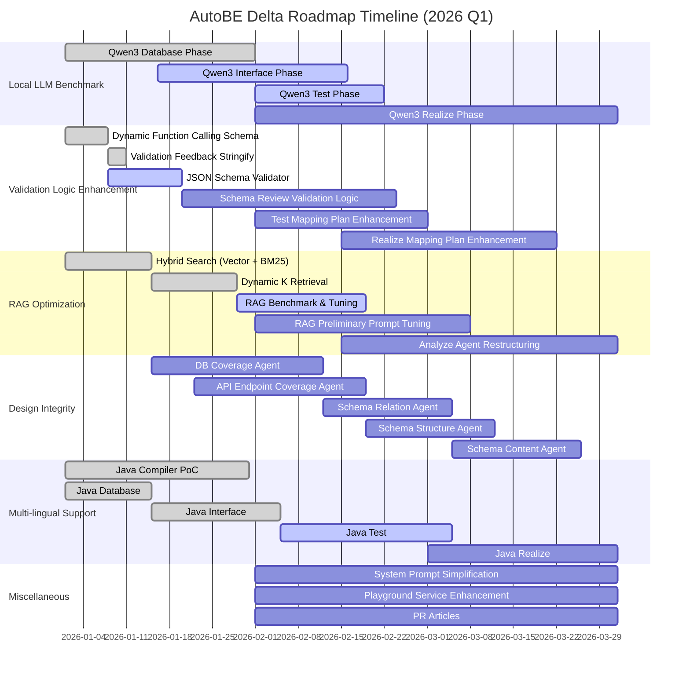

## Preface

import AutoBeDemoModelMovie from "../../../movies/demo/AutoBeDemoModelMovie";



AutoBE Delta 로드맵은 Gamma에서의 **수평적 확장**을 **수직적 심화**로 전환하는 것을 골자로 한다.

Gamma 로드맵에서 우리는 "일단 지른다"는 기조 아래 RAG, Modularization, Complementation 등 다양한 기능을 빠르게 구현하였다. 퀄리티보다 기능의 폭을 우선시한 결과, AutoBE는 백엔드 생성의 전 영역을 아우르는 플랫폼으로 성장하였으나, 동시에 곳곳에 안정성의 빈틈이 남게 되었다.

Delta에서는 이 빈틈들을 메운다. 상용 모델에서는 드러나지 않던 로직 결함과 validation 누락을 Local LLM 벤치마크를 통해 발굴하고, 이를 체계적으로 수정한다. 또한 Gamma에서 도입한 RAG에 **Vector Similarity 검색**을 추가하여 Hybrid Search 체계를 완성하고, **Multi-lingual Support**(Java/Kotlin)를 본격 가동한다.

## 1. Local LLM Benchmark

<AutoBeDemoModelMovie model="qwen/qwen3-next-80b-a3b-instruct" />

Claude Sonnet이나 GPT 같은 상용 모델은 똑똑하다. 시스템 프롬프트가 다소 모호하거나, validation feedback 로직에 허점이 있어도 해당 로직이 발동할 상황 자체를 잘 안 만든다. 이는 개발자 입장에서 결함을 발견하기 어렵다는 뜻이기도 하다. 잘 돌아가니까 문제가 없다고 착각하게 되는 것이다.

반면 `qwen3-next-80b-a3b`나 `qwen3-30b-a3b-thinking`과 같은 오픈소스 모델로 동일한 워크플로우를 실행하면 이야기가 달라진다. 상용 모델에서는 한 번도 실패한 적 없던 워크플로우가 Qwen3에서는 수시로 좌초한다. 존재하지 않는 DB 테이블을 참조하고, DTO 속성명에 예약어를 쓰고, JSON Schema의 `properties` 안에 `description`이나 세상 존재하지 않는 스펙의 데이터를 집어넣는다.

이것이 바로 Delta의 핵심 전략이다. **Qwen3를 시금석 삼아 숨겨진 결함들을 발굴하고, 이를 수정함으로써 상용 모델에서도 더욱 견고한 동작을 담보한다.** Database, Interface, Test, Realize의 각 Phase에 대해 벤치마크를 수행하고, 실패 원인을 분석하여 개선하는 작업을 반복한다. 한 Phase에서 100% 성공률을 달성하면 다음 Phase로 넘어가고, 다시 실패 원인을 분석하고 개선한다. 이 단순하지만 지루한 반복이 Delta의 근간이다.

## 2. Validation Logic Enhancement

프롬프트 이전에 스키마와 로직이 완벽해야 한다. 상용 모델에서는 문제시되지 않던 edge case들이 Qwen3에서 드러나며, 이를 통해 기존 설계의 허점을 발견한다. 스키마와 validation 로직이 완전무결해지도록 강화하고, 벤치마크 과정에서 발굴되는 edge case들을 지속적으로 개선한다.

### 2.1. Dynamic Function Calling Schema

Gamma에서 도입한 **Preliminary Asset**은 후속 Phase가 이전 Phase의 산출물에 접근할 수 있게 해주는 기능이다. 예를 들어 Interface Phase에서 DTO를 설계할 때, `getDatabaseTable(name: string)` 함수를 호출하여 Database Phase에서 설계한 테이블 스키마를 참조할 수 있다. Test Phase에서는 `getInterfaceOperation(endpoint: string)`으로 API endpoint 정보를 가져온다.

문제는 이 함수들의 파라미터 타입이 `string`으로 정적 선언되어 있다는 점이다. 시스템 프롬프트에서 "존재하지 않는 endpoint를 요청하지 말라"고 명시하고, validation feedback으로 에러를 반환해도, Qwen3는 이를 좀처럼 따르지 않는다.

이에 preliminary asset 관련 함수들에 대해 **동적인 function calling schema**를 구성한다. 요청 가능한 테이블명이나 endpoint를 `enum` 유니언으로 제한함으로써, 스키마 차원에서 존재하지 않는 DB 테이블이나 API operation에 대한 접근을 타입 수준에서 원천 차단한다.

```typescript
// Before: 정적 스키마
interface IAutoBePreliminaryGetDatabaseSchemas {
  type: "getDatabaseSchemas";
  schemaNames: string[] & tags.MinItems<1>;
}

// After: 동적 스키마
interface IAutoBePreliminaryGetDatabaseSchemas {
  type: "getDatabaseSchemas";
  schemaNames: Array<
    | "shopping_customers"
    | "shopping_sales"
    | "shopping_sale_snapshots"
    | "shopping_sale_snapshot_units"
    | ...
  > & tags.MinItems<1>;
}
```

### 2.2. JSON Schema Validator

Interface Phase에서 DTO를 설계할 때, Qwen3는 매우 다양한 JSON Schema 오류를 범한다. 단순한 constraint 오류부터 구조적 결함까지 그 종류가 방대하다:

- Object type의 metadata(`description`, `AutoBeOpenApi.IJsonSchema.IObject["x-autobe-database-schema"]`)를 `properties` 안에 넣는 문제
- Object type이 아닌데 `AutoBeOpenApi.IJsonSchema.IObject["x-autobe-database-schema"]`를 지정하는 문제
- 상호 모순적인 JSON schema constraint 구성 (예: `minimum > maximum`)
- DTO 타입명/속성명 대소문자 혼재 및 시스템 예약어 사용
- `id` 및 `*_id` 속성의 UUID 타입 미준수

이외에도 다양한 edge case들이 벤치마크 과정에서 지속적으로 발굴된다. 이러한 오류들을 검증하는 validator를 추가하여, 잘못된 스키마가 후속 Phase로 전파되는 것을 방지한다.

### 2.3. Validation Feedback Stringify

기존에는 runtime validation 실패 시 `typia.validate<T>()` 함수가 반환하는 `IValidation.IFailure` 값을 그대로 에이전트에게 피드백했다. 그러나 이 구조체는 기계적인 에러 정보만 담고 있어, Qwen3는 무엇이 잘못되었는지 정확히 파악하지 못하는 경우가 많았다.

이에 **커스텀 JSON stringify 함수**를 개발하여, validation error 내역을 주석으로 첨언하는 방식으로 개선한다. 에러가 발생한 속성 옆에 `// ERROR: ...` 형태로 구체적인 오류 사유를 명시함으로써, 에이전트가 어떤 부분을 어떻게 고쳐야 하는지 직관적으로 파악할 수 있게 한다.

### 2.4. Schema Review Validation Logic

Design Integrity 섹션에서 다루는 Schema Relation/Structure/Content Agent들은 DTO 품질을 보장하기 위한 핵심 에이전트들이다. 이 에이전트들이 정상 동작하려면 **강력한 validation logic**이 선행되어야 한다. Qwen3 벤치마크에서 드러난 문제들—일부 속성 검토 누락, 엉터리 검토 결과, 수정 지시 미반영—을 원천 차단하기 위한 validation 로직을 체계적으로 구축한다.

**완전 순회 검증**:
- 에이전트가 출력한 검토 결과에서 모든 타입과 속성이 포함되었는지 검증
- 누락된 타입이나 속성이 하나라도 있으면 에러 반환
- 검토 결과의 `path` 필드가 실제 스키마의 경로와 일치하는지 확인

**수정 지시 정합성 검증**:
- 수정 타입에 따른 필수 필드 검증 (`add`/`modify`는 `property` 필수)
- `path`가 가리키는 위치가 실제 스키마에 존재하는지 확인 (`delete`, `modify` 시)
- `add` 시 동일 경로에 기존 속성이 없는지 확인
- 순환 참조 가능성 사전 검증

**에이전트별 특화 검증**:
- **Relation Agent**: FK 관계의 양방향 일관성, 참조 타입의 실존 여부
- **Structure Agent**: DB 컬럼과 DTO 속성의 1:1 대응 검증, 타입 호환성 매트릭스 적용
- **Content Agent**: description/example 필드의 비어있지 않음 검증, 예시값의 타입 적합성

이 validation logic은 Schema Agent들이 동작하기 전에 구현되어야 하며, Design Integrity 섹션의 세 에이전트 모두에 공통 적용된다.

### 2.5. Test Mapping Plan Enhancement

Gamma에서 도입한 **Modularization**은 대규모 프로젝트를 여러 모듈로 분할하여 각각 독립적으로 코드를 생성하는 기능이다. Test Phase의 Mapping Plan은 어떤 테스트 파일이 어떤 API endpoint를 커버하는지, 테스트 간 실행 순서와 의존성은 어떻게 되는지를 정의한다. Qwen3에서는 다음과 같은 문제들이 빈번히 발생했다:

- 존재하지 않는 endpoint를 테스트 대상으로 지정
- 동일 endpoint에 대한 중복 테스트 할당
- 테스트 간 의존성 순환 (A→B→C→A)
- 선행 테스트 없이 후행 테스트 실행 시도

**Validation 강화 항목**:
- endpoint 존재 여부 검증
- 중복 할당 검증
- 의존성 DAG 검증 (순환 참조 탐지)
- 의존성 순서 검증 (위상 정렬 가능 여부)

**Dynamic Enum Schema 적용**:
- Mapping Plan의 endpoint 필드를 `string`에서 실제 존재하는 endpoint의 `enum` 유니언으로 변경
- 테스트 파일명 필드도 동적 enum으로 제한하여 오타 및 존재하지 않는 파일 참조 방지

### 2.6. Realize Mapping Plan Enhancement

Realize Phase의 Mapping Plan은 어떤 Provider가 어떤 API endpoint를 구현하는지, Provider 간 호출 관계는 어떻게 되는지를 정의한다. Test Phase보다 복잡한 의존성 구조를 가지며, 다음과 같은 추가적인 문제들이 발생했다:

- Provider와 endpoint 간 N:M 매핑 시 누락 발생
- 공통 유틸리티 함수의 중복 생성
- Provider 간 순환 호출
- DB 트랜잭션 경계 불일치

**Validation 강화 항목**:
- endpoint 완전 커버리지 검증
- Provider 간 의존성 DAG 검증
- 공통 유틸리티 중복 탐지
- DB 접근 패턴 일관성 검증

**계층적 Mapping Plan 구조**:
- 기존의 flat한 Mapping Plan을 **계층 구조**로 재설계
- `Module → Provider → Endpoint` 3단계 계층으로 명확한 소유권 정의
- 각 계층별 validation을 독립적으로 수행하여 에러 원인 특정 용이

**Provider 의존성 명시적 선언**:
- Provider가 다른 Provider를 호출할 경우 Mapping Plan에 명시적으로 선언 강제
- 선언되지 않은 Provider 호출 시 컴파일 에러로 처리
- 이를 통해 암묵적 의존성으로 인한 런타임 에러 방지

**점진적 검증 파이프라인**:
1. **Syntactic Validation**: Mapping Plan 구조의 문법적 정합성
2. **Semantic Validation**: endpoint/Provider 존재 여부, 타입 일치
3. **Dependency Validation**: DAG 검증, 순환 참조 탐지
4. **Coverage Validation**: 모든 endpoint가 구현되었는지 확인

각 단계를 통과해야 다음 단계로 진행하며, 실패 시 해당 단계에 특화된 상세 에러 메시지를 제공한다.

## 3. RAG Optimization

Gamma에서 도입한 RAG(Retrieval-Augmented Generation)는 에이전트가 모든 input materials를 일괄적으로 수신하는 monolithic 구조였다. 프로젝트 규모가 커질수록 토큰 소모량이 기하급수적으로 증가했고, 에이전트가 실제로 필요로 하지 않는 정보까지 컨텍스트에 포함되어 비효율이 발생했다.

Delta에서는 에이전트가 **능동적으로 필요한 정보만 선택적으로 요청**하는 구조로 전환한다. 각 workflow agent의 function calling schema에 `analyzeFiles()`, `getDatabaseSchemas()`, `getInterfaceOperations()`, `getInterfaceSchemas()` 등의 함수를 추가하여, 에이전트가 스스로의 판단 아래 필요한 에셋을 취득하도록 한다. 이를 통해 **토큰 소모량 70% 절감**을 목표로 한다.

### 3.1. Hybrid Search (Vector + BM25)

기존 BM25 기반 키워드 검색은 정확한 키워드 매칭에 의존하기 때문에, 동의어나 유사 개념을 포착하기 어렵다. "결제 시스템"을 검색할 때 "payment processing"이나 "구매 처리"가 누락될 수 있는 것이다.

Delta에서는 **Vector Similarity 검색**을 추가하여 Hybrid Search 체계를 구축한다. 요구사항 문서의 각 섹션을 OpenAI의 `text-embedding-3-small` 모델로 임베딩하고, 쿼리와의 코사인 유사도를 계산한다. BM25 점수와 Vector 점수를 가중 합산하여 최종 랭킹을 산출함으로써, 키워드 일치와 의미적 연관성을 모두 고려한 검색이 가능해진다.

```
final_score = α × BM25_score + (1 - α) × vector_similarity
```

α 값은 벤치마크를 통해 최적값을 도출하며, 초기값은 0.5로 설정한다.

### 3.2. Dynamic K Retrieval

Top-K 검색에서 K값을 고정하면 두 가지 문제가 발생한다. K가 너무 작으면 관련 문서가 누락되고, K가 너무 크면 불필요한 문서가 포함되어 토큰을 낭비한다. 쿼리에 따라 실제로 관련된 문서가 3개일 수도, 30개일 수도 있기 때문이다.

Delta에서는 검색 결과의 **점수 분포(sharpness)**를 분석하여 K값을 동적으로 조정한다. 점수가 급격히 떨어지는 지점(elbow point)을 감지하여 그 이전까지만 결과를 반환한다.

- **sharpness 기준값**: 0.2에서 0.5로 상향 조정 (벤치마크 기반)
- **K 범위**: kMin=5, kMax=150

이를 통해 쿼리의 특성에 맞는 적절한 양의 컨텍스트만 로딩하여, 토큰 비용을 절감하면서도 recall을 유지한다.

### 3.3. RAG Benchmark & Tuning

RAG 시스템의 성능을 정량적으로 평가하기 위한 벤치마크 프레임워크를 구축한다. 정답이 명확한 14개 테스트 케이스를 구성하고, 의도한 문서가 Top-1으로 검색되는지를 기준으로 검증한다.

벤치마크 항목:
- **Retrieval Accuracy**: 의도한 문서의 Top-K 포함 여부
- **Token Efficiency**: RAG 도입 전후 토큰 소모량 비교
- **Tool Calling Count**: todo, bbs, shopping 프로젝트 대상 function calling 횟수 측정

특히 오픈소스 모델(Qwen3)에서 발생하던 "이미 취득한 에셋을 무한 재요청하는 문제"를 해결하기 위해, validation feedback 로직과 시스템 프롬프트를 지속적으로 강화한다.

### 3.4. RAG Preliminary Prompt Tuning

RAG 시스템의 핵심은 에이전트가 **필요한 시점에 적절한 에셋을 요청**하는 것이다. 그러나 현재 에이전트들은 요구사항 정의서를 조회하는 `getAnalysisFiles()` 함수를 좀처럼 호출하지 않는 문제가 있다. DB 스키마나 API 스펙은 잘 요청하면서, 정작 그 설계의 근거가 되는 요구사항 문서는 참조하지 않는 것이다.

이 문제의 원인은 RAG preliminary agent의 시스템 프롬프트에 있다. 에이전트에게 "필요하면 요청하라"고만 지시했을 뿐, **언제 요구사항을 참조해야 하는지**에 대한 구체적인 가이드가 부족하다.

**프롬프트 최적화 방향**:
- 요구사항 참조가 필수인 상황을 명시적으로 열거
- `getAnalysisFiles()` 호출의 구체적인 트리거 조건 제시
- 요구사항 미참조 시 발생할 수 있는 문제점 경고
- 좋은 요구사항 활용 사례와 나쁜 사례 대비 예시

**Index File 이중 구조**:
대규모 요구사항 문서의 경우, 전체를 한 번에 로딩하면 토큰 한도를 초과한다. 이를 해결하기 위해 **`[인덱스 파일] + [RAG top-k 파일들]`** 이중 구조를 적용한다. 인덱스 파일에는 요구사항 문서의 목차, 섹션 제목, 각 섹션의 1-2문장 요약이 담겨있다. 에이전트는 먼저 인덱스 파일을 읽어 전체 구조를 파악한 후, 현재 작업에 필요한 상세 섹션만 선택적으로 요청한다. 이를 통해 에이전트가 "숲을 보고 나무를 고르는" 방식으로 효율적인 정보 탐색이 가능해진다.

RAG preliminary agent뿐 아니라, 요구사항을 활용하는 모든 에이전트(Database, Interface, Test, Realize)의 프롬프트를 전반적으로 검토하고 최적화한다.

### 3.5. Analyze Agent Restructuring

Analyze Phase는 사용자의 요구사항을 구조화된 형태로 변환하는 첫 단계다. 현재는 단순히 입력 문서를 정리하는 수준이지만, RAG 최적화와 맞물려 **근본적인 재설계**가 필요하다.

**현재 문제점**:
- 요구사항 문서가 **파일 단위**로 RAG 검색 및 로딩되어, 파일 간 분량 편차가 큼
- 주기능 페이지는 수천 토큰, 부속 기능 페이지는 수백 토큰으로 검색 랭킹에 불균형 발생
- 파일 경계가 논리적 단위와 불일치
- 청크 분할 기준이 Analyze 단계에서 결정되어야 하나 현재는 고려되지 않음
- 요구사항 간 상호 참조 및 의존성 정보가 누락됨

**청크 세분화 전략**:
- 파일 단위에서 **주제(topic)** 또는 **단원(section)** 단위로 청크 분할
- 헤딩 레벨(H1, H2, H3)을 기준으로 계층적 분할
- 청크 간 적정 토큰 수 범위 설정 (예: 500~2000 토큰)
- 청크 간 오버랩을 통한 문맥 연속성 보장

**검색 방식 개선**:
- 청크 단위 검색 후 상위 컨텍스트(부모 섹션) 자동 포함
- 관련 청크들의 클러스터링을 통한 연관 문서 동시 로딩
- 청크 메타데이터(출처 파일, 섹션 경로, 토큰 수) 활용

**Analyze Agent 개편 방향**:
- 요구사항 문서의 **계층 구조 자동 분석** 및 청크 경계 결정
- 각 청크의 **요약문 자동 생성** (인덱스 파일용)
- 요구사항 간 **상호 참조 그래프** 구축
- 후속 Phase에서 활용할 **시맨틱 태그** 자동 부여

Analyze Agent의 출력물이 RAG 시스템의 입력으로 직접 활용될 수 있도록, 두 시스템 간의 인터페이스를 명확히 정의하고 통합한다.

## 4. Design Integrity

백엔드 시스템에서 DB 설계와 Interface 설계는 서로 긴밀하게 연결되어야 한다. DB에 정의된 테이블이 API로 적절히 노출되어야 하고, API가 참조하는 데이터는 DB에 존재해야 하며, DB 컬럼의 타입과 DTO 속성의 타입이 일관되어야 한다. 이러한 설계 간 일관성이 깨지면 런타임 에러, 데이터 손실, 보안 취약점으로 이어질 수 있다.

Gamma에서는 각 Phase가 독립적으로 동작하여 이러한 교차 검증이 부족했다. Delta에서는 **Design Integrity**라는 개념을 도입하여, Phase 간 설계 일관성을 검증하고 보장하는 메커니즘을 구축한다.

### 4.1. DB Coverage Agent

요구사항 정의서 대비 DB 테이블 설계의 **커버리지(coverage)**를 검증하는 에이전트를 개발한다. 요구사항 문서를 분석하여 언급된 엔티티, 속성, 관계를 추출하고, 이것이 실제 DB 스키마에 반영되어 있는지 확인한다.

검증 항목:
- **Entity Coverage**: 요구사항에 명시된 모든 개념이 테이블로 모델링되었는가
- **Attribute Coverage**: 각 엔티티의 속성이 컬럼으로 정의되었는가
- **Relationship Coverage**: 엔티티 간 관계(1:1, 1:N, M:N)가 FK와 중간 테이블로 구현되었는가

누락이 감지되면 에이전트가 보충 테이블/컬럼을 제안하고, 사용자 승인 후 Database Phase의 산출물에 반영한다.

### 4.2. API Endpoint Coverage Agent

요구사항 및 DB 설계 대비 API endpoint의 커버리지를 검증하는 에이전트를 개발한다. DB에 정의된 테이블에 대해 적절한 CRUD endpoint가 존재하는지, 요구사항에 명시된 비즈니스 로직이 API로 노출되는지 확인한다.

검증 항목:
- **Base CRUD Coverage**: 각 테이블에 대한 기본 CRUD(Create, Read, Update, Delete) endpoint 존재 여부
- **Action Endpoint Coverage**: 요구사항에 명시된 특수 동작(예: "주문 취소", "결제 승인")에 대한 endpoint 존재 여부
- **Query Endpoint Coverage**: 목록 조회, 검색, 필터링 등 조회 기능의 endpoint 존재 여부

기 설계된 endpoint에 대한 추가, 수정, 삭제가 가능하도록 인터랙티브한 리뷰 프로세스를 제공한다.

### 4.3. Schema Relation Agent

Gamma에서는 DTO 품질을 보장하기 위해 4개의 리뷰 에이전트가 순차적으로 동작했다:

1. **Relation Review Agent**: FK 관계, 참조 무결성 검증
2. **Security Review Agent**: 보안 취약점, 인증 경계 검증
3. **Content Review Agent**: 필드 완전성, 타입 적절성 검증
4. **Phantom Review Agent**: 실제 DB에 존재하지 않는 속성 제거

상용 모델에서는 이 에이전트들이 대체로 정상 동작했다. 그러나 Qwen3 벤치마크에서 심각한 문제들이 드러났다. 일부 속성을 검토하지 않고 넘어가거나, 검토 결과를 엉터리로 작성하거나, 수정 지시를 실제 스키마에 제대로 반영하지 못하는 경우가 빈번했다.

Delta에서는 이를 3개의 에이전트(Relation, Structure, Content)로 재구성하고, **function calling schema와 validation logic을 극단적으로 강화**한다. 일말의 여지도 남기지 않는 **슈퍼 스키마 + 로직 강화**가 목표다.

기존 방식은 리뷰 결과로 JSON Schema 전체를 다시 생성했으나, 이는 토큰 소모량이 크고 의도치 않은 변경이 발생할 위험이 있었다. Delta에서는 세 에이전트 모두 **개별 속성에 대한 표적 수정 지시를 담은 AST 구조**로 출력을 전환한다:

```typescript
interface ISchemaModification {
  type: "add" | "delete" | "modify";
  path: string;           // e.g., "IShoppingSale.seller_id"
  property?: IProperty;   // for add/modify
  reason: string;         // 수정 사유
}
```

또한 세 에이전트 모두 **모든 속성에 대한 완전 순회**를 강제한다. 에이전트는 각 타입과 속성을 하나씩 검토하고, 검토 결과(수정 필요/불필요)를 명시적으로 출력해야 한다. Validator가 검토 누락 여부를 검사하여, 단 하나의 속성이라도 빠뜨리면 에러를 반환한다. 이를 통해 Qwen3가 일부 속성을 건너뛰는 문제를 원천 차단한다.

**Schema Relation Agent**는 DTO 간의 **참조 관계**를 검증하고 교정한다:

- **FK Relation Integrity**: DB의 FK 관계가 DTO에 올바르게 반영되었는지 검증
- **Reference Type Consistency**: 참조 타입(`IShoppingSale.seller: IShoppingSeller`)의 정합성 확인
- **Aggregation/Composition**: 1:N, M:N 관계가 배열 타입으로 적절히 표현되었는지 검증
- **Circular Reference Prevention**: 순환 참조로 인한 무한 루프 방지

### 4.4. Schema Structure Agent

**Schema Structure Agent**는 DTO의 **구조적 정합성**을 검증하고 교정한다. 특히 DB 스키마와의 일치성을 핵심 기준으로 삼는다:

- **DB Existence Check**: DTO 속성이 실제 DB 컬럼에 대응하는지 확인, 없으면 삭제 지시 (Phantom 기능 통합)
- **Type Consistency**: DB 타입과 DTO 타입의 호환성 검증, 불일치 시 DB에 맞추어 수정
- **Nullable Consistency**: DB의 `NOT NULL` 제약에 맞추어 DTO의 optional/required 조정
- **Security Boundary**: 민감 정보(actor_id, actor_session_id 등)가 Write DTO에 노출되지 않도록 검증 (Security 기능 통합)

Relation Agent와 동일하게 모든 속성에 대한 완전 순회가 강제되며, 검토 누락 시 에러를 반환한다. 불일치가 감지되면 **DB 스키마를 기준으로** DTO를 수정한다. DB가 진실의 원천(source of truth)이다.

### 4.5. Schema Content Agent

**Schema Content Agent**는 DTO의 구조를 변경하지 않고, 오직 **메타데이터(설명, 예시, 주석)**만 보충한다. Relation, Structure Agent와 마찬가지로 JSON Schema 전체를 재생성하지 않고, **표적 수정 지시를 담은 AST 구조**로 출력한다:

```typescript
interface IContentModification {
  path: string;                    // e.g., "IShoppingSale.customer_id"
  description?: string;            // 타입/속성 설명
  example?: unknown;               // 예시값
  deprecated?: string;             // 사용 중단 안내
}
```

검토 항목:

- **Type Description**: 각 DTO 타입이 무엇을 표현하는지 명확한 설명 작성
- **Property Description**: 각 속성의 의미, 용도, 제약사항을 기술
- **Example Values**: 대표적인 예시값 제공 (OpenAPI의 `example` 필드)
- **Deprecation Notice**: 사용 중단 예정인 속성에 대한 안내

다른 에이전트와 동일하게 **모든 타입과 속성에 대한 완전 순회**가 강제된다. Validator가 검토 누락을 검사하여, description이나 example이 누락된 속성이 있으면 에러를 반환한다.

Relation, Structure, Content Agent를 분리함으로써 각 에이전트의 역할이 명확해지고, 독립적으로 작업을 진행할 수 있으며, 각각의 검토 완전성을 개별적으로 보장할 수 있다.

## 5. Multi-lingual Support

AutoBE는 현재 TypeScript/NestJS 기반 백엔드 코드를 생성한다. 그러나 엔터프라이즈 시장에서 Java/Spring 생태계의 수요는 여전히 크다. Delta에서는 Multi-lingual 지원을 위한 아키텍처 개편과 Java Compiler 개발을 본격 가동한다.

AutoBE의 각 Phase는 서로 다른 코드 생성 구조를 가지고 있어, Java 지원 전략도 Phase별로 달라진다. 일부 Phase는 언어 중립적 AST(Abstract Syntax Tree)를 이미 사용하고 있어 code generator 추가로 대응 가능하지만, 일부 Phase는 TypeScript에 특화된 구조를 가지고 있어 근본적인 아키텍처 개편이 필요하다.

| Phase | 현재 구조 | Java 지원 전략 |
|-------|----------|---------------|
| **Database** | Agent가 AST 생성 | Java code generator 개발 |
| **Interface** | Agent가 AST 생성 | Java code generator 개발 |
| **Test** | Agent가 TypeScript를 text로 작성 | TS → AST 변환 Agent → Java code gen |
| **Realize** | AST 구조 없음 | 언어 중립적 AST 설계 필요 |

### 5.1. Java Compiler PoC

2026년 1월 첫주까지 Java Compiler PoC를 수행한다. Database, Interface, Test Phase 각각에 대해 Java 코드 생성을 시도하고, 실제 구현 시 예상되는 애로사항을 사전에 파악한다.

PoC에서 도출한 주요 과제:
- **Database**: Prisma 스키마와 Hibernate Entity 간의 매핑 규칙 정의
- **Interface**: OpenAPI 스펙에서 Spring Controller/DTO로의 변환 규칙 정의
- **Test**: TypeScript 테스트 코드의 구조 분석 및 AST 변환 가능성 검토

이를 통해 각 Phase별 집중 작업 포인트를 도출하고, 전체 구현 로드맵을 구체화한다.

### 5.2. Java Database

Database Phase에서는 에이전트가 function calling을 통해 [`AutoBeDatabase.IApplication`](https://github.com/wrtnlabs/autobe/blob/main/packages/interface/src/database/AutoBeDatabase.ts) AST를 생성한다. 이 AST는 테이블, 컬럼, 관계, 인덱스 등 DB 스키마의 모든 정보를 언어 중립적으로 표현한다.

Java code generator는 이 AST를 입력받아 다음을 생성한다:
- **Hibernate Entity 클래스**: `@Entity`, `@Table`, `@Column` 등 JPA 어노테이션이 적용된 Java 클래스
- **Repository 인터페이스**: Spring Data JPA의 `JpaRepository`를 상속하는 인터페이스
- **관계 매핑**: `@OneToMany`, `@ManyToOne`, `@ManyToMany` 등 연관관계 어노테이션

Prisma의 relation 문법과 Hibernate의 연관관계 매핑 간에는 개념적 차이가 있어, 이를 정확히 변환하는 로직을 구현해야 한다. 특히 implicit many-to-many 관계, cascade 옵션, fetch 전략 등에서 세심한 처리가 필요하다.

### 5.3. Java Interface

Interface Phase에서도 에이전트가 [`AutoBeOpenApi.IDocument`](https://github.com/wrtnlabs/autobe/blob/main/packages/interface/src/openapi/AutoBeOpenApi.ts) AST를 생성한다. 이 AST는 OpenAPI 3.1 스펙을 기반으로 API endpoint, request/response 스키마, 인증 정보 등을 표현한다.

Java code generator는 이 AST를 입력받아 다음을 생성한다:
- **Spring Controller**: `@RestController`, `@RequestMapping`, `@GetMapping` 등이 적용된 컨트롤러 클래스
- **DTO 클래스**: Request/Response body를 표현하는 Java record 또는 class
- **Swagger 문서**: `@Operation`, `@ApiResponse`, `@Schema` 등 SpringDoc 어노테이션

OpenAPI의 JSON Schema와 Java 타입 시스템 간의 매핑, 특히 `oneOf`, `anyOf`, `nullable` 등의 처리가 핵심 과제다. 또한 NestJS의 데코레이터 기반 validation과 Spring의 Bean Validation(`@Valid`, `@NotNull` 등) 간의 대응도 고려해야 한다.

### 5.4. Java Test

Test Phase는 에이전트가 TypeScript 코드를 text로 직접 작성하는 구조다. 언어 중립적 AST 없이 코드가 생성되기 때문에, Java 지원을 위해서는 중간 변환 단계가 필요하다.

과거 AST 모드의 흔적으로 [`AutoBeTest`](https://github.com/wrtnlabs/autobe/blob/main/packages/interface/src/test/AutoBeTest.ts) 구조체가 존재한다. 그러나 이 구조체 역시 TypeScript에 특화된 표현을 포함하고 있어, 그대로 Java code generator의 입력으로 사용하기에는 한계가 있다. 따라서 다음과 같은 다단계 전략을 구사한다:

1. **TypeScript 코드 생성**: 에이전트가 TypeScript e2e 테스트 코드를 text로 작성
2. **AST 변환 Agent**: 별도의 변환 에이전트가 TypeScript 코드를 파싱하여 `AutoBeTest` 구조체로 변환
3. **언어 중립화**: `AutoBeTest`의 TypeScript 특화 표현을 언어 중립적 형태로 정제
4. **Java code generator**: 정제된 AST를 입력받아 JUnit 5 기반 테스트 코드 생성

특히 3단계의 언어 중립화 과정에서는 다양한 실험이 필요하다:

- TypeScript의 `async/await` 패턴을 Java의 동기 호출 또는 CompletableFuture로 변환
- 화살표 함수 콜백을 Java 람다 또는 익명 클래스로 변환
- 타입 단언(type assertion)을 Java 캐스팅으로 변환
- 테스트 프레임워크 차이 대응 (vitest → JUnit 5, expect → AssertJ)

이 과정에서 `AutoBeTest` 구조체 자체의 개편이 필요할 수 있으며, 보다 언어 중립적인 테스트 표현 체계를 설계해야 할 수 있다.

### 5.5. Java Realize

Realize Phase는 가장 도전적인 영역이다. 현재 AST 구조 자체가 존재하지 않으며, 에이전트가 TypeScript Provider 코드를 text로 직접 작성한다. Provider 코드는 실제 비즈니스 로직을 구현하는 부분으로, API endpoint의 동작을 정의한다.

Java 지원을 위해서는 **언어 중립적 AST**를 새로이 설계해야 한다. 이 AST는 다음과 같은 프로그래밍 개념을 표현할 수 있어야 한다:

- **제어 흐름**: if/else, switch, for/while, try/catch
- **데이터 조작**: 변수 선언, 할당, 연산
- **함수 호출**: 메서드 호출, 체이닝, 콜백
- **객체 조작**: 속성 접근, 인스턴스 생성

문제는 TypeScript 특유의 문법들이다:
- **Object Literal**: `{ key: value }` 형태의 즉석 객체 생성
- **Undefined/Null 처리**: `undefined` 키워드, optional chaining (`?.`), nullish coalescing (`??`)
- **Spread Operator**: `...obj` 형태의 객체/배열 전개
- **Destructuring**: `const { a, b } = obj` 형태의 구조 분해

이러한 TypeScript 고유 문법을 배제한 **범용 AST**를 설계하고, 이를 Java 코드로 변환하는 code generator를 개발해야 한다. 3개월이라는 기간 내에 **Draft 수준의 설계**를 목표로 하며, 실제 구현 및 검증은 후속 로드맵에서 진행한다.

## 6. Miscellaneous

### 6.1. System Prompt Simplification

AutoBE의 시스템 프롬프트는 **메타 프롬프팅(Meta Prompting)** 방식으로 구성되어 있다. 에이전트에게 호출해야 할 함수와 그 타입 정의를 제공하고, 함수 및 인터페이스 타입에 작성된 JSDoc 주석이 곧 문서화 역할을 한다.

문제는 이 주석들을 AI에게 설명시키고 시스템 프롬프트를 생성하게 했다는 점이다. 그 결과 시스템 프롬프트가 지나치게 장황하고, 표현이 중복되거나 핵심을 놓치는 경우가 있다. 이는 불필요한 토큰 소모로 이어지며, 프롬프트 품질 자체도 보장할 수 없다.

Delta에서는 시스템 프롬프트를 근본적으로 재검토한다:

- **중복 표현 제거**: 동일한 개념을 여러 번 설명하는 부분 통합
- **핵심 지시 명확화**: 에이전트가 반드시 준수해야 할 규칙을 간결하게 정리
- **토큰 효율 개선**: 불필요한 수식어와 설명 제거로 토큰 소모량 절감
- **일관성 확보**: 각 Phase별 시스템 프롬프트의 문체와 구조 통일

### 6.2. Playground Service Enhancement

AutoBE는 로컬에서 구동 가능한 Playground 서비스를 제공한다. 그러나 현재 버전은 최소한의 기능만 구현된 상태로, 사용자 경험이 미흡하다.

Delta에서는 과거 해커톤에서 개발한 서비스 수준으로 Playground를 강화한다:

- **SQLite 기반 이력 저장**: 로컬 SQLite DB에 백엔드 어플리케이션과 대화 내역을 영구 보존
- **프로젝트 관리**: 여러 백엔드 프로젝트를 생성, 조회, 삭제할 수 있는 관리 기능
- **대화 내역 조회**: 각 프로젝트별 에이전트와의 대화 기록을 타임라인 형태로 열람
- **산출물 다운로드**: 생성된 코드, 스키마, 문서를 일괄 다운로드

이를 통해 사용자가 AutoBE를 통해 생성한 백엔드 어플리케이션들을 체계적으로 보존하고 관리할 수 있게 한다.

### 6.3. PR Articles

AutoBE를 개발자 커뮤니티에 알리기 위한 홍보 활동을 전개한다. dev.to, Reddit, Hacker News 등 주요 개발자 커뮤니티에 기술 아티클을 지속적으로 게시한다.

작성 예정 주제:

- **AutoBE 소개**: AI 기반 백엔드 자동 생성 플랫폼의 개념과 동작 원리
- **기술 심층 분석**: RAG, Multi-Phase Architecture, Design Integrity 등 핵심 기술 해설
- **사용 사례**: AutoBE로 실제 백엔드를 생성하는 튜토리얼
- **벤치마크 결과**: 상용 모델 vs 오픈소스 모델 성능 비교 분석

분기 내 지속적으로 아티클을 작성하여 AutoBE의 인지도를 높이고 커뮤니티 피드백을 수집한다.
