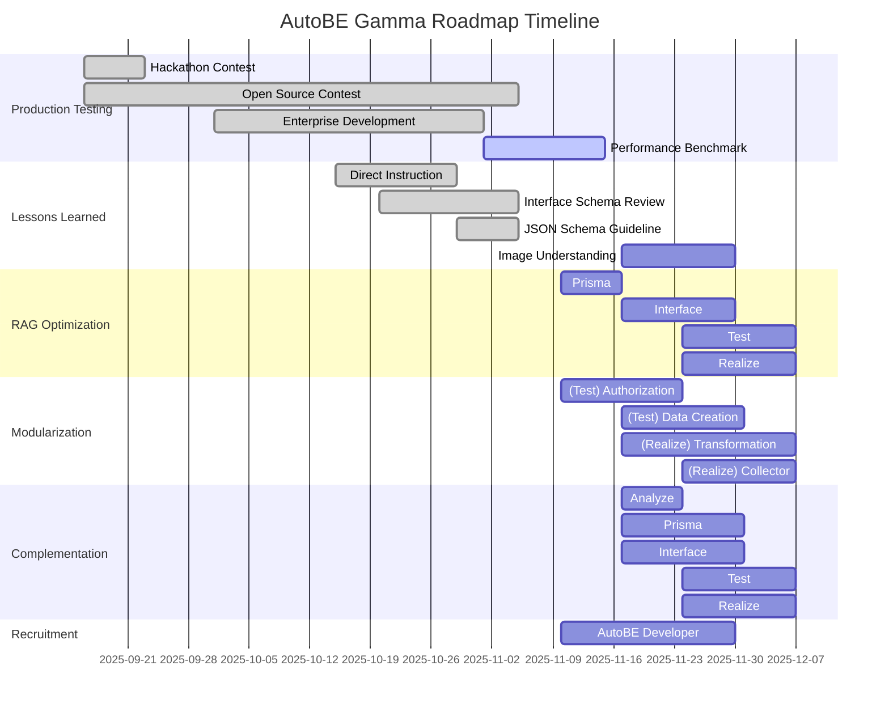

import { Tabs } from "nextra/components";

import AutoBeDemoModelMovie from "../../../movies/demo/AutoBeDemoModelMovie";

## Preface


AutoBE Gamma 로드맵은 [v1.0 legacy roadmap](./v1.0-legacy)에서 전략적으로 전환된 계획이다. Enterprise Development 단계에서의 실제 필드 테스트를 통해 얻은 교훈을 바탕으로, 보다 실용적이고 빠른 개발 방향으로 로드맵을 재편성하였다.

**전략적 변화**: v1.0 로드맵이 각 기능의 100% 완성도(컴파일 성공률 100%, 런타임 성공률 100%)를 추구했다면, Gamma 릴리즈는 개발 주기를 대폭 단축하고 더 많은 기능을 포괄하되, 각 티켓마다 기초 설계와 프로토타입 구현에 집중한다. 완벽함보다는 실질적인 가치 전달을 우선시하며, 이후 단계에서 품질 개선을 진행하는 방식이다.

**팀 확장 계획**: Gamma에서 구축한 핵심 기능들은 세분화된 티켓으로 나뉘어, 새롭게 채용할 AutoBE 개발자들이 품질 강화와 프로덕션 안정화를 담당한다. 이러한 병렬 개발 전략을 통해 속도와 품질 양쪽을 모두 확보한다.

## 1. Production Testing
### 1.1. Hackathon Contest
AutoBE의 기반 프레임워크인 Agentica를 주제로 오픈소스 해커톤 대회를 공동 개최하였다. 참여자들은 AutoBE를 활용하여 백엔드 어플리케이션을 생성하고 리뷰하며 다양한 피드백을 제공하였다.

참가자들은 자연어 인터페이스만으로 완전한 백엔드 어플리케이션을 생성하는 데 성공했지만, 상금이 걸린 경쟁 환경의 특성상 비판적 시각의 피드백은 제한적이었다. 그리고 생성된 코드베이스가 10만 줄이 넘는 방대한 규모여서 그런지, 참여자들이 직접 꼼꼼하게 리뷰하며 검토하기보다, AI의 도움을 받아 평가 보고서를 작성하는 경우가 많았다.

따라서 본 해커톤을 통해 AutoBE의 코드 생성 능력은 실증하였으되, 현실적인 개발 환경에서 보다 심도 있는 비판적 평가가 필요함을 인식하게 되었다.

### 1.2. Open Source Contest
한국 정부와 공동으로 Agentica 오픈소스 대회를 개최하였다. Agentica는 function calling에 특화된 Agentic AI 프레임워크로서 AutoBE의 핵심 엔진 역할을 수행한다. 특히 [`AutoBePrisma.IApplication`](https://github.com/wrtnlabs/autobe/blob/main/packages/interface/src/prisma/AutoBePrisma.ts), [`AutoBeOpenApi.IDocument`](https://github.com/wrtnlabs/autobe/blob/main/packages/interface/src/openapi/AutoBeOpenApi.ts), [`AutoBeTest.IFunction`](https://github.com/wrtnlabs/autobe/blob/main/packages/interface/src/test/AutoBeTest.ts) 등 컴파일러 AST 구조를 function calling으로 생성하고 타입 오류를 자동으로 교정하는 핵심 기능을 담당한다.

대회는 Agentica를 활용한 AI 챗봇 및 에이전트 어플리케이션 개발 경진대회로 진행되었으며, 다수의 팀이 참가하여 본선에 총 10개 팀이 진출해 경쟁 중이다. 실제 활용 사례와 피드백을 수집하며 Agentica의 발전 방향을 모색하는 동시에, function calling을 위한 스키마 설계와 에이전트 활용에 뛰어난 역량을 보인 참가자들을 Wrtn Technologies AX 개발팀으로 추천할 예정이다.

이처럼 대회는 단순히 피드백을 수집하는 것을 넘어, 스키마 설계 및 function calling 아키텍처에 전문성을 가진 인재를 발굴하는 인재 파이프라인으로도 기능한다.

### 1.3. Enterprise Development
Wrtn Technologies의 B2B 엔터프라이즈 백엔드를 AutoBE로 구축하고, 실제 운영 환경에 약 한 달 간 배포하여 엔터프라이즈 규모의 첫 실전 검증을 수행하였다. Wrtn Technologies는 월 활성 사용자 700만 명을 보유한 대규모 AI 챗봇 서비스([https://wrtn.ai](https://wrtn.ai))를 운영 중이며, 기존 B2C 서비스를 B2B 시장으로 확장하는 과정에서 AutoBE를 활용한 백엔드 개발로 플랫폼의 실전 역량을 시험하였다.

엔터프라이즈 환경에서 AutoBE를 운영하며 강점과 동시에 명확한 한계점을 발견하였는데, 이러한 실전 경험이 Gamma 로드맵의 방향성을 결정하는 결정적 계기가 되었다. 특히 DB 설계나 API 스펙을 자연어가 아닌 직접적인 기술 명세로 제공할 수 있는 기능의 필요성이 부각되었고, Interface phase의 DTO 설계에서 데이터 무결성과 보안성을 대폭 강화해야 한다는 요구가 명확해졌다.

또한 Figma 등 시각적 산출물로부터 요구사항을 자동으로 추출하는 기능, 토큰 효율화를 위한 RAG 최적화, 그리고 Test와 Realize agent가 재사용 가능한 모듈 코드를 생성하여 개발자의 수정 편의성을 높이는 것이 중요한 과제로 드러났다. 무엇보다 생성된 백엔드를 처음부터 다시 만드는 것이 아니라 점진적으로 개선할 수 있는 incremental update 기능이 절실했다.

이 한 달간의 실전 경험은 수개월의 이론적 기획보다 더 가치 있는 통찰을 제공하였으며, Gamma 릴리즈 계획 수립의 직접적 근거가 되었다.

### 1.4. Performance Benchmark
AutoBE의 운영 효율성을 다차원적으로 측정, 평가, 최적화하는 종합 성능 벤치마크 시스템을 구축한다. 각 파이프라인 단계의 완료 시간과 작업당 토큰 소비량을 측정하여 생성 속도와 토큰 효율성을 파악하고, 특히 RAG 최적화 시 개선 효과를 정량적으로 검증할 것이다.

생성된 코드가 TypeScript, OpenAPI, Prisma 컴파일러 검증을 1회 시도에 통과하는 비율과 사람 개입 없이 E2E 테스트를 통과하는 비율을 추적하며, 코드 유지보수성과 테스트 커버리지, 모범 사례 준수도 등 품질 지표도 함께 모니터링한다.

벤치마크 데이터는 에이전트 시스템 프롬프트 개선 및 오케스트레이션 최적화에 직접 반영되어 지속적인 개선 루프를 형성한다. 성능 저하가 발생하면 즉시 조사하고, 개선 사항은 아키텍처 결정의 검증 지표로 활용한다. Gamma 기간 동안 기능 확장을 진행하면서도 체계적인 성능 모니터링을 통해 새로운 기능이 사용자 경험을 향상시키는지 악화시키는지 객관적으로 판단할 수 있다.

## 2. Lessons Learned
### 2.1. Direct Instruction
정밀한 기술 명세가 필요한 상황에서, 사용자가 DB 스키마나 API 스펙을 자연어가 아닌 직접적 지시로 제공할 수 있어야 한다. AutoBE는 자연어 인터페이스를 통한 백엔드 생성을 핵심 가치로 삼아왔지만, 엔터프라이즈 필드 테스트 결과 직접 명세가 필수적인 상황들이 존재함을 확인하였다.

그러나 기존 시스템과 공유하는 테이블 스키마(예: AI 챗봇 관련 테이블)나 B2B 통합을 위한 필수 API 규격, 규제 준수를 위해 정확히 정의되어야 하는 데이터 구조, 레거시 시스템 호환성 제약사항 등은 자연어로 충분히 표현하기 어렵다. 현재 AutoBE는 사용자 대화에서 요구사항을 추출하여 Analyze agent에만 전달하는 구조를 가지고 있기 때문이다. Prisma (DB 설계)와 Interface (API 설계) agent는 Analyze의 출력만 받을 뿐, 사용자의 직접적인 기술 명세를 수신할 수 없다.

Gamma에서는 이 간극을 메우기 위해 명세 추출 시스템을 구현할 예정이다. 

사용자 대화에서 직접적 기술 지시를 분석하여, 자연어 요구사항은 기존 방식대로 Analyze agent로 라우팅하되, DB/API 명세는 발췌하고 정리하여 Prisma 및 Interface agent에 직접 전달한다.

이를 통해 사용자가 고수준 의도와 저수준 기술 제약을 동시에 명시할 수 있는 하이브리드 워크플로우를 지원하여, 접근성은 유지하면서도 비즈니스 맥락상 필수적인 아키텍처 결정을 사용자가 직접 통제할 수 있게 된다.

### 2.2. Interface Schema Review
Interface phase의 DTO 설계 프로세스를 전문화된 리뷰 에이전트로 분할하여, 관계 무결성, 보안 강화, 내용 완전성 각 영역을 심층적으로 검증할 계획이다.

현재는 단일 Review Agent가 DTO 설계에 대한 검증 일체를 담당하고 있는데, 엔터프라이즈 필드 테스트 결과 이 모놀리식 접근법이 관계 모델링, 보안 제약, 내용 정확성이라는 서로 경쟁하는 요구사항을 동시에 다루는데 한계가 있음이 드러났다. Gamma에서는 3단계 리뷰 파이프라인을 구축할 예정이다.

먼저 Relation Review Agent는 외래 키 관계와 중첩 객체 구조를 검증하며, DTO 변형(Create, Update, Read)이 composition, aggregation, association 등 엔티티 연관관계를 올바르게 표현하는지 확인한다. Prisma 모델과 OpenAPI 스키마 간 관계 불일치를 탐지하고 교정하며, 선택적/필수 관계, 계단식 갱신, 순환 의존성 등 복잡한 시나리오를 처리한다.

Security Review Agent는 클라이언트 제공 데이터와 서버 관리 데이터 간 인증 경계 분리를 강제하고, 요청 DTO에 해시된 비밀번호 필드가 노출되는 등의 치명적 취약점을 방지한다. 인증된 요청 본문에서 `user_id`, `member_id` 같은 actor identity 필드를 제거하는지 검증하고, 응답 DTO가 토큰이나 솔트, 내부 ID 같은 민감한 시스템 필드를 유출하지 않도록 보장한다.

Content Review Agent는 Prisma 스키마와 교차 참조하여 필드 완전성을 보장하고, Prisma에서 OpenAPI JSON Schema로의 데이터 타입 매핑을 검증하며, 비즈니스 로직 기반으로 필수/선택 필드 설정을 강제하고 모든 속성에 대한 종합적 문서화를 보장한다.

이러한 관심사 분리를 통해 각 에이전트가 해당 영역을 심층 전문화할 수 있게 되어 DTO 품질이 극적으로 향상될 것이다. 현재 누락되는 보안 취약점을 체계적으로 포착하고, 관계 모델링 오류를 코드 생성 전에 탐지하며, 필드 완전성을 자동 교차 참조를 통해 보장할 수 있을 것으로 기대한다.

### 2.3. JSON Schema Guideline
Interface 스키마 리뷰 에이전트를 정교하게 전문화할 계획인데, 이에 따라 예상되는 도전과제가 있다. 많은 LLM 모델들이 구문적으로 유효하고 의미적으로 올바른 JSON Schema 구조를 일관되게 생성하는데 어려움을 겪는다는 점이다.

`openai/gpt-4.1` 같은 상용 모델은 JSON Schema 생성을 안정적으로 처리하지만, 오픈소스 대안들은 빈번하게 잘못된 스키마를 생성할 가능성이 있다. 특히 3단계 리뷰 파이프라인을 도입하면 이 문제가 증폭될 수 있다. 관계, 보안, 내용 리뷰 에이전트가 상호 의존적 수정을 가할 때, 사소한 JSON Schema 오류조차도 컴파일 실패로 연쇄적으로 확대될 수 있기 때문이다.

> **`qwen/qwen3-next-80b-a3b-instruct` - `todo`**
> 
> - Source Code: [`qwen/qwen3-next-80b-a3b-instruct/todo`](https://github.com/wrtnlabs/autobe-examples/tree/main/qwen/qwen3-next-80b-a3b-instruct/todo)
> - Score: 100
> - Elapsed Time: 1h 8m 53s
> - Token Usage: 8.34M
> - Function Calling Success Rate: 72.86%
> 
> Phase | Generated | Token Usage | Elapsed Time | FCSR
> :-----|:----------|------------:|-------------:|------:
> 🟢 Analyze | `actors`: 1, `documents`: 3 | 111.6K | 32s | 100%
> 🟢 Prisma | `namespaces`: 2, `models`: 3 | 114.5K | 8m 34s | 29%
> 🟢 Interface | `operations`: 8, `schemas`: 12 | 3.95M | 45m 3s | 65%
> 🟢 Test | `functions`: 2 | 2.39M | 7m 31s | 77%
> 🟢 Realize | `functions`: 8 | 1.78M | 7m 11s | 97%

근본 원인을 분석해보면 LLM이 JSON Schema의 미묘한 요구사항에 대한 명시적 구조 가이드가 부족하다는 점을 알 수 있다. `properties`, `required`, `additionalProperties`의 올바른 중첩 방법, 스키마 컴포지션을 위한 `$ref`의 정확한 사용, 유효한 `type` 제약과 형식 지정자, `minLength`나 `pattern`, `enum` 등 검증 키워드의 적절한 적용, 그리고 OpenAPI 전용 확장과 핵심 JSON Schema의 구분 등이 모호하게 전달되고 있다.

Gamma에서는 에이전트 시스템 프롬프트에 직접 내장되는 포괄적 JSON Schema 작성 가이드라인을 개발할 예정이다. 일반적인 DTO 시나리오(Create, Update, Read 변형)에 대한 사전 검증된 구조 템플릿을 제공하고, 특정 검증 키워드를 언제 사용할지에 대한 명확한 제약 명세를 정의한다. 엔티티 관계와 중첩 객체를 위한 표준 참조 패턴을 마련하고, 일반적 실수와 그 교정 방법을 명시적으로 문서화하여 안티 패턴을 방지한다.

이를 통해 에이전트에게 명확하고 규범적인 JSON Schema 구성 규칙을 제공함으로써, 역량이 떨어지는 모델에서도 잘못된 스키마 생성을 극적으로 감소시킬 수 있을 것으로 기대한다. 이는 AutoBE의 모델 호환성을 확대하여 생성 품질을 유지하면서도 운영 비용을 절감하는 결과로 이어질 것이다.

### 2.4. Image Understanding
요구사항은 깔끔한 텍스트 문서로 도착하지 않는다. 실제 소프트웨어 개발은 Figma 목업, 화이트보드 다이어그램, 주석이 달린 와이어프레임의 혼란스러운 교차점에서 작동한다. AutoBE는 대화뿐만 아니라 시각적 산출물로부터도 요구사항을 추출하고 해석할 수 있어야 한다.

엔터프라이즈 필드 테스트 동안 핵심 요구사항이 디자인 파일에만 존재하는 경우를 빈번하게 발견하였다. Figma 디자인에서는 UI 레이아웃이 암묵적으로 데이터 모델을 정의하고(예: 폼 필드가 곧 DTO 속성), 와이어프레임의 네비게이션 흐름은 API 엔드포인트 구조를 노출하며, 손으로 그렸거나 도구로 생성된 ERD 다이어그램은 데이터베이스 스키마를 담고 있다. 플로우차트는 특정 API 작업이 필요한 비즈니스 로직 시퀀스를 보여주고, 기존 시스템 스크린샷은 마이그레이션 명세를 제공한다. Wrtn Technologies 내부에서조차 공식 요구사항 문서는 불완전한 경우가 많았고, "진실의 원천"은 명세 문서가 아닌 디자인 산출물에 존재하였다.

Gamma에서는 시각 이해 능력을 가진 에이전트를 개발할 예정이다. 시각적 레이아웃을 파싱하여 데이터 모델과 엔티티 관계를 추론하는 구조 정보 추출 기능을 구현하고, 디자인 결정에 내재된 요구사항을 탐지한다(예: 페이지네이션 컨트롤이 있으면 오프셋 기반 API 설계가 필요함을 암시). 이미지 분석을 대화 컨텍스트와 결합하여 종합적으로 이해하고, 시각적 입력으로부터 공식 요구사항 명세를 생산한다.

이미지로부터 파생된 요구사항을 기존 Analyze agent 파이프라인으로 전달하여 텍스트 요구사항과 병합함으로써 전체론적 분석을 수행하도록 구현할 예정이다. 이 멀티모달 접근을 통해 제품 팀이 실제로 의도를 전달하는 전체 스펙트럼을 포착할 수 있을 것이다.

멀티모달 LLM 능력이 발전함에 따라 AutoBE는 시각적 이해에 점점 더 의존하게 될 것이며, 최종적으로는 Figma 링크나 스크린샷 업로드를 주요 요구사항 소스로 수용하는 것을 목표로 한다.

## 3. RAG Optimization
<br/>
<AutoBeDemoModelMovie model="openai/gpt-4.1" />

지능형 순환 워크플로우를 통해 토큰 효율성을 극대화하고 생성 품질을 향상시키는 차세대 아키텍처로 전환한다.

AutoBE의 각 에이전트는 현재 상류 산출물을 한꺼번에 받는 단일 모놀리식 function call로 작동한다. Test Agent는 모든 문서, 모든 Prisma 모델, 모든 API 작업을 동시에 수신하고, Realize Agent는 완전한 OpenAPI 명세와 모든 테스트 시나리오를 한번에 수집한다. 프로젝트 복잡도에 따라 토큰 소비가 기하급수적으로 증가하며, 에이전트가 특정 컴포넌트를 선택적으로 탐색하거나 반복할 수 없다.

이 "일괄 처리" 접근은 초기 검증에는 효과적이었으나, 모듈화와 유지보수/보완 기능 구현에는 극복 불가능한 장벽을 만든다. 선택적 컨텍스트 없이는 에이전트가 코드 모듈 간 관계를 분석할 수 없고, 점진적 업데이트를 위해서도 전체 컨텍스트를 재생성해야 하며, 대규모 프로젝트는 컨텍스트 윈도우 한계를 초과하게 된다.

Gamma는 에이전트가 필요한 정보만 능동적으로 쿼리하고 선택적으로 로드하는 순환형, 검색 증강 생성 워크플로우를 도입한다. 에이전트는 수동적 소비자가 아닌 능동적 탐색자가 된다. 먼저 사용 가능한 산출물(파일 목록, 모델 이름, API 엔드포인트)을 검토하여 초기 평가를 수행하고, 현재 작업에 기반하여 특정 문서, 모델, 작업을 선택적으로 요청한다. 필요에 따라 추가 컨텍스트를 로드하되 필요 이상으로는 절대 로드하지 않으며, 충분한 정보가 수집되면 출력을 생성한다.

**신규 Function Calling 인터페이스**:

<Tabs
  items={["Interface Agent", "Test Agent"]}
  defaultIndex={1}>
  <Tabs.Tab>
```typescript showLineNumbers
interface IAutoBeInterfaceOperationApplication {
  getDocuments(filenames: string[]): Record<string, string>;
  getModels(names: string[]): AutoBePrisma.IModel[];
  complete(operations: AutoBeOpenApi.IOperation[]): void;
  halt(reason: string): void;
}
```
  </Tabs.Tab>
  <Tabs.Tab>
```typescript showLineNumbers
interface IAutoBeTestScenarioApplication {
  getDocuments(filenames: string[]): Record<string, string>;
  getModels(names: string[]): AutoBePrisma.IModel[];
  getOperation(endpoints: AutoBeOpenApi.IEndpoint[]): {
    operations: AutoBeOpenApi.IOperation[];
    schemas: Record<string, AutoBeOpenApi.IJsonSchemaDescriptive>;
  };
  complete(scenario: IAutoBeTestScenario): void;
  halt(reason: string): void;
}
```
  </Tabs.Tab>
</Tabs>

이 순환형 워크플로우는 선택적 정보 로딩을 통해 불필요한 컨텍스트를 제거함으로써 토큰 소비를 70% 절감하고, 대규모 프로젝트에서도 안정적으로 처리할 수 있는 메모리 효율성을 제공한다. 집중된 컨텍스트로 더욱 정확한 코드 생성이 가능하며, 각 단계에서 피드백을 즉시 반영하는 점진적 개선을 실현한다.

무엇보다 중요한 것은 에이전트가 코드 구조를 분석하고 공통 패턴을 식별하여 재사용 가능한 모듈을 추출할 수 있게 되며(§4), 점진적 업데이트 시 영향받는 컴포넌트만 로드하여 유지보수를 지원한다는 점이다(§5). 프로젝트 크기에 따라 토큰이 기하급수적이 아닌 선형적으로 증가하여 엔터프라이즈 확장성을 확보한다. AutoBE를 더욱 스마트하고 효율적인 시스템으로 진화시켜, 대규모 엔터프라이즈 프로젝트에서도 비용 효율적인 운영을 가능하게 한다.

RAG 최적화는 단순한 성능 개선이 아니라 모듈화(§4)와 보완(§5)의 아키텍처 전제조건이다. 선택적 컨텍스트 로딩 없이는 에이전트가 코드 관계를 추론하거나 타겟팅된 업데이트를 수행할 수 없다.

## 4. Modularization
실제 개발자들은 생성된 코드를 수정해야 한다. 엔터프라이즈 필드 테스트 결과, AutoBE의 현재 출력물은 기능적으로는 정확하지만 테스트 및 구현 파일 전반에 걸친 광범위한 코드 중복으로 인해 사람의 유지보수에 구조적으로 적대적임이 드러났다.

B2B 백엔드 개발 중 개발자들은 회사 고유의 보안 정책을 통합하고, 제3자 결제 게이트웨이 커넥터를 추가하며, 기존 AI 챗봇 시스템과 인터페이스하고, WebSocket 스트리밍 기능을 구현하고, 조직 전체의 에러 처리 규칙을 적용하는 등 생성된 코드를 자주 커스터마이징해야 했다.

AutoBE는 컴파일 및 런타임 성공률 100%를 목표로 하여 에이전트가 자체 완결형 독립 구현을 생성하도록 했다. Test Agent는 각 E2E 테스트 함수에 인라인 인증, 데이터 생성, 검증 로직을 포함시키고, Realize Agent는 각 API 엔드포인트가 변환 및 데이터베이스 작업을 처음부터 구현하도록 했다. 이 "복사-붙여넣기" 패턴은 정확성을 보장했으나 유지보수 악몽을 만들었다. 테스트 파일 전반에 걸쳐 수백 개의 중복된 인증 흐름이 존재하고, 수십 개의 테스트 함수에 동일한 데이터 생성 로직이 산재하며, 모든 API 핸들러에 중복된 Prisma-to-DTO 변환 코드가 있어 버그를 수정하려면 수많은 위치에서 수동 업데이트가 필요했다.

하지만 이는 실수가 아니라 의도적이었다. AutoBE의 초기 개발은 코드 우아함을 추구하기 전에 기능적 정확성을 입증하는 것을 올바르게 우선시했다. 모듈화는 성공적인 구현 전반의 패턴 이해가 필요하며, 이는 광범위한 생성 테스트 이후에만 나타났다.

RAG 최적화가 선택적 코드 분석을 가능하게 하면(§3), 에이전트가 생성된 코드를 분석하여 공통 작업을 식별하고, 재사용 가능한 유틸리티 함수와 클래스를 생성하며, 중복 코드를 모듈 호출로 대체하되 100% 컴파일 및 런타임 성공률은 보존하도록 개발할 계획이다.

### 4.1. (Test) Authorization

```typescript
export const test_api_shopping_sale_pause = async (
  connection: api.IConnection,
): Promise<void> => {
  const customerConnection = { ... };
  const sellerConnection = { ... };
  const adminConnection = { ... };

  await test_api_shopping_actor_admin_login(adminConnection);
  await test_api_shopping_actor_customer_create(customerConnection);
  await test_api_shopping_actor_seller_join(sellerConnection);

  ...
};
```

사용자 컨텍스트가 필요한 모든 테스트 함수에 반복되는 인증 및 권한 부여 로직을 모듈화할 예정이다.

인증 로직을 중앙화하면 JWT에서 세션 기반 인증으로 전환하는 것 같은 전역 커스터마이징을 단일 지점 수정만으로 가능하게 된다.

### 4.2. (Test) Data Creation
```typescript
export const test_api_shopping_sale_pause = async (
  connection: api.IConnection,
): Promise<void> => {
  ...

  const sale: IShoppingSale = await generate_random_sale(sellerConnection);
  await ShoppingApi.functional.shoppings.sellers.sales.pause(
    sellerConnection,
    sale.id,
  );
};
```

테스트 픽스처 설정을 위한 Create 엔드포인트 API 호출을 모듈화할 계획이다.

픽스처 생성을 일관되고 유지보수 가능하게 만들어, DTO에 필수 필드를 추가할 때 팩토리 함수만 업데이트하면 모든 테스트가 자동으로 새 요구사항을 준수하게 된다.

### 4.3. (Realize) Transformation
```typescript
export namespace ShoppingSaleSnapshotUnitStockTransformer {
  export const transform = (
    input: Prisma.shopping_sale_snapshot_unit_stocksGetPayload<
      ReturnType<typeof select>
    >
  ): IShoppingSaleUnitStock => {
    if (input.mv_inventory === null)
      throw ErrorProvider.internal("No inventory status exists.");
    return {
      id: input.id,
      name: input.name,
      choices: input.choices
        .sort((a, b) => a.sequence - b.sequence)
        .map(ShoppingSaleSnapshotUnitStockChoiceProvider.json.transform),
      inventory: {
        income: input.mv_inventory.income,
        outcome: input.mv_inventory.outcome,
      },
      price: {
        nominal: input.nominal_price,
        real: input.real_price,
      },
    };
  };
  export const select = () =>
    ({
      include: {
        choices: ShoppingSaleSnapshotUnitStockChoiceProvider.json.select(),
        mv_inventory: true,
      },
    }) satisfies Prisma.shopping_sale_snapshot_unit_stocksFindManyArgs;
}
```

모든 GET 엔드포인트에 중복된 Prisma 모델에서 Read DTO로의 변환 로직을 모듈화할 예정이다.

계산된 필드 추가, 데이터 정제 적용, DTO 구조 조정을 한 곳에서만 변경할 수 있도록 하여, 민감 필드 편집 같은 커스텀 비즈니스 로직이 모든 엔드포인트에 일관되게 적용되도록 한다.

### 4.4. (Realize) Collection
```typescript
export namespace ShoppingSaleSnapshotUnitStockCollector {
  export const collect = (props: {
    options: ReturnType<
      typeof ShoppingSaleSnapshotUnitOptionCollector.collect
    >[];
    input: IShoppingSaleUnitStock.ICreate;
    sequence: number;
  }) =>
    ({
      id: v4(),
      name: props.input.name,
      sequence: props.sequence,
      choices: {
        create: props.input.choices.map((value, i) =>
          ShoppingSaleSnapshotUnitStockChoiceProvider.collect({
            options: props.options,
            input: value,
            sequence: i,
          })
        ),
      },
      real_price: props.input.price.real,
      nominal_price: props.input.price.nominal,
      quantity: props.input.quantity,
      mv_inventory: {
        create: {
          income: props.input.quantity,
          outcome: 0,
        },
      },
    }) satisfies Prisma.shopping_sale_snapshot_unit_stocksCreateWithoutUnitInput;
}
```

Create DTO에서 Prisma 입력 준비 로직을 모듈화하여 중첩 관계와 데이터 검증을 처리하도록 개발할 예정이다.

connect, create, disconnect 같은 관계 처리 로직을 재사용 가능한 모듈로 중앙화하여, 조직별 데이터 변환이나 커스텀 검증을 추가하기 간단하게 만든다.

---

모듈화 성공 기준은 명확하다. 개발자가 수백 개의 생성된 파일을 뒤지는 대신 유틸리티 모듈을 편집하여 인증, 로깅, 에러 처리, 데이터 변환 같은 횡단 관심사를 수정할 수 있어야 한다. 이는 AutoBE의 출력을 "정확하지만 유지보수 불가능"에서 "정확하면서 개발자 친화적"으로 변화시킨다.

## 5. Complementation
필드 테스트에서 가장 치명적으로 누락된 기능은 처음부터 재생성하는 대신 생성된 백엔드를 점진적으로 개선할 수 있는 능력이다. 사람은 10만 줄 이상의 코드를 한 번에 완벽하게 리뷰할 수 없다.

엔터프라이즈 필드 테스트 동안 발견된 모든 문제가 전체 재생성 주기를 촉발하였다. 개발자가 불완전한 API나 잘못된 DTO를 발견하면 AutoBE에 피드백을 제공했고, AutoBE는 전체 백엔드를 처음부터 재생성했다. 그러면 개발자가 다시 검토하는 과정에서 이전에 놓쳤던 새로운 문제를 발견했다. 코드가 너무 방대하여 완전한 검토가 불가능했기 때문이다. 이 주기가 끝없이 반복되었다.

이 재생성 루프는 프로덕션에서 AutoBE를 사용하는 데 있어 가장 좌절스러운 측면이었다. 개발자는 전부 아니면 전무의 재생성이 아닌 반복적 개선이 필요하다.

Gamma에서는 RAG 최적화(§3)를 활용하여 모든 파이프라인 단계에서 타겟팅된 유지보수 기능을 제공한다. 업데이트가 필요한 특정 모델, DTO, 엔드포인트만 식별하고, 관련 기존 코드와 명세만 선택적으로 로드하며, 완전한 재작성이 아닌 최소 diff를 생산한다. 변경 사항이 의존성을 깨지 않도록 일관성을 자동으로 검증한다.

성공 기준은 분명하다. 개발자가 "`User.ICreate`에 이메일 검증 추가"나 "Article 모델에 `view_count` 추가" 같은 특정 변경을 요청하면, 관련 컴포넌트만 영향을 미치는 수술적 업데이트를 제공할 수 있어야 한다. "모두 불태우고 처음부터"의 시대를 종식시키는 것이 목표다.

## 6. Recruitment
AutoBE의 가속화된 개발 속도는 팀 확장을 요구한다. Gamma 프로토타입을 프로덕션 수준의 기능으로 변환할 전담 AutoBE 개발자를 채용한다.

v1.0 로드맵이 다음 단계로 진행하기 전에 각 기능의 100% 컴파일 및 런타임 성공을 달성하는 데 집중한 반면, Gamma는 완벽함보다 폭을 우선시하여 더 많은 기능에 걸쳐 기초 구현을 제공한다. 프로토타입 우선 개발로 핵심 아키텍처와 워크플로우를 신속히 구축하고, 더 빠른 검증을 위해 의도적으로 초기 품질 트레이드오프를 수용하며, 이후 주기를 강화 및 최적화에 할애한다.

엔터프라이즈 필드 테스트는 이론적 완벽함보다 개발자 경험과 실용적 유용성이 더 중요하다고 가르쳤다. 사용자는 초기에 불안정하더라도 점진적 업데이트 기능을 가지고, 패턴이 최적이 아니더라도 코드 모듈화를 적용하며, 에러 처리가 불완전하더라도 직접 명세를 제어할 수 있는 시스템으로부터 더 많은 이득을 얻는다. 모든 변경에 대해 전체 재생성이 필요한 완벽하게 컴파일되는 시스템보다 말이다.

Gamma는 RAG 인프라, 모듈화 패턴, 보완 워크플로우, 멀티모달 요구사항 처리라는 아키텍처 기반을 구축한다. 채용된 AutoBE 개발자는 Gamma 구현을 세분화된 개선 티켓으로 분해하고, 프로덕션급 안정성과 에러 처리, 엣지 케이스 커버리지를 달성하여 품질을 강화한다. 프롬프트 엔지니어링, 캐싱 전략, 오케스트레이션 효율성을 정제하여 성능을 최적화하고, Gamma 사용 중 발견된 롱테일 시나리오를 해결하여 커버리지를 확대하며, Gamma 이후에도 지속적인 기능 개발이 가능하도록 모멘텀을 유지한다.

채용은 Gamma 개발과 병행 진행되어, 기초 시스템을 구축하면서 동시에 이를 정제할 개발자를 온보딩한다. 이 중복은 Gamma 프로토타입이 완성되는 즉시 생산성을 보장한다.

깊이 있는 TypeScript, NestJS, Prisma 전문 지식을 갖추고, LLM 능력과 한계를 이해하며, function calling 및 에이전트 AI 시스템 경험(Agentica 배경 이상적)을 가진 개발자를 찾는다. 개발자 도구와 코드 생성에 대한 열정이 있고, 빠른 반복과 프로토타입 정제에 편안함을 느끼는 사람이 이상적이다.

확장된 팀 역량으로 AutoBE는 영웅 주도 프로토타입 개발에서 지속 가능한 커뮤니티 주도 진화로 전환한다. Gamma 로드맵은 끝이 아니라 AutoBE의 다음 장을 위한 기반이다.