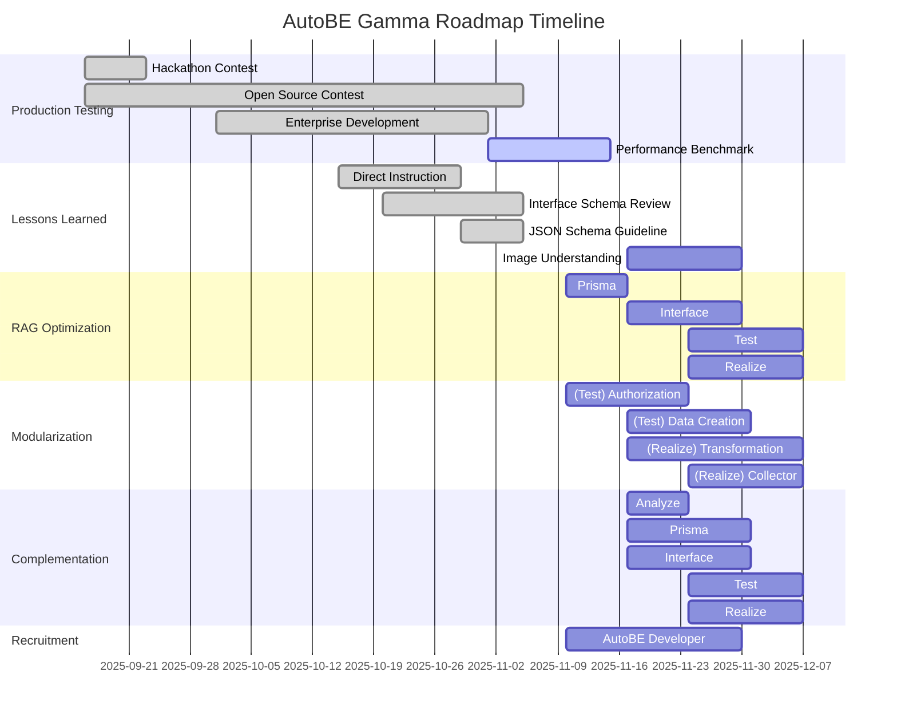

import { Tabs } from "nextra/components";

import AutoBeDemoModelMovie from "../../../movies/demo/AutoBeDemoModelMovie";

## Preface


(AI 야, 로드맵이 v1.0 플랜에서 변경되었는데, 그 이유가 Enterprise Development 단계에서의 필드테스트와 그것의 전훈임을 명시하고, 그에 따른 감마 플랜을 신설하여 로드맵을 변경함을 대강 요약하여 서술하거라. 참고로 v1.0 로드맵은 [v1.0 legacy roadmap](./v1.0-legacy) 이런 식으로 어딘가에 링크 걸어주어야 함. 그리고 v1.0 로드맵보다 개발 주기가 훨씬 짧아졌고 만들어야 할 기능도 더 많아졌는데, 대신 감마 로드맵은 각각의 티켓마다 100% 완성도를 바라고하는게 아니라, 우선 기초 개발을 해놓고 감마 로드맵 이후에 추가 퀄리티 재고를 하려는 목적으로 진행하는거야. 각각의 일을 완벽하게 하려는게 아니라, 기초 설계와 프로토타입 구현을 이루고, 이들 각각을 다시 티켓으로 나누어 새로이 채용할 AutoBE 개발자들에게 퀄리티 재고를 맡기려하는, 뭐 그런 스토리야. 다만 이러한 이야기를 너무 길게는 하지 마려무나.)

## 1. Production Testing
### 1.1. Hackathon Contest
AutoBE 의 기반 프레임워크가 되는 Agentica 의 오픈소스 대회를 공동 개최였다. 그리고 AutoBE 해커톤 대화에 참여하여 백엔드 어플리케이션을 생성하고 리뷰한 참여자들로부터, 피드백을 받았다.

그러나 해커톤 대회에 참여하여 상금을 받고자하는 참여자들의 입장이 있어서 그러한지, 비판적인 시각의 피드백은 거의 받지 못하였다. 또한 AutoBE 가 생성해주는 코드의 양이 워낙 방대해서인지, 생성된 코드를 사람이 직접 꼼꼼히 둘러보며 리뷰하기보다는, AI 의 도움을 받아 보고서를 생성한 경우가 많았다.

(AI야, 내가 뭐 대강 축약해서 쓴건데, 너가 좀 글 좀 다듬어서 잘 써 보니라)

### 1.2. Open Source Contest
Agentica 의 오픈소스 대회를 한국 정부와 공동 개최하였다.

Agentica 는 function calling 에 특화된 Agentic AI framework 로써, AutoBE 의 핵심 엔진으로 기능하고 있다. 특히 [`AutoBePrisma.IApplication`](https://github.com/wrtnlabs/autobe/blob/main/packages/interface/src/prisma/AutoBePrisma.ts) 이나 [`AutoBeOpenApi.IDocument`](https://github.com/wrtnlabs/autobe/blob/main/packages/interface/src/openapi/AutoBeOpenApi.ts) 및 [`AutoBeTest.IFunction`](https://github.com/wrtnlabs/autobe/blob/main/packages/interface/src/test/AutoBeTest.ts) 등 컴파일러의 AST 구조를 function calling 으로 생성하고 잘못된 타입 데이터를 교정하는데 지대한 역할을 하고 있다.

그리고 이러한 Agentica 를 활용하여 AI chatbot 등을 만드는 오픈소스 대회를 한국 정부와 함께 개최하였다. 많은 팀들이 참가하였고, 본선에 총 10 팀이 진출하여 자웅을 겨루고 잇다.

우리는 이들로부터 Agentica 의 활용 사례를 수집하고, 또한 피드백 받는다. 특히 대회 참가자들 중 특별히 AI function calling 을 위한 함수와 스키마 정의를 조리있게 잘하고 에이전트 활용력이 뛰어난 참가자들을 물색, 자사 Wrtn Technologies 의 AI Agent 개발팀에 영입하고자 한다.

(AI야, 내가 뭐 대강 축약해서 쓴건데, 너가 좀 글 좀 다듬어서 잘 써 보니라)

### 1.3. Enterprise Development
AutoBE 로 자사(Wrtn Technologies)의 B2B 엔터프라이즈 백엔드를 빌드하고, 이를 실제 운영 환경에 적용하며 약 한 달 간의 필드 테스트를 진행하였다.

AutoBE 를 개발한 Wrtn Technologies 가 운영하는 AI 챗봇 (https://wrtn.ai) 은 MAU가 약 700 만명에 달할 정도로 큰 서비스이다. 현재 이 서비스는 B2C 서비스로 운영되고 있는데, Wrtn Technologies 는 이 서비스를 B2B 서비스로 확장하고자 한다. 그리고 B2B 백엔드 개발에 AutoBE 를 활용하여 필드 테스트를 진행하였다.

그리고 이렇게 대형 서비스의 백엔드 개발에 AutoBe 를 활용하여 필드 테스트를 진행하면서, AutoBE 의 장점과 동시에 한계점도 느꼈다. 이러한 전훈들을 바탕으로 AutoBE 의 기능을 개선하고 보완하며, 동시에 로드맵 계획도 수정하여 이렇게 감마 플랜이 수립되었다.

Wrtn Technologies 의 B2B 백엔드 서버를 생성하며 느낀 AutoBE 의 보완점은 크게 다음과 같다.

- 스펙에 대한 지시: DB 설계나 API 스펙에 대한 직접적인 지시를 할 수 있어야 한다
- DTO 강화: Interface phase 의 DTO 설계부에서 무결성과 안정성 및 보안성을 강화해야 한다
- 이미지 분석 능력: 문서가 아닌 이미지로부터도 요구사항을 발굴할 수 있어야 한다
- RAG Optimization: 아래 기능들의 지원을 위해 당장 필요하다
- 모듈화: test 와 realize agent 의 생성 코드가 모듈화되어, 사용자가 직접 수정하기 편해야함
- 유지보수 기능 지원: 생성된 코드를 유지보수할 수 있는 기능이 필요하다

(AI야, 내가 뭐 대강 축약해서 쓴건데, 너가 좀 글 좀 다듬어서 잘 써 보니라)

### 1.4. Performance Benchmark
AutoBE 의 성능 벤치마크 측정 시스템을 구축, 상시 평가하고 개선한다.

(AI야, 알아서 잘 써 보니라.)

## 2. Lessons Learned
### 2.1. Direct Instruction
DB 스키마나 API 스펙 등에 유저가 직접 지시하여 개입할 수 있는 기능이 필요하다.

AutoBE 는 자연어로써 백엔드 어플리케이션을 생성하는 것을 목표로 해왔다. 그러나 Wrtn Technologies 의 B2B 백엔드 개발에는, 사용자가 DB 및 API 설계에 대한 스펙을 직접 지시할 수 있는 기능이 필요하였다. 예를 들어 AI 챗봇에 관련된 테이블과 DTO 스키마가 미리 정해져있다던가, B2B 고유의 API 규격이 존재한다던가 하는 사유로 말이다.

이에 AutoBE 는 사용자의 대화 내역을 분석, 요구사항을 정의하기 위한 analyze agent 에만 이를 전달하고 활용하는게 아니라, prisma 나 interface 등의 DB 및 API 설계 에이전트에도 해당 영역의 스펙을 발췌하여 직접 지시하고 전달할 수 있도록 개선해야한다.

(AI야, 내가 뭐 대강 축약해서 쓴건데, 너가 좀 글 좀 다듬어서 잘 써 보니라)

### 2.2. Interface Schema Review
Interface phase 의 DTO 설계부에서 리뷰 에이전트들을 분할하고 강화하여, 무결성과 안정성 및 보안성을 높인다.

- Relation
- Security
- Content

(AI야, 시스템 프롬프트 INTERFACE_SCHEMA.md 와 INTERFACE_SCHEMA_RELATION_REVIEW.md 와 INTERFACE_SCHEMA_SECURITY_REVIEW.md 및 INTERFACE_SCHEMA_CONTENT_REVIEW.md 를 참고하여 잘 써 보니라.)

### 2.3. JSON Schema Guideline
AutoBE 에서 DTO 는 JSON schema 를 기반으로 작성되는데, 이 JSON schema 의 작성 가이드라인을 수립하고 에이전트가 이를 준수하도록 개선해야 한다.

(AI야, interface schema review 에이전트가 저렇게 삼분화되고 보다 더 방대하고 복잡한 내용을 다루다보니, GPT-4.1 같은 상용 모델 말고 오픈소스 모델들에서는 DTO 를 JSON schema 로 만드는 거서부터 다 박살이나고, 엉터리같은 JSON schema 를 엄청 많이 만들더라고. 그래서 JSON schema 작성 가이드라인을 AI agent 에게 제공하려 함이니라. 알아서 잘 써 주도록.)

### 2.4. Image Understanding
이미지로부터 요구사항을 수집하고 이해하는 기능을 개발한다.

(AI야, 요구사항을 문서나 혹은 대화로 세세하게 풀어나가면 좋으련만, 세상은 그렇지 않단다. 우리 회사조차도 요구사항 정의서가 아닌 figma 등의 이미지 에셋에 실제 요구사항이 숨겨져있는 경우가 허다하게 많았단다. 이에 이미지로부터 요구사항을 수집하고 이해하는 에이전트를 만들어, analyze agent 에 이를 전달하고 활용할 수 있어야 한단다. 맥락을 이해했을거라 믿으며, 너가 잘 써주기를 바란단다)

## 3. RAG Optimization
<br/>
<AutoBeDemoModelMovie model="openai/gpt-4.1" />

Transitioning to a next-generation architecture that maximizes token efficiency and improves generation quality through intelligent cyclic workflows.

Currently, each AutoBE agent operates with a single function call, receiving and processing all results from previous stages in bulk. For example, the Test Agent receives all documents generated by Analysis, Prisma, and Interface Agents at once, causing inefficiency where token consumption increases exponentially at each stage.

In gamma update, we're transitioning to an intelligent cyclic structure where each agent **selectively requests only necessary information**. Agents gradually collect information through multiple function calls and generate final outputs when sufficient context is secured.

**Revolutionary Improvement Effects**:
- **70% Token Consumption Reduction**: Eliminating unnecessary context through selective information loading
- **Improved Memory Efficiency**: Stable processing even in large-scale projects
- **Enhanced Accuracy**: More accurate code generation with focused context
- **Progressive Improvement**: Immediate reflection of feedback at each stage

<Tabs 
  items={["Interface Agent", "Test Agent"]}
  defaultIndex={1}>
  <Tabs.Tab>
```typescript showLineNumbers
interface IAutoBeInterfaceOperationApplication {
  getDocuments(filenames: string[]): Record<string, string>;
  getModels(names: string[]): AutoBePrisma.IModel[]; 
  complete(operations: AutoBeOpenApi.IOperation[]): void;
  halt(reason: string): void;
}
```
  </Tabs.Tab>
  <Tabs.Tab>
```typescript showLineNumbers
interface IAutoBeTestScenarioApplication {
  getDocuments(filenames: string[]): Record<string, string>;
  getModels(names: string[]): AutoBePrisma.IModel[]; 
  getOperation(endpoints: AutoBeOpenApi.IEndpoint[]): {
    operations: AutoBeOpenApi.IOperation[];
    schemas: Record<string, AutoBeOpenApi.IJsonSchemaDescriptive>;
  };
  complete(scenario: IAutoBeTestScenario): void;
  halt(reason: string): void;
}
```
  </Tabs.Tab>
</Tabs>

This cyclic workflow evolves AutoBE into a smarter and more efficient system, enabling cost-effective operation even in large-scale enterprise projects.

(AI 야, 내가 이전에 썼던 문서를 다시 가져왔는데, 문제는 이 RAG optimization 이 이후 단원인 modularization 과 complementation 에 필수적으로 선행되어야한다는 것이거든? 이것까지 잘 고려하여 양질의 품질로 개정해주렴)

## 4. Modularization
(AI 야, Enterprise Development 를 통해 필드 테스트를 진행했을 때, AutoBE 가 생성한 코드를 개발자가 개입하여 직접 수정하는 경우도 왕왕 있었거든? 뭐 회사 특유의 보안 규칙이나 외부에 연동해야하는 결제 API 등이나, 아니면 기 개발된 AI 챗봇과의 연동이나 웹소켓 스트리밍 기능 추가 등, 사연은 다양하지. 근데 현재 AutoBE 는 test agent 의 경우 각 e2e 테스트 함수마다 로직을 각자 따로 구현하며, realize agent 도 API 별로 로직을 따로이 만들어. 그래서 무수히 파편화된 코드와 중복의 향연은 이를 사용자가 직접 수정하는데 매우 어려운 난관으로 다가왔단다. 물론 AutoBE 는 그간 생성된 백엔드 어플리케이션의 컴파일 성공률 100%와 런타임 성공률 100%를 목표로 달려왔는데다가, 원래 처음에는 이렇게 각각 따로이 코드를 생성하게 하고 추후 개선점이나 패턴을 찾아 모듈화를 시키는게 맞긴 하거든? 그래도 아무튼 필드 테스트 때 매우 불편했어. 그래서 이것도 시급한 과제로써 처리하기로 하였지. 이에 대해 잘 써주기를 바래.)

### 4.1. (Test) Authorization
### 4.2. (Test) Data Creation
### 4.3. (Realize) Transformation
### 4.4. (Realize) Collection

## 5. Complementation
AutoBE 에 유지보수 기능을 개발하여 도입한다.

(AI 야, Enterprise Development 를 통해 필드 테스트를 진행했는데, AutoBE 가 생성한 결과가 일부 마음에 안 들 수도 있잖아? 필드 테스트는 그 때마다 AutoBE 로 백엔드 어플리케이션을 완전히 다시 만들어야했었고, 그래서 매우 불편하고 번거로웠단다. 그리고 사람이란게 10만줄에 달하는 방대한 코드를 처음부터 완벽하게 리뷰할 수가 없어요. 그래서 미처 발견못했는데, AutoBE 로 다시 백엔드 생성하고보니, 어? 또 새로운 마음에 안 드는 거리를 발견했네? 같은 경우가 있더라고. 이래서 필드 테스트에서 가장 절실했던게 이 유지보수 기능을 지원하는 거였어. 너가 잘 서술해주리라 믿는다.)

## 6. Recruitment
AutoBE 개발자를 채용, gamma release 이후 지속적인 유지보수와 기능 개선을 담당한다.