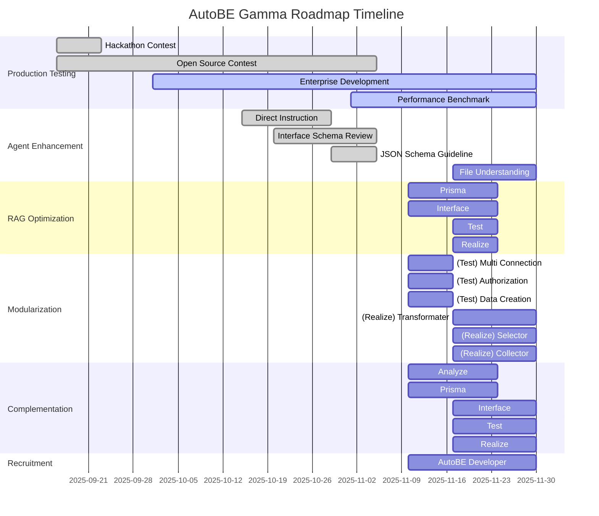

import { Tabs } from "nextra/components";

import AutoBeDemoModelMovie from "../../../movies/demo/AutoBeDemoModelMovie";

## Preface


## 1. Production Testing
### 1.1. Hackathon Contest
AutoBE 의 해커톤 대회를 개최함.

### 1.2. Open Source Contest
AutoBE 의 기반 프레임워크가 되는 Agentica 의 오픈소스 대회를 공동 개최함.

### 1.3. Enterprise Development
AutoBE 를 만든 회사 Wrtn Technologies 의 B2B 용 엔터프라이즈 백엔드 시스템을 AutoBE 로 개발함.

### 1.4. Performance Benchmark
AutoBE 의 성능 벤치마크 측정 시스템을 구축, 상시 평가하고 개선함.

## 2. Agent Enhancement
### 2.1. Direct Instruction
DB 스키마나 API 스펙 등에 유저가 직접 지시하여 개입할 수 있는 기능을 도입함.

### 2.2. Interface Schema Review
Interface phase 의 DTO 설계부에서 리뷰 에이전트들을 분할하고 강화하여, 무결성과 안정성 및 보안성을 높임.

### 2.3. JSON Schema Guideline
AutoBE 에서 DTO 는 JSON schema 를 기반으로 작성되는데, 이 JSON schema 의 작성 가이드라인을 수립하고 에이전트가 이를 준수하도록 개선함.

### 2.4. File Understanding
파일 분석 능력을 강화하여, 이미지나 문서 파일 등으로부터 요구사항을 수집하고 이해하는 기능을 개발한다.

## 3. RAG Optimization
<br/>
<AutoBeDemoModelMovie model="openai/gpt-4.1" />

Transitioning to a next-generation architecture that maximizes token efficiency and improves generation quality through intelligent cyclic workflows.

Currently, each AutoBE agent operates with a single function call, receiving and processing all results from previous stages in bulk. For example, the Test Agent receives all documents generated by Analysis, Prisma, and Interface Agents at once, causing inefficiency where token consumption increases exponentially at each stage.

In gamma update, we're transitioning to an intelligent cyclic structure where each agent **selectively requests only necessary information**. Agents gradually collect information through multiple function calls and generate final outputs when sufficient context is secured.

**Revolutionary Improvement Effects**:
- **90% Token Consumption Reduction**: Eliminating unnecessary context through selective information loading
- **Improved Memory Efficiency**: Stable processing even in large-scale projects
- **Enhanced Accuracy**: More accurate code generation with focused context
- **Progressive Improvement**: Immediate reflection of feedback at each stage

<Tabs 
  items={["Interface Agent", "Test Agent"]}
  defaultIndex={1}>
  <Tabs.Tab>
```typescript showLineNumbers
interface IAutoBeInterfaceOperationApplication {
  getDocuments(filenames: string[]): Record<string, string>;
  getModels(names: string[]): AutoBePrisma.IModel[]; 
  complete(operations: AutoBeOpenApi.IOperation[]): void;
  halt(reason: string): void;
}
```
  </Tabs.Tab>
  <Tabs.Tab>
```typescript showLineNumbers
interface IAutoBeTestScenarioApplication {
  getDocuments(filenames: string[]): Record<string, string>;
  getModels(names: string[]): AutoBePrisma.IModel[]; 
  getOperation(endpoints: AutoBeOpenApi.IEndpoint[]): {
    operations: AutoBeOpenApi.IOperation[];
    schemas: Record<string, AutoBeOpenApi.IJsonSchemaDescriptive>;
  };
  complete(scenario: IAutoBeTestScenario): void;
  halt(reason: string): void;
}
```
  </Tabs.Tab>
</Tabs>

This cyclic workflow evolves AutoBE into a smarter and more efficient system, enabling cost-effective operation even in large-scale enterprise projects.

## 4. Modularization
### 4.1. (Test) Multi Connection
### 4.2. (Test) Authorization
### 4.3. (Test) Data Creation
### 4.4. (Realize) Transformer
### 4.5. (Realize) Selection
### 4.6. (Realize) Collection

## 5. Complementation
AutoBE 에 유지보수 기능을 개발하여 도입한다.

## 6. Recruitment
AutoBE 개발자를 채용, gamma release 이후 지속적인 유지보수와 기능 개선을 담당한다.