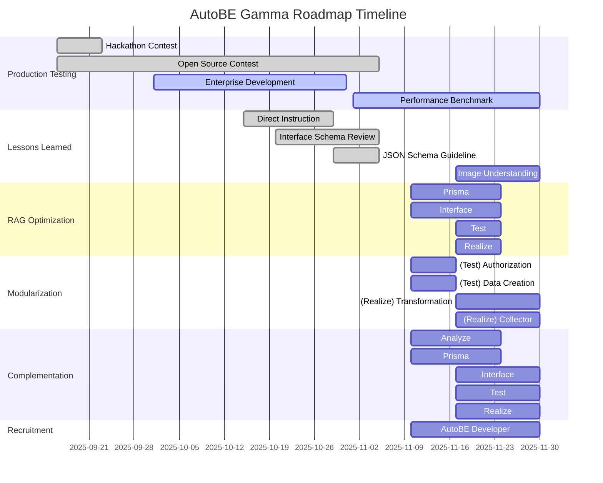

import { Tabs } from "nextra/components";

import AutoBeDemoModelMovie from "../../../movies/demo/AutoBeDemoModelMovie";

## Preface


## 1. Production Testing
### 1.1. Hackathon Contest
AutoBE 의 기반 프레임워크가 되는 Agentica 의 오픈소스 대회를 공동 개최였다. 그리고 AutoBE 해커톤 대화에 참여하여 백엔드 어플리케이션을 생성하고 리뷰한 참여자들로부터, 피드백을 받았다.

그러나 해커톤 대회에 참여하여 상금을 받고자하는 참여자들의 입장이 있어서 그러한지, 비판적인 시각의 피드백은 거의 받지 못하였다. 또한 AutoBE 가 생성해주는 코드의 양이 워낙 방대해서인지, 생성된 코드를 사람이 직접 꼼꼼히 둘러보며 리뷰하기보다는, AI 의 도움을 받아 보고서를 생성한 경우가 많았다.

### 1.2. Open Source Contest
Agentica 의 오픈소스 대회를 한국 정부와 공동 개최하였다.

Agentica 는 function calling 에 특화된 Agentic AI framework 로써, AutoBE 의 핵심 엔진으로 기능하고 있다. 특히 [`AutoBePrisma.IApplication`](https://github.com/wrtnlabs/autobe/blob/main/packages/interface/src/prisma/AutoBePrisma.ts) 이나 [`AutoBeOpenApi.IDocument`](https://github.com/wrtnlabs/autobe/blob/main/packages/interface/src/openapi/AutoBeOpenApi.ts) 및 [`AutoBeTest.IFunction`](https://github.com/wrtnlabs/autobe/blob/main/packages/interface/src/test/AutoBeTest.ts) 등 컴파일러의 AST 구조를 function calling 으로 생성하고 잘못된 타입 데이터를 교정하는데 지대한 역할을 하고 있다.

그리고 이러한 Agentica 를 활용하여 AI chatbot 등을 만드는 오픈소스 대회를 한국 정부와 함께 개최하였다. 많은 팀들이 참가하였고, 본선에 총 10 팀이 진출하여 자웅을 겨루고 잇다.

우리는 이들로부터 Agentica 의 활용 사례를 수집하고, 또한 피드백 받는다. 특히 대회 참가자들 중 특별히 AI function calling 을 위한 함수와 스키마 정의를 조리있게 잘하고 에이전트 활용력이 뛰어난 참가자들을 물색, 자사 Wrtn Technologies 의 AI Agent 개발팀에 영입하고자 한다.

### 1.3. Enterprise Development
AutoBE 로 자사(Wrtn Technologies)의 B2B 엔터프라이즈 백엔드를 빌드하고, 이를 실제 운영 환경에 적용하며 약 한 달 간의 필드 테스트를 진행하였다.

AutoBE 를 개발한 Wrtn Technologies 가 운영하는 AI 챗봇 (https://wrtn.ai) 은 MAU가 약 700 만명에 달할 정도로 큰 서비스이다. 현재 이 서비스는 B2C 서비스로 운영되고 있는데, Wrtn Technologies 는 이 서비스를 B2B 서비스로 확장하고자 한다. 그리고 B2B 백엔드 개발에 AutoBE 를 활용하여 필드 테스트를 진행하였다.

그리고 이렇게 대형 서비스의 백엔드 개발에 AutoBe 를 활용하여 필드 테스트를 진행하면서, AutoBE 의 장점과 동시에 한계점도 느꼈다. 이러한 전훈들을 바탕으로 AutoBE 의 기능을 개선하고 보완하며, 동시에 로드맵 계획도 수정하여 이렇게 감마 플랜이 수립되었다.

Wrtn Technologies 의 B2B 백엔드 서버를 생성하며 느낀 AutoBE 의 보완점은 크게 다음과 같다.

- 스펙에 대한 지시: DB 설계나 API 스펙에 대한 직접적인 지시를 할 수 있어야 한다
- DTO 강화: Interface phase 의 DTO 설계부에서 무결성과 안정성 및 보안성을 강화해야 한다
- 이미지 분석 능력: 문서가 아닌 이미지로부터도 요구사항을 발굴할 수 있어야 한다
- 모듈화: test 와 realize agent 의 생성 코드가 모듈화되어, 사용자가 직접 수정하기 편해야함
- 유지보수 기능 지원: 생성된 코드를 유지보수할 수 있는 기능이 필요하다

### 1.4. Performance Benchmark
AutoBE 의 성능 벤치마크 측정 시스템을 구축, 상시 평가하고 개선함.

## 2. Lessons Learned
### 2.1. Direct Instruction
DB 스키마나 API 스펙 등에 유저가 직접 지시하여 개입할 수 있는 기능이 필요하다.

AutoBE 는 자연어로써 백엔드 어플리케이션을 생성하는 것을 목표로 해왔다. 그러나 Wrtn Technologies 의 B2B 백엔드 개발에는, 사용자가 DB 및 API 설계에 대한 스펙을 직접 지시할 수 있는 기능이 필요하였다. 예를 들어 AI 챗봇에 관련된 테이블과 DTO 스키마가 미리 정해져있다던가, B2B 고유의 API 규격이 존재한다던가 하는 사유로 말이다.

이에 AutoBE 는 사용자의 대화 내역을 분석, 요구사항을 정의하기 위한 analyze agent 에만 이를 전달하고 활용하는게 아니라, prisma 나 interface 등의 DB 및 API 설계 에이전트에도 해당 영역의 스펙을 발췌하여 직접 지시하고 전달할 수 있도록 개선해야한다.

### 2.2. Interface Schema Review
Interface phase 의 DTO 설계부에서 리뷰 에이전트들을 분할하고 강화하여, 무결성과 안정성 및 보안성을 높인다.

- Relation
- Security
- Content

### 2.3. JSON Schema Guideline
AutoBE 에서 DTO 는 JSON schema 를 기반으로 작성되는데, 이 JSON schema 의 작성 가이드라인을 수립하고 에이전트가 이를 준수하도록 개선해야 함.

### 2.4. Image Understanding
이미지로부터 요구사항을 수집하고 이해하는 기능을 개발한다.

## 3. RAG Optimization
<br/>
<AutoBeDemoModelMovie model="openai/gpt-4.1" />

Transitioning to a next-generation architecture that maximizes token efficiency and improves generation quality through intelligent cyclic workflows.

Currently, each AutoBE agent operates with a single function call, receiving and processing all results from previous stages in bulk. For example, the Test Agent receives all documents generated by Analysis, Prisma, and Interface Agents at once, causing inefficiency where token consumption increases exponentially at each stage.

In gamma update, we're transitioning to an intelligent cyclic structure where each agent **selectively requests only necessary information**. Agents gradually collect information through multiple function calls and generate final outputs when sufficient context is secured.

**Revolutionary Improvement Effects**:
- **70% Token Consumption Reduction**: Eliminating unnecessary context through selective information loading
- **Improved Memory Efficiency**: Stable processing even in large-scale projects
- **Enhanced Accuracy**: More accurate code generation with focused context
- **Progressive Improvement**: Immediate reflection of feedback at each stage

<Tabs 
  items={["Interface Agent", "Test Agent"]}
  defaultIndex={1}>
  <Tabs.Tab>
```typescript showLineNumbers
interface IAutoBeInterfaceOperationApplication {
  getDocuments(filenames: string[]): Record<string, string>;
  getModels(names: string[]): AutoBePrisma.IModel[]; 
  complete(operations: AutoBeOpenApi.IOperation[]): void;
  halt(reason: string): void;
}
```
  </Tabs.Tab>
  <Tabs.Tab>
```typescript showLineNumbers
interface IAutoBeTestScenarioApplication {
  getDocuments(filenames: string[]): Record<string, string>;
  getModels(names: string[]): AutoBePrisma.IModel[]; 
  getOperation(endpoints: AutoBeOpenApi.IEndpoint[]): {
    operations: AutoBeOpenApi.IOperation[];
    schemas: Record<string, AutoBeOpenApi.IJsonSchemaDescriptive>;
  };
  complete(scenario: IAutoBeTestScenario): void;
  halt(reason: string): void;
}
```
  </Tabs.Tab>
</Tabs>

This cyclic workflow evolves AutoBE into a smarter and more efficient system, enabling cost-effective operation even in large-scale enterprise projects.

## 4. Modularization
### 4.1. (Test) Authorization
### 4.2. (Test) Data Creation
### 4.3. (Realize) Transformation
### 4.4. (Realize) Collection

## 5. Complementation
AutoBE 에 유지보수 기능을 개발하여 도입한다.

## 6. Recruitment
AutoBE 개발자를 채용, gamma release 이후 지속적인 유지보수와 기능 개선을 담당한다.