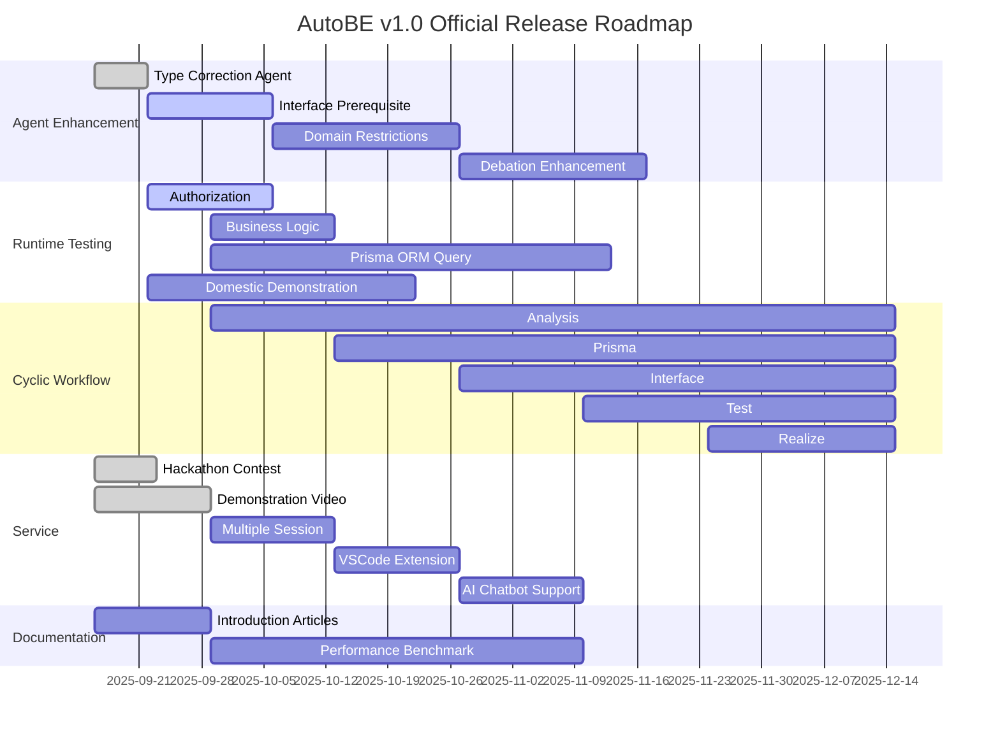

## Preface


## 1. Agent Enhancement
### 1.1. Type Correction Agent
TypeScript 타입 캐스팅 및 타입 할당 오류 해결을 전문으로 하는 독립적인 교정 에이전트를 도입하여 컴파일 성공률을 획기적으로 개선하였습니다.

AutoBE의 Test와 Realize Agent는 복잡한 TypeScript 코드를 생성하는 과정에서 typia 태그 타입 불일치, Date to string 변환, nullable/undefined 타입 할당 등 다양한 타입 캐스팅 오류를 빈번하게 발생시켰습니다. 기존의 범용 컴파일러 피드백 시스템으로는 이러한 특화된 오류 패턴을 효과적으로 해결할 수 없었으며, 특히 `"typia.tag"` 속성 불일치와 같은 복잡한 교차 타입 문제는 지속적인 컴파일 실패의 주요 원인이었습니다.

이에 AutoBE 팀은 타입 캐스팅 오류만을 전문적으로 처리하는 Type Correction Agent를 개발했습니다. 이 에이전트는 `satisfies` 연산자 패턴, `typia.assert` vs `typia.assertGuard`의 정확한 구분, nullish coalescing 처리 등 12가지 주요 타입 오류 패턴에 대한 전문적인 해결 전략을 구현합니다.

**주요 성과**: 이 미션은 현재 완료되었으며, 그 결과 Beta 릴리즈에서 `openai/gpt-4.1`뿐만 아니라 `openai/gpt-4.1-mini`, `qwen3-next-80b-a3b` 등의 경량 모델로도 **컴파일 성공률 100%**를 달성할 수 있게 되었습니다. 이는 AutoBE의 접근성을 크게 향상시켜, 더 많은 개발자들이 비용 효율적으로 AI 백엔드 개발을 활용할 수 있는 기반을 마련했습니다.

### 1.2. Interface Prerequisite
API 호출 간 의존성을 명확히 정의하여 테스트 품질과 AI 챗봇 지능을 동시에 향상시키는 선행조건 도출 시스템을 구축합니다.

Interface Agent에 `AutoBeOpenApi.IOperation.prerequisites` 속성을 추가하여, 각 API 작업을 수행하기 전에 필수적으로 호출해야 하는 다른 API들을 명시적으로 정의합니다. 예를 들어, "주문 생성" API는 "사용자 인증", "상품 재고 확인", "배송지 검증" 등의 선행 API 호출이 필요하며, 이러한 의존성 관계를 체계적으로 문서화합니다.

**핵심 활용 분야**:

1. **정교한 E2E 테스트 시나리오**: Test Agent가 API 호출 순서를 정확히 이해하여 실제 사용자 플로우를 반영한 현실적인 테스트 케이스를 생성합니다. 선행조건이 명확하면 테스트 데이터 준비, 상태 설정, 정리 작업까지 자동화할 수 있습니다.

2. **AI 챗봇 지능 향상**: [4.5. AI Chatbot Support](#45-ai-chatbot-support)에서 설명할 AI 챗봇이 사용자 요청을 처리할 때, 필요한 정보를 자동으로 수집하고 올바른 순서로 API를 호출할 수 있게 됩니다. 예를 들어, 사용자가 "내 주문 취소해줘"라고 요청하면, 챗봇은 자동으로 "사용자 인증 → 주문 조회 → 취소 가능 여부 확인 → 주문 취소" 순서로 API를 호출합니다.

이 기능은 단순한 문서화를 넘어, AutoBE가 생성한 백엔드를 즉시 대화형 인터페이스로 변환할 수 있는 핵심 인프라가 됩니다.

### 1.3. Domain Restrictions
도메인별 제약사항과 비즈니스 규칙을 체계적으로 관리하여 실무 수준의 백엔드 애플리케이션을 생성합니다.

실제 비즈니스 환경에서는 도메인마다 고유한 제약사항과 규칙이 존재합니다. 금융 도메인의 거래 한도, 전자상거래의 재고 관리 규칙, 의료 시스템의 개인정보 보호 요구사항 등이 그 예입니다. AutoBE는 이러한 도메인별 특성을 이해하고 적절한 제약사항을 자동으로 적용할 수 있도록 발전합니다.

**구현 내용**:
- **산업별 템플릿**: 금융, 의료, 전자상거래, 교육 등 주요 산업별 표준 제약사항 라이브러리 구축
- **규정 준수 자동화**: GDPR, PCI-DSS, HIPAA 등 규정 요구사항을 코드 레벨에서 자동 적용
- **비즈니스 규칙 엔진**: 복잡한 비즈니스 로직을 선언적으로 정의하고 검증하는 시스템
- **도메인 검증 체계**: 생성된 코드가 해당 도메인의 모든 제약사항을 준수하는지 자동 검증

이를 통해 AutoBE는 단순한 CRUD 애플리케이션을 넘어, 실제 비즈니스 요구사항을 충족하는 production-ready 백엔드를 생성할 수 있게 됩니다.

### 1.4. Debation Enhancement
사용자와의 심층적인 요구사항 토론을 통해 완벽한 백엔드 사양을 도출하는 지능형 대화 시스템을 구현합니다.

v1.0 릴리즈는 "알아서 해주세요" 같은 추상적 요구사항이 아닌, 실제 비즈니스 사례에 기반한 구체적이고 복잡한 요구사항을 정확히 이해하고 구현하는 것을 목표로 합니다. 이를 위해 AutoBE는 사용자와 능동적으로 대화하며 숨겨진 요구사항을 발견하고, 모호한 부분을 명확히 하는 고도화된 토론 능력을 갖추게 됩니다.

**강화된 대화 능력**:
- **컨텍스트 기반 질문**: 도메인과 프로젝트 특성에 맞는 맞춤형 질문 생성
- **요구사항 충돌 감지**: 상충하는 요구사항을 식별하고 사용자와 함께 해결
- **Best Practice 제안**: 사용자 요구사항에 대해 업계 표준과 모범 사례 제시
- **점진적 구체화**: 추상적 요구사항을 단계별 대화를 통해 구체적 사양으로 변환
- **의사결정 기록**: 모든 설계 결정과 그 근거를 체계적으로 문서화

이러한 강화된 토론 능력을 통해 AutoBE는 단순한 코드 생성 도구를 넘어, 진정한 AI 기술 파트너로 진화합니다.

## 2. Runtime Testing
AutoBE는 베타 릴리즈에서 **컴파일 성공률 100%**라는 획기적인 이정표를 달성했습니다. 이제 v1.0 릴리즈에서는 한 단계 더 나아가 **런타임 성공률 100%**를 목표로, AI가 즉시 배포 가능한 완전무결한 백엔드 애플리케이션을 생성하는 새로운 시대를 열고자 합니다.

컴파일 성공은 문법적 정확성을 보장하지만, 진정한 가치는 실제 운영 환경에서 안정적으로 동작하는 코드에 있습니다. AutoBE v1.0은 비즈니스 로직의 정확성, 데이터 무결성, 성능 최적화, 보안 강화 등 런타임 품질의 모든 측면을 AI가 자율적으로 검증하고 보장하는 시스템을 구축합니다.

### 2.1. Authorization
인증/인가 로직을 런타임에서 정확하게 구현하는 코드 생성을 개선합니다.

JWT와 Session 기반 인증을 올바르게 구현하고, 사용자 역할에 따른 기본적인 권한 관리 로직을 자동 생성합니다. 토큰 생성, 갱신, 만료 등 필수적인 생명주기 관리를 구현하여 안정적으로 동작하는 인증 시스템을 자동으로 만들 수 있게 합니다.

### 2.2. Business Logic
비즈니스 규칙을 정확하게 구현하여 런타임 오류 없는 로직을 생성합니다.

**핵심 개선 사항**:
- **기본 트랜잭션 처리**: 데이터베이스 작업의 원자성 보장
- **비즈니스 규칙 구현**: 도메인별 비즈니스 로직을 정확하게 코드로 변환
- **에러 처리**: 예상 가능한 예외 상황에 대한 적절한 처리
- **데이터 검증**: 입력 데이터의 유효성 검증 로직 자동 생성

AutoBE는 요구사항에 명시된 비즈니스 로직을 안정적으로 구현합니다.

### 2.3. Prisma ORM Query
데이터베이스 쿼리를 런타임에서 정확하게 실행하는 ORM 쿼리 생성을 개선합니다.

현재 AutoBE는 복잡한 DB 설계에서 Prisma ORM 쿼리를 생성할 때, 컴파일은 통과하지만 런타임에서 실패하는 코드를 간혹 생성합니다. 특히 다중 관계 조인, 순환 참조, 복잡한 필터링 조건에서 문제가 발생합니다.

v1.0에서는 조인 쿼리와 필터링 로직을 정확하게 처리하고, 기본 집계 함수들을 올바르게 사용하며, 트랜잭션 처리 시 데이터 일관성을 유지하도록 개선합니다. 이를 통해 (analyze → prisma → interface → test → realize)로 이어지는 전체 워크플로우에서 안정적으로 동작하는 코드를 생성합니다.

### 2.4. Domestic Demonstration
뤼튼 테크놀로지스가 자사 서비스 개발에 AutoBE를 적용하여 실용성을 검증합니다.

AutoBE를 실제 프로덕션 환경에서 사용 가능한 도구로 만들기 위해, 자사 서비스 개발에 실험적으로 적용합니다. 구체적인 내용은 공개할 수 없지만, 실제 운영 서비스 개발에 활용하여 실무 적용 가능성을 확인할 예정입니다.

**검증 목표**:
- **실용성**: 실제 비즈니스 요구사항을 충족하는 백엔드 생성
- **안정성**: 생성된 코드가 프로덕션 환경에서 안정적으로 동작
- **유지보수성**: AI로 생성된 코드를 개발자가 이해하고 수정 가능
- **개발 속도**: 전통적 개발 방식 대비 개발 시간 단축 효과

이 실증 프로젝트를 통해 AutoBE가 실무에서 활용 가능한 실용적인 도구임을 증명합니다.

## 3. Cyclic Workflow
지능형 순환 워크플로우를 통해 토큰 효율성을 극대화하고 생성 품질을 향상시키는 차세대 아키텍처로 전환합니다.

현재 AutoBE의 각 에이전트는 단일 함수 호출로 작동하며, 이전 단계의 모든 결과물을 일괄 전달받아 처리합니다. 예를 들어 Test Agent는 Analysis, Prisma, Interface Agent가 생성한 모든 문서를 한 번에 받아 처리하는데, 이는 각 단계마다 토큰 소비량이 기하급수적으로 증가하는 비효율을 초래했습니다.

v1.0에서는 각 에이전트가 **필요한 정보만 선택적으로 요청**하는 지능형 순환 구조로 전환합니다. 에이전트는 여러 번의 함수 호출을 통해 점진적으로 정보를 수집하고, 충분한 컨텍스트가 확보되면 최종 결과물을 생성합니다.

**혁신적 개선 효과**:
- **토큰 소비 90% 절감**: 선택적 정보 로딩으로 불필요한 컨텍스트 제거
- **메모리 효율성 향상**: 대규모 프로젝트에서도 안정적인 처리 가능
- **정확도 향상**: 집중된 컨텍스트로 더 정확한 코드 생성
- **점진적 개선**: 각 단계에서 피드백을 받아 즉시 반영 가능

```typescript
interface ITestWriteApplication {
  getDocuments(filenames: string[]): Record<string, string>;
  getModel(names: string[]): AutoBePrisma.IModel[]; 
  getOperation(endpoints: AutoBeOpenApi.IEndpoint[]): {
    operations: AutoBeOpenApi.IOperation[];
    schemas: Record<string, AutoBeOpenApi.IJsonSchemaDescriptive>;
  };
  complete(file: IAutoBeTestFunction): void;
  halt(reason: string): void;
}
```

이러한 순환 워크플로우는 AutoBE를 더욱 스마트하고 효율적인 시스템으로 진화시켜, 대규모 엔터프라이즈 프로젝트에서도 비용 효율적으로 운영할 수 있게 합니다.

## 4. Service
### 4.1. Hackathon Contest
베타 릴리즈 직후 진행된 해커톤을 통해 AutoBE의 실전 검증과 커뮤니티 피드백을 성공적으로 수집했습니다.

2025년 9월 12일부터 14일까지 진행된 첫 번째 AutoBE 해커톤에는 40명의 숙련된 백엔드 개발자가 참여하여 AutoBE의 코드 생성 능력을 평가했습니다. 참가자들은 `openai/gpt-4.1-mini`와 `openai/gpt-4.1` 모델을 사용하여 실제 백엔드 애플리케이션을 생성하고, 요구사항 분석부터 구현 코드까지 전 과정을 검증했습니다.

**주요 성과**:
- 총 상금 $6,400 규모의 대회 성공적 완료
- 80개 이상의 상세한 기술 리뷰 확보
- 프로덕션 준비도에 대한 실무자 관점의 귀중한 피드백 수집
- AutoBE의 강점과 개선점에 대한 구체적인 인사이트 도출

참가자 피드백: https://github.com/wrtnlabs/autobe/discussions/categories/hackathon-2025-09-12

### 4.2. Demonstration Video
AutoBE와 AutoView를 결합한 풀스택 개발 프로세스를 시각적으로 보여주는 데모 영상을 제작합니다.

AutoBE의 백엔드 생성 능력과 AutoView의 프론트엔드 자동화를 통합하여, AI가 완전한 웹 애플리케이션을 처음부터 끝까지 구축하는 과정을 시연합니다. Reddit과 같은 커뮤니티 플랫폼을 몇 시간 만에 구현하는 과정을 담을 예정입니다.

**데모 내용**:
- 자연어 요구사항만으로 백엔드 구축
- Swagger 문서 기반 프론트엔드 생성
- 데이터베이스 스키마 설계 및 API 구현 과정
- 실행 가능한 애플리케이션 완성

데모 영상:

<br/>
<iframe
  src="https://www.youtube.com/embed/iE0b3Gt_uPk"
  title="Demo AutoBE & AutoView : Full-Stack development of a Reddit-like App"
  width="100%"
  style={{ aspectRatio: "16/9" }}
  allow="accelerometer; autoplay; clipboard-write; encrypted-media; gyroscope; picture-in-picture; web-share"
  referrerPolicy="strict-origin-when-cross-origin"
  allowFullScreen
></iframe>

### 4.3. Multiple Session


로컬 플레이그라운드에 다중 세션 관리 기능을 추가하여 여러 프로젝트를 효율적으로 관리할 수 있게 됩니다.

현재 AutoBE 플레이그라운드는 단일 세션만 지원하여 새로운 프로젝트를 시작하면 이전 대화가 사라지는 제약이 있습니다. v1.0에서는 해커톤 서비스에서 구현했던 다중 세션 인터페이스를 로컬 환경에 적용하여, 개발자가 여러 프로젝트를 동시에 진행하고 언제든지 이전 대화로 돌아갈 수 있게 합니다.

**기술적 차이점**:
- **해커톤 서비스**: PostgreSQL 기반의 클라우드 환경에서 다중 사용자 세션 관리
- **로컬 플레이그라운드**: SQLite 기반의 경량화된 로컬 세션 관리 시스템

**주요 기능**:
- 프로젝트별 독립된 대화 히스토리 유지
- 세션 간 빠른 전환 및 검색
- 대화 내용 내보내기/가져오기
- 프로젝트 템플릿 저장 및 재사용

### 4.4. VSCode Extension
개발자의 가장 친숙한 환경인 VSCode에서 직접 AutoBE를 사용할 수 있는 확장 프로그램을 출시합니다.

현재 AutoBE를 사용하려면 저장소를 클론하고 의존성을 설치하는 번거로운 과정이 필요합니다. v1.0에서는 VSCode 마켓플레이스에서 원클릭으로 설치 가능한 확장 프로그램을 제공하여, 개발자가 익숙한 IDE 환경에서 즉시 AI 백엔드 개발을 시작할 수 있게 합니다.

**핵심 기능**:
- **통합 개발 환경**: VSCode 내에서 AutoBE 채팅 인터페이스 직접 사용
- **실시간 코드 생성**: 생성된 코드가 에디터에 즉시 반영되어 바로 편집 가능
- **IntelliSense 지원**: 생성된 API와 데이터 모델에 대한 자동 완성 및 문서화
- **디버깅 통합**: 생성된 백엔드 코드를 VSCode 디버거로 즉시 디버깅
- **Git 통합**: 변경사항 추적 및 버전 관리 자동화

이를 통해 AutoBE는 개발자의 일상 워크플로우에 자연스럽게 통합되어, AI 지원 개발이 특별한 도구가 아닌 일상적인 개발 방식이 되도록 합니다.

### 4.5. AI Chatbot Support
AutoBE로 생성한 백엔드를 즉시 대화형 AI 챗봇으로 변환하여, 기술적 지식 없이도 API 기능을 완벽하게 체험하고 검증할 수 있습니다.

AutoBE가 생성하는 백엔드 애플리케이션은 수백 개의 API 엔드포인트와 복잡한 데이터 모델을 포함하여, 전체 구조를 파악하기 어려울 수 있습니다. 특히 프로그래밍에 익숙하지 않은 비즈니스 담당자나 기획자는 생성된 백엔드가 자신의 요구사항을 제대로 구현했는지 검증하기 어렵습니다.

v1.0에서는 **자동 AI 챗봇 변환** 기능을 통해 이 문제를 혁신적으로 해결합니다. 생성된 백엔드 API를 분석하여 자연어로 모든 기능을 사용할 수 있는 지능형 챗봇을 자동 생성합니다.

**실제 활용 시나리오**:
아래 영상은 AutoBE로 생성한 쇼핑몰 백엔드를 챗봇으로 변환한 실제 사례입니다. 사용자는 "상품 검색해줘", "장바구니에 담아줘", "주문해줘" 같은 자연스러운 대화만으로 복잡한 전자상거래 시스템의 모든 기능을 사용할 수 있습니다.

**챗봇이 자동으로 처리하는 작업**:
- API 호출 순서 자동 결정 (prerequisites 활용)
- 필요한 파라미터 대화형으로 수집
- 복잡한 워크플로우 단계별 안내
- 오류 발생 시 친절한 설명과 대안 제시
- 실행 결과를 이해하기 쉬운 형태로 표시

이를 통해 **"만들었으니 써보세요"**가 아닌 **"대화하면서 확인하세요"**라는 새로운 패러다임을 제시합니다.

<br/>
<iframe
  src="https://www.youtube.com/embed/RAzYo02HTXA"
  title="Demo AutoBE & AutoView : Full-Stack development of a Reddit-like App"
  width="100%"
  style={{ aspectRatio: "16/9" }}
  allow="accelerometer; autoplay; clipboard-write; encrypted-media; gyroscope; picture-in-picture; web-share"
  referrerPolicy="strict-origin-when-cross-origin"
  allowFullScreen
></iframe>

## 5. Documentation
### 5.1. Introduction Articles
전략적 콘텐츠 마케팅을 통해 AutoBE를 글로벌 개발자 커뮤니티에 확산시킵니다.

베타 릴리즈의 성공적인 문서화 전략을 바탕으로, v1.0에서는 더욱 체계적이고 포괄적인 기술 콘텐츠를 제작하여 주요 개발자 커뮤니티와 플랫폼에 배포합니다.

**콘텐츠 전략**:
- **기술 심화 시리즈**: AutoBE의 아키텍처, 컴파일러 전략, AI Function Calling 등 핵심 기술 상세 설명
- **성공 사례 연구**: 실제 기업에서 AutoBE를 활용한 프로젝트 사례와 ROI 분석
- **튜토리얼 시리즈**: 초급부터 고급까지 단계별 학습 자료
- **비교 분석**: 기존 개발 방식 대비 AutoBE의 장점을 정량적으로 분석

**배포 채널**:
- Medium, Dev.to, Hacker News 등 주요 기술 블로그 플랫폼
- Reddit, Stack Overflow 등 개발자 커뮤니티
- YouTube, Twitch 등 비디오 플랫폼을 통한 라이브 코딩 세션
- 주요 테크 컨퍼런스 발표 및 워크샵

### 5.2. Performance Benchmark
AI Function Calling 기반 코드 생성의 새로운 벤치마크 표준을 수립하고, 주요 AI 모델의 성능을 체계적으로 평가합니다.

AutoBE의 혁신은 AI가 텍스트로 코드를 작성하는 것이 아니라, **AST(Abstract Syntax Tree) 구조를 Function Calling으로 직접 구축**한다는 점입니다. 이는 기존 코드 생성 벤치마크와는 완전히 다른 평가 기준이 필요함을 의미합니다.

**AutoBE 전용 벤치마크 체계**:
- **Function Calling 정확도**: 복잡한 중첩 함수 호출의 정확한 실행률
- **AST 구조 완성도**: 생성된 구문 트리의 문법적/의미적 정확성
- **컨텍스트 일관성**: 다단계 워크플로우에서 컨텍스트 유지 능력
- **도메인 이해도**: 비즈니스 요구사항을 코드로 변환하는 정확도
- **컴파일 성공률**: 생성된 코드의 즉시 빌드 가능 비율
- **런타임 안정성**: 실제 실행 환경에서의 오류율

**평가 대상 모델**:
- **OpenAI**: GPT-4.1, GPT-4.1-mini, GPT-5 (출시 예정)
- **Anthropic**: Claude 4 시리즈
- **오픈소스**: Qwen3-next-80b-a3b, Llama 3.1, Mistral Large
- **신규 모델**: 매월 새로운 모델 추가 평가

**공개 벤치마크 리더보드**:
v1.0 출시와 함께 **월간 AutoBE 벤치마크 리포트**를 발행합니다. 각 모델의 성능을 10개 카테고리, 100개 테스트 시나리오로 평가하여 순위를 공개합니다. 이는 개발자들이 프로젝트 특성에 맞는 최적의 AI 모델을 선택할 수 있는 객관적 지표가 될 것입니다.

특히 비용 대비 성능 분석을 통해, 스타트업은 경제적인 모델을, 엔터프라이즈는 최고 성능 모델을 선택할 수 있도록 가이드를 제공합니다. 이 벤치마크는 AI 코드 생성 분야의 새로운 industry standard로 자리잡을 것입니다.