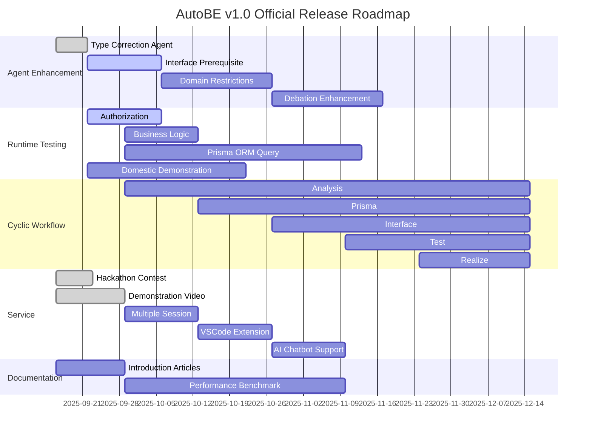

## Preface


## 1. Agent Enhancement
### 1.1. Type Correction Agent
### 1.2. Interface Prerequisite
### 1.3. Domain Restrictions
### 1.4. Debatation Enhancement

## 2. Runtime Testing
### 2.1. Authorization
### 2.2. Business Logic
### 2.3. Prisma ORM Query
### 2.4. Domestic Demonstration

## 3. Cyclic Workflow
일방향적 workflow 를 순환형으로 전환하는 작업을 진행한다.

현재 AutoBE 를 구성하는 에이전트는 AI function calling 에 사용하는 함수가 오직 한 개뿐이며, input materials 는 이전 단계의 에이전트가 생성한 결과물 전체이다. 가령 test agent 의 경우에는 이전 (analyze, prisma, interface) 에이전트가 생성한 요구사항 정의서와 DB 설계 및 API 스펙 모두를 전달받아 테스트 코드를 생성한다. 이 때문에 각 단계가 진행될 때마다 소요되는 AI 토큰 비용은 기하급수적으로 증가하였다.

이에 AutoBE 를 구성하는 각 워크플로우가 복수의 함수를 순환적으로 호출하는 구조로 전환한다. 각 에이전트는 여러 차례 (multi-turn) 에 걸쳐 필요한 input materials 만큼만을 추출하여 활용하며, 필요충분한 정보를 모았을 때 비로소 최종 결과물을 생성한다. 이를 통해 토큰 소비량과 컨텍스트를 대폭 절감, 각 워크플로우의 완성도를 높인다.

**식으로 잘 써라, 아래 예시 코드는 그대로 활용하는게 좋음.**

```typescript
interface ITestWriteApplication {
  getDocument(title: string): string;
  getModel(name: string): AutoBePrisma.IModel; 
  getOperation(input: AutoBeOpenApi.IEndpoint): AutoBeOpenApi.IOperation;
  getSchema(key: string): AutoBeOpenApi.IJsonSchemaDescriptive;
  complete(file: IAutoBeTestFunction): void;
  halt(reason: string): void;
}
```

## 4. Service
### 4.1. Hackathon Contest
AutoBE 베타 릴리즈 후, 해커톤 대회를 운영한다.

현재 해커톤 대회가 종료되었으며, 우승자가 선정되었다.

해커톤 대회 참여자들이 제출한 피드백: https://github.com/wrtnlabs/autobe/discussions/categories/hackathon-2025-09-12

### 4.2. Demonstration Video
AutoBE 및 AutoView 를 사용한 시연 영상을 제작함.

데모 영상 제작이 완료되었으며, 아래는 그 결과.

https://youtu.be/iE0b3Gt_uPk

### 4.3. Multiple Session
AutoBE 의 로컬 플레이그라운드가 해커톤 때 사용한 서비스처럼 여러 세션을 지원토록 개선, 

### 4.4. VSCode Extension
AutoBE 를 vscode extension 으로도 구현, AutoBE 를 직접 git clone 해야만 사용할 수 있는 플레이그라운드를 벗어나, vscode 마켓플레이스에서 바로 설치하여 사용할 수 있도록 개선.

### 4.5. AI Chatbot Support
AutoBE 로 생성한 백엔드 어플리케이션을 즉시 AI 챗봇으로 변환, 사용자가 백엔드 API 기능들을 대화형으로 체험해 볼 수 있도록 지원.

## 5. Documentation
### 5.1. Introduction Articles
AutoBE 를 소개하는 게시물들을 작성, 개발자 커뮤니티에 배포.

### 5.2. Performance Benchmark
AutoBE 의 성능을 각 AI 모델별로 벤치마킹, AutoBE 가 생성하는 백엔드 어플리케이션의 품질을 수치화하여 제시.