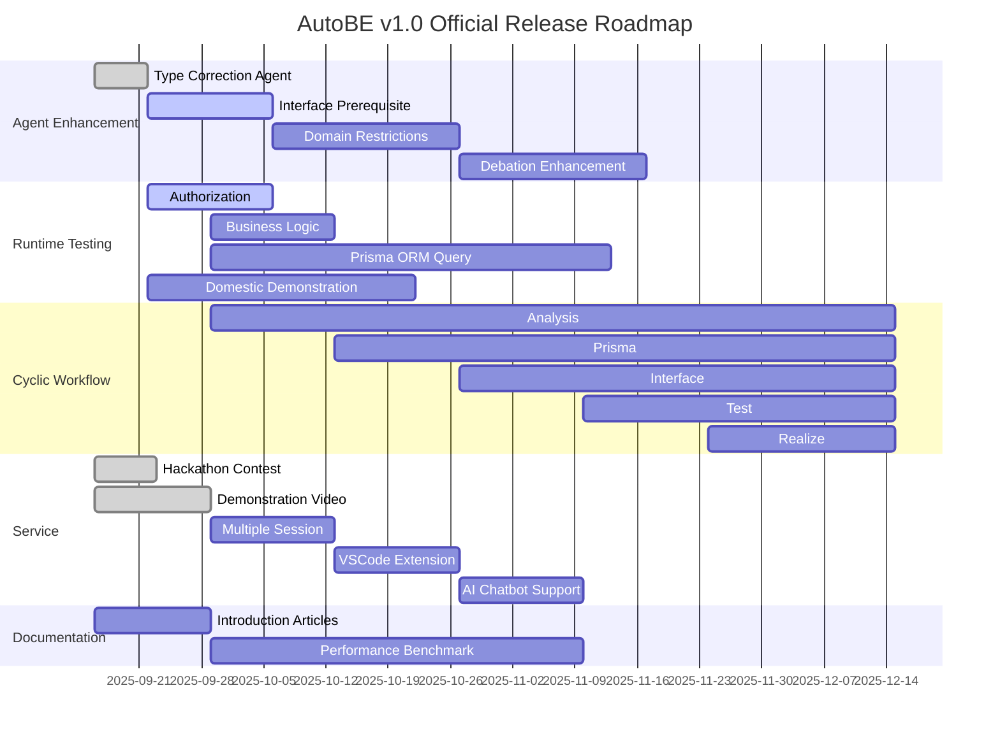

## Preface


## 1. Agent Enhancement
### 1.1. Type Correction Agent
`packages/agent/prompts/COMMON_CORRECT_CASTING.md` 를 참고하여, 대충 이 단원을 잘 써 줘.

대략 TypeScript 및 typia tag 관련 캐스팅 에러들이 잦고 도통 종래의 컴파일 에러 피드백 에이전트들이 이를 해결치 못하니, 단독 에이전트를 만들어 별도 처리하겠다고 해.

그리고 현재 이 미션은 완수하였는데, 이로써 Beta release 에서 gpt-4.1 이 아닌 gpt-4.1-mini 나 qwen3-next-80b-a3b 등의 경량 모델로도 컴파일 성공률 100% 를 달성할 수 있게 되었다고 해 줘.

### 1.2. Interface Prerequisite
interface agent 에서 각 API operation 마다 prerequisites (선행조건) 을 도출해내도록 한다.

`AutoBeOpenApi.IOperation.prerequisites` 속성을 추가, 각 API operation 마다 이를 수행하기 위하여 선행적으로 호출하고 준비해두어야하는 다른 API operation 들을 명시하도록 하는 미션이야.

이 이유는 e2e test 프로그램을 작성하는 test agent 가 보다 세밀하고 정교한 테스트 시나리오를 작성할 수 있도록 함이 첫번째고, 두번째는 [4.5. AI Chatbot Support](#45-ai-chatbot-support) 을 지원하기 위함이지.

특히 4.5 단원에 대하여 간략하게 소개하면서, 이 미션이 꼭 수행되어야하는 이유를 잘 적어주렴.

### 1.3. Domain Restrictions


### 1.4. Debatation Enhancement
AutoBE 가 요구사항에 대하여 유저와 보다 심도있고 세밀한 토론이 가능하도록 에이전트를 강화할꺼야.

특히 이번 v1.0 릴리즈에서는 "알아서 해 줘" 식 막무가내 요구사항보다, 실제 사례에 기반한 세밀한 요구사항들을 컨트롤하는게 중요하다 생각하여 그에 대하여 집중하고자 한다.

이 이야기 적당히 살 붙여서 너가 재량껏 써 봐.

## 2. Runtime Testing
AutoBE 는 지난 베타 릴리즈에서, 컴파일 성공률 100% 륻 달성했다.

그리고 이번 v1.0 릴리즈 타깃으로는, 런타임 성공률 100% 를 목표로 하여, 그야말로 AI가 완전무결한 백엔드 어플리케이션을 생성할 수 있도록 할거야.

뭐 이런 식으로 서두를 장식해주렴.

### 2.1. Authorization
인증 부문에 대하여, 런타임에서 100% 성공하는 코드를 작성하도록 개선한다.

### 2.2. Business Logic
비지니스 로직에 대하여, 마찬가지로 런타임에서 100% 성공하는 코드를 작성하도록 개선한다.

### 2.3. Prisma ORM Query
현재 AutoBE 는 복잡한 DB 설계가 이루어진 경우, Prisma ORM Query 를 잘못 생성, 컴파일은 통과하는데 런타임에서는 실패하는 코드를 종종 작성하고는 한다해 줘.

물론 이 문제는 v1.0 release 에서 해결함으로써, AutoBE 가 (analyze -> prisma -> interface -> test -> realize) 로 이어지는 전체 워크플로우에서, 모두 무결하고 완벽한 설계와 로직 코드를 작성하도록 할꺼야.

라는 식으로 한 번 더 중요한 이야기를 반복해주렴.

### 2.4. Domestic Demonstration
AutoBE 를 만드는 뤼튼 테크놀로지에서, 자사의 서비스 개발에 AutoBE 를 실험하고 활용함으로써, 상업적으로 충분히 활용 가능함을 증명하려고 한다고 해 줘.

사내 프로젝트라 그 주제를 너무 자세하게 이야기 할 수 는 없으되, 약 500~1,000 만명이 사용하는 초대형 서비스를 대상으로 한다고 해. 이를 AutoBe 로 개발하고 운영하며 유지보수하는 것을 목표로 하는 것이지.

## 3. Cyclic Workflow
일방향적 workflow 를 순환형으로 전환하는 작업을 진행한다.

현재 AutoBE 를 구성하는 에이전트는 AI function calling 에 사용하는 함수가 오직 한 개뿐이며, input materials 는 이전 단계의 에이전트가 생성한 결과물 전체이다. 가령 test agent 의 경우에는 이전 (analyze, prisma, interface) 에이전트가 생성한 요구사항 정의서와 DB 설계 및 API 스펙 모두를 전달받아 테스트 코드를 생성한다. 이 때문에 각 단계가 진행될 때마다 소요되는 AI 토큰 비용은 기하급수적으로 증가하였다.

이에 AutoBE 를 구성하는 각 워크플로우가 복수의 함수를 순환적으로 호출하는 구조로 전환한다. 각 에이전트는 여러 차례 (multi-turn) 에 걸쳐 필요한 input materials 만큼만을 추출하여 활용하며, 필요충분한 정보를 모았을 때 비로소 최종 결과물을 생성한다. 이를 통해 토큰 소비량과 컨텍스트를 대폭 절감, 각 워크플로우의 완성도를 높인다.

> 이런 식으로 잘 써봐라.
>
> 아래 예시 코드는 그대로 사용하도록.

```typescript
interface ITestWriteApplication {
  getDocuments(filenames: string[]): Record<string, string>;
  getModel(names: string[]): AutoBePrisma.IModel[]; 
  getOperation(endpoints: AutoBeOpenApi.IEndpoint[]): {
    operations: AutoBeOpenApi.IOperation[];
    schemas: Record<string, AutoBeOpenApi.IJsonSchemaDescriptive>;
  };
  complete(file: IAutoBeTestFunction): void;
  halt(reason: string): void;
}
```

## 4. Service
### 4.1. Hackathon Contest
AutoBE 베타 릴리즈 후, 해커톤 대회를 운영한다.

현재 해커톤 대회가 종료되었으며, 우승자가 선정되었다.

해커톤 대회 참여자들이 제출한 피드백: https://github.com/wrtnlabs/autobe/discussions/categories/hackathon-2025-09-12

> 대략 `website/src/content/docs/hackathon/index.mdx` 참고해서 짧게 쓸 것.

### 4.2. Demonstration Video
AutoBE 및 AutoView 를 사용한 시연 영상을 제작한다라는 이야기를 적당히 써.

그리고 현재 데모 영상 제작이 완료되었으며, 아래는 그 결과라도 또 자연스럽게 적어주려무나.

<br/>
<iframe
  src="https://www.youtube.com/embed/iE0b3Gt_uPk"
  title="Demo AutoBE & AutoView : Full-Stack development of a Reddit-like App"
  width="100%"
  style={{ aspectRatio: "16/9" }}
  allow="accelerometer; autoplay; clipboard-write; encrypted-media; gyroscope; picture-in-picture; web-share"
  referrerPolicy="strict-origin-when-cross-origin"
  allowFullScreen
></iframe>

### 4.3. Multiple Session


AutoBE 의 로컬 플레이그라운드가 여러 채팅 세션을 지원토록 개선한다고 해.

대략 그 모습은 Hackathon 서비스에서와 같을 것이라고 해 주려무나.

단, Hackathon 서비스는 표준 백엔드 서버와 함께 Postgres DB 를 쓰는 방식이었는데, 로컬 플레이그라운드는 SQLite DB 를 쓰는 방식일 것이라 해 줘.

### 4.4. VSCode Extension
AutoBE 를 vscode extension 으로도 구현, AutoBE 를 직접 git clone 해야만 사용할 수 있는 플레이그라운드를 벗어나, vscode 마켓플레이스에서 바로 설치하여 사용할 수 있도록 할꺼야.

대충 알아서 스토리 만들어줘.

### 4.5. AI Chatbot Support
AutoBE 로 생성한 백엔드 어플리케이션을 즉시 AI 챗봇으로 변환, 사용자가 백엔드 API 기능들을 대화형으로 체험해 볼 수 있도록 지원할꺼야.

AutoBE 로 백엔드 어플리케이션을 생성해도, 그 설계도나 코드가 매우 방대하여, 섣불리 이해하기 어려운 경우가 많어. 특히 백엔드 아키텍처나 프로그래밍에 숙달되지 못한 유저라면 더더욱 AutoBE 가 생성한 백엔드 어플리케이션이 잘 만들어진 것이지, 자신이 원하는 바대로 잘 구현된 것인지 알기 어려울꺼야.

그래서 AutoBE 로 생성한 백엔드 어플리케이션과 그 API 에 대한 챗봇을 만들어, 사용자가 챗봇과 대화하며 스스로 의도했던 기능들이 잘 구현되었는지 확인해 볼 수 있도록 할꺼야.

뭐 이런 스토리들을 적어주렴. 그리고 아래는 쇼핑몰 백엔드 API 를 챗봇으로 만든 경우로써, 보다시피 사용자가 쇼핑몰의 모든 기능을 챗봇으로 사용할 수 있거든? 뭐 이런 예제를 통해서 더 설명을 강화하고 설득력을 높이고싶으니 그런 거 고려해서 잘 써 줘 봐.

<br/>
<iframe
  src="https://www.youtube.com/embed/RAzYo02HTXA"
  title="Demo AutoBE & AutoView : Full-Stack development of a Reddit-like App"
  width="100%"
  style={{ aspectRatio: "16/9" }}
  allow="accelerometer; autoplay; clipboard-write; encrypted-media; gyroscope; picture-in-picture; web-share"
  referrerPolicy="strict-origin-when-cross-origin"
  allowFullScreen
></iframe>

## 5. Documentation
### 5.1. Introduction Articles
AutoBE 를 소개하는 게시물들을 작성, 개발자 커뮤니티에 배포할꺼야.

`./beta.mdx` 참고해서 잘 써 줘.

### 5.2. Performance Benchmark
AutoBE 의 성능을 각 AI 모델별로 벤치마킹할꺼라 해 줘.

AutoBE 의 특징은 AI 가 프로그래밍 코드를 텍스트로 작성하게하는게 아니라, 프로그래밍 언어의 AST (Abstract Syntax Tree) 구조를 AI function calling 으로 직접 생성한다는 데에 있어. 따라서 AutoBE 는 통상적으로 AI 가 프로그래밍 스크립트를 얼마나 잘 쓰는지 그 능력을 확인하는 벤치마크와는 다르게, AI function calling 의 정확도와 신뢰성에 대한 벤치마크가 함께 필요해.

v1.0 릴리즈에서는 이러한 AutoBE 용 벤치마크가 추가될 것이라 해 줘. OpenAI 는 gpt-4.1, gpt-4.1-mini, gpt-5. Anthropic 은 Cluade 4, 오픈소스 모델 중에서는 qwen3-next-80b-a3b 등, 다양한 AI 모델을 대상으로 벤치마크를 진행할꺼고 매 달 정기적으로 벤치마크 결과와 함께 순위를 발표할꺼라고 해 줘.

대충 스토리는 이러한건데, 너가 알아서 잘 흥미롭께 써 줄 것이라 믿는다.